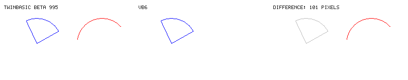

Filed as [twinbasic/twinbasic#2463](https://github.com/twinbasic/twinbasic/issues/2463).

## `Circle` with a positive angle above 2 pi raises no error and draws an arc, where VB6 raises error 5

**Describe the bug**
`Circle` does not check a positive *Start* or *End*. VB6 accepts angles from -2 pi to 2 pi and raises error 5 (*Invalid procedure call or argument*) for any other, drawing nothing. twinBASIC raises error 5 for a negative angle below -2 pi, as VB6 does, but a positive angle above 2 pi raises nothing and is drawn as if 2 pi had been subtracted from it: `Form1.Circle (195, 65), 50, vbRed, 7, 3` draws the arc from 0.72 to 3 radians. Observed by drawing on a form with `AutoRedraw` on, printing `Err.Number`, and saving what the form holds as a picture.

**To Reproduce**
Steps to reproduce the behavior:
1. Open `circle-positive-angle-unchecked.twinproj` (attached as `circle-positive-angle-unchecked.zip`). Its `Sub Main` loads `Form1` without showing it, sets `AutoRedraw`, `ScaleMode = vbPixels`, a white background and a client area of 260 x 130 pixels, and then runs:
   ```
   Form1.Circle (65, 65), 50, vbBlue, -0.5, -2
   On Error Resume Next
   Form1.Circle (195, 65), 50, vbRed, 7, 3
   n = Err.Number
   On Error GoTo 0
   Debug.Print "Circle Start 7: Err " & n
   PngDump.Surface Form1, "main"
   ```
   The blue pie is a valid call, there to give the picture a reference. `PngDump` is a module in the project that copies the form's pixels with `BitBlt` and saves them as `main.png` with GDI+, so the picture does not depend on twinBASIC's own picture code.
2. Run it.
3. The DEBUG CONSOLE shows `Circle Start 7: Err 0`, and `main.png` shows a red arc beside the pie.

**Expected behavior**
Error 5, and nothing drawn by the second call, as VB6 does. The VB6 project (attached as `circle-positive-angle-unchecked-vb6.zip`, the same code with the same `PngDump` module) prints `Circle Start 7: Err 5`, and its picture holds the pie alone.

**Screenshots**
What twinBASIC BETA 995 drew on the left, what VB6 drew in the middle, and on the right the 101 pixels that differ, in red over a grey copy of the VB6 picture:



**Desktop:**
 - OS: Windows 10 Pro 22H2 (build 19045)
 - twinBASIC compiler version: BETA 995

**Additional context**
Severity: low. A program whose angle grows past 2 pi by mistake gets a drawing instead of the error that would show the mistake.

What was tried: BETA 983 behaves the same. A *Start* of 2 pi + 0.001 and an *End* of 7 are drawn the same way; -7 and -2 pi - 0.001, as *Start* or *End*, raise error 5 and draw nothing in both twinBASIC and VB6. VB6's limit is a little above 2 pi, the same for either sign: the **Single** 6.283186 is accepted and 6.283187 refused, and twinBASIC refuses the same negative values. The rest of `Circle`'s angle handling matches VB6: a negative angle draws the radius to that end, a pie (both negative) is filled with `FillColor` and `FillStyle`, and an arc with one radius or none is not. The package source shows the cause: `Circle` in the VB package's `Graphics.twin` compares the angle with `6.28318619728` only inside `If Start < 0 Then` (and `If _End < 0 Then`), after taking its absolute value, so a positive angle is never compared.

<!-- Reproducer: bugs/circle-positive-angle-unchecked/ (mode run, expects the line `Circle Start 7: Err 0`, and expect.imagesDiffer: the picture differs from images/main-vb6.png); run on 995. The VB6 project is in vb6/ (`bug_repro.mjs vb6 circle-positive-angle-unchecked`). The sweep behind "What was tried" (every case on 995, 983 and VB6) is in .claude/tooling-review-scratch/beta995-probes/s75/ (circle.out995.txt, circle.out983.txt, circle.outvb6.txt), local scratch files that are not in the repository. Stated in a WARNING naming BETA 995 in docs/Reference/Core/Graphics-Methods.md (section "What the built-in surfaces do with the flags") and under Circle's Start/End on the pages for Form, PictureBox, Printer, UserControl, Report and PropertyPage under docs/Reference/Default/VB/. Only Form was run; the other five share the same implementation. When fixed, replace each WARNING with a NOTE saying since which build. -->
