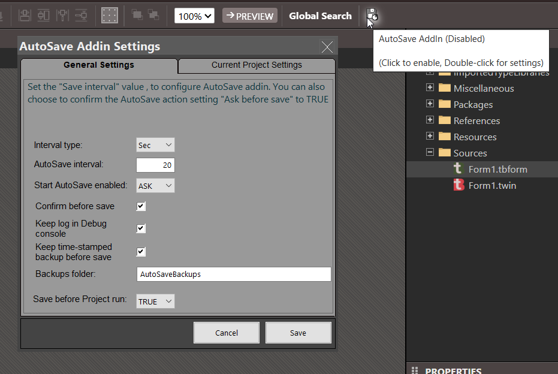

## Auto Save

AutoSave addin for twinBasic, provides automatic saving with the ability to choose a time interval, confirmation and Auto-load.

> Latest Release: [v3.1.5.0](https://github.com/sokinkeso/AutoSaveAddin/releases/tag/v3.1.5.0)

Developer: Community

### Features

- Automatic saving
- Choose a time interval
- Choose interval type (seconds or minutes)
- Check project for changes before saving
- Shows notification for the First-time-save, in a new project
- Confirmation before save
- Auto-Load on project open/new
- Startup options: Start Enabled, Disabled or  Ask the user
- Logging in the debug console
- Keeps General or Project settings
- Save before Project run

The button, that added on the toolbar, has two functions:

- Enable/Disable the Autosave functionality (with Click)
- Show addin settings (with Double-click)

> [!IMPORTANT]  
> **To install this addin in TwinBasic, just unzip and copy each architecture dll in the corresponding folder**  
> `\twinBASIC_IDE_BETA_xxx\addins\win32\`  
> `\twinBASIC_IDE_BETA_xxx\addins\win64\`  

## Download

- https://github.com/sokinkeso/AutoSaveAddin/releases

## Links

- https://github.com/sokinkeso/AutoSaveAddin
