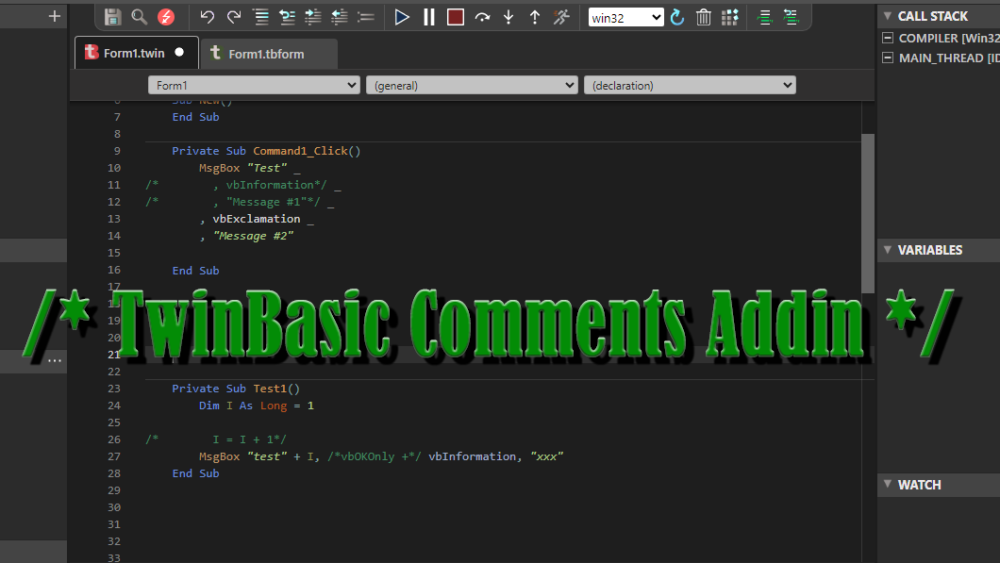

## Comments

This is an Add-in that takes advantage of TwinBasic's ability to insert inline and multiline comments.

The addin, appears on the IDE with two new buttons (Comment and Uncomment).

> Latest Release: N/A https://github.com/sokinkeso/Comments-Addin-for-twinBasic/releases

Developer: @sokinkeso (Community)

### Features

- Line-Mode commenting
This mode works with selecting a number of lines or a single line or just putting the cursor on a line.
Clicking the [Comment] button, will comment-out each line separately.

- Range-Mode commenting
Select multiple lines or a range of characters in a line and with CTRL+Click on the [Comment] button,
a single comment will be created for the whole range.

- Uncomment
Put the cursor inside the range of a comment, and click the [Uncomment] button.

- Empty lines not commented-out

- Line continuation character (_) , is not included inside the comment (Line-Mode)

> [!IMPORTANT]  
> **To install this addin in TwinBasic, just unzip and copy each architecture dll in the corresponding folder**
> \twinBASIC_IDE_BETA_xxx\addins\win32\
> \twinBASIC_IDE_BETA_xxx\addins\win64\

## Download

- https://github.com/sokinkeso/Comments-Addin-for-twinBasic/releases

## Links

- https://github.com/sokinkeso/Comments-Addin-for-twinBasic
