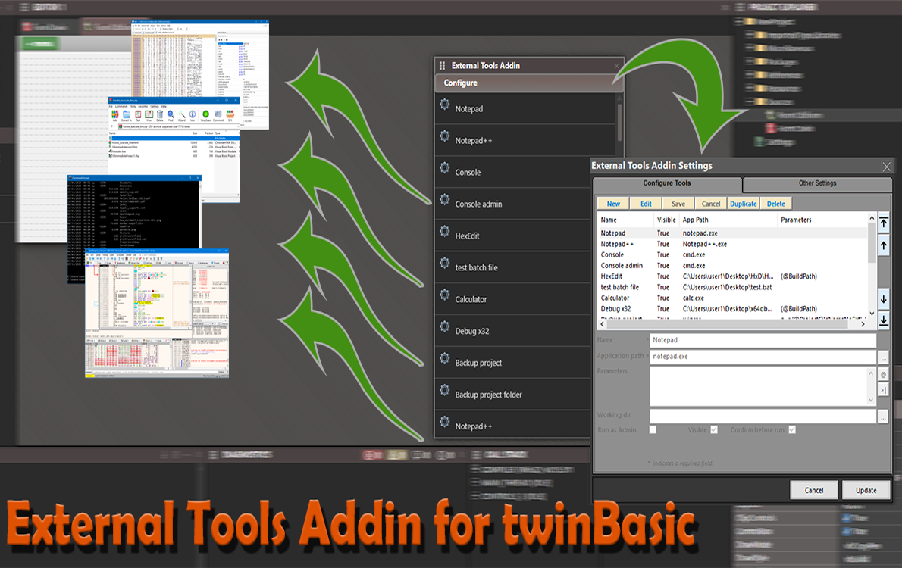

## External Tools

With this addin, you can call any of your favorite tools from inside the twinBasic IDE, like: Hex editors, debuggers, console window, zip/unzip tools, calculators, versioning control tools, and many other!

> Latest Release: [v1.2.0.0](https://github.com/sokinkeso/ExternalTools-Addin-for-twinBasic/releases/tag/v1.2.0.0)

Developer: @sokinkeso (Community)

### Features

1) A floating panel window for showing the available tools. To show this window you have to click on the "Exteranl Tool button" on the IDE toolbar.
in this window you have a list of the tools and a Configuration button at the top.
You can execute any tool from the list with a single click.
This window can be moved or docked in the IDE. For saving its docked position use the "Window->Panel Layouts->Save Current Panel layout as"
menu from the IDE menus.

1) Settings window. With a single click on the Configuration button, the Settings window appears. 
In this window you can see an other list with the available tools. 
This time, clicking on the list, the details of each tool are shown in the fields below the list.

1) You have six buttons available for manipulating your tools: 
 - New, for creating a new tool 
 - Edit, for editing an existing tool 
 - Save, for saving the current editing (new or existing)
 - Cancel, for cancel the edit state 
 - Douplicate, for creating a new tool based on the selected one
 - Delete, for deleting the selected tools

2) You also have four buttons at the right side of the window to change the order in which the tools appear.

3) Right clicking on the list, you have a popup menu with the basic actions (New, Edit, Duplicate), and
   two extra actions:
- Copy, for copying the selected tools as a TAB delimited list in the clipboard
- Paste, for pasting a list of tools from the clipboard in the list.
You can use Copy/Paste for quick importing the examples provided with the addin.

When adding or editing a tool, have in mind that:
 - the "Name" and "Application Path" are required fields. You cannot save the tool without these two fields.
 - You can select the desired app clicking on the ellipsis button at the right of the textbox, or you just can write the name of the executable.
 - In the "Parameters" field, you can add any command line parameters for the tool.
 - The "Working dir" field, is for setting the default directory. Not all applications respect this.
 - The "Run As Admin" check box is for running your tool with administrative rights.
 - The "Visible" checkbox is used to show the tool in the main addin list.
 - The "Confirm before run" checkbox is used to ask for confirmation before running the tool.
 - Clicking the [*] button, you have the ability to choose from a list of predefined variables , like time, date, project name and so on.
 - Clicking on the [>]] button, you can preview the real parameters.
 - Clicking on the Save button above the list, only saves temporary the changes to the list.
   You have to click the [Update] button , so any changes will be made permanent, and available next time the addin loads.

** The "Other Settings" tab is disabled in this release **

> [!IMPORTANT]  
> **To install this addin in TwinBasic, just unzip and copy each architecture dll in the corresponding folder**
> \twinBASIC_IDE_BETA_xxx\addins\win32\
> \twinBASIC_IDE_BETA_xxx\addins\win64\

Any comments/suggestions/bug reports,  are always welcome!

## Download

- https://github.com/sokinkeso/ExternalTools-Addin-for-twinBasic/releases

## Links

- https://github.com/sokinkeso/ExternalTools-Addin-for-twinBasic
