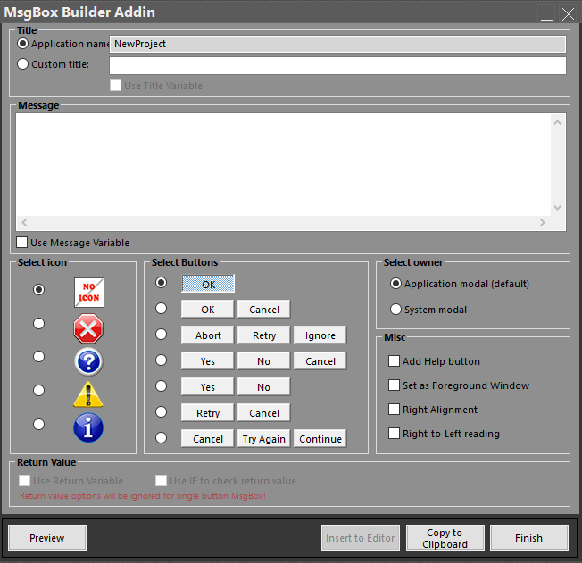

## MsgBox Builder

MsgBox Builder addin, is designed to provide a user-friendly GUI for creating built-in message boxes, along with accompanying code to handle user responses.
By automating the creation of the MsgBox statement, the time of writing the code by hand is significantly reduced.

> Latest Release: [v1.1.6](https://github.com/sokinkeso/MsgBox-Builder-Addin-for-twinBasic/releases/tag/v1.1.6)

Developer: @sokinkeso (Community)

### Features

- Application or Custom title, with the option of using separate variable
- Message ,with the option of using separate variable
- Easy icon selection
- Easy Button-Group and Default Button selection
- Return value check using Select-Case or If-ElseIf statements, with the option of using separate variable.
- Copy to Clipboard button
- Preview button

> [!IMPORTANT]  
> **To install this addin in TwinBasic, just unzip and copy each architecture dll in the corresponding folder**
> \twinBASIC_IDE_BETA_xxx\addins\win32\
> \twinBASIC_IDE_BETA_xxx\addins\win64\

Release History

2024-03-28
----------
- MsgBox Builder addin designed and implemented

2024-03-29
----------
- Fixed Custom title automatically selected, once typing has started in the custom title textbox (Wayne Philips)
- Fixed Issue when empty string was specified as a message.
- Added Preview button

2024-04-01
----------
- Fixed x64 bug, addin window not owned by the IDE

2025-04-24 v1.1.6 ***build with BETA 747
------------------
- fixed: buttons selection not aligned with Select-Case and If-Then statements
- minor graphical issues
- light theme added

## Download

- https://github.com/sokinkeso/MsgBox-Builder-Addin-for-twinBasic/releases

## Links

- https://github.com/sokinkeso/MsgBox-Builder-Addin-for-twinBasic
