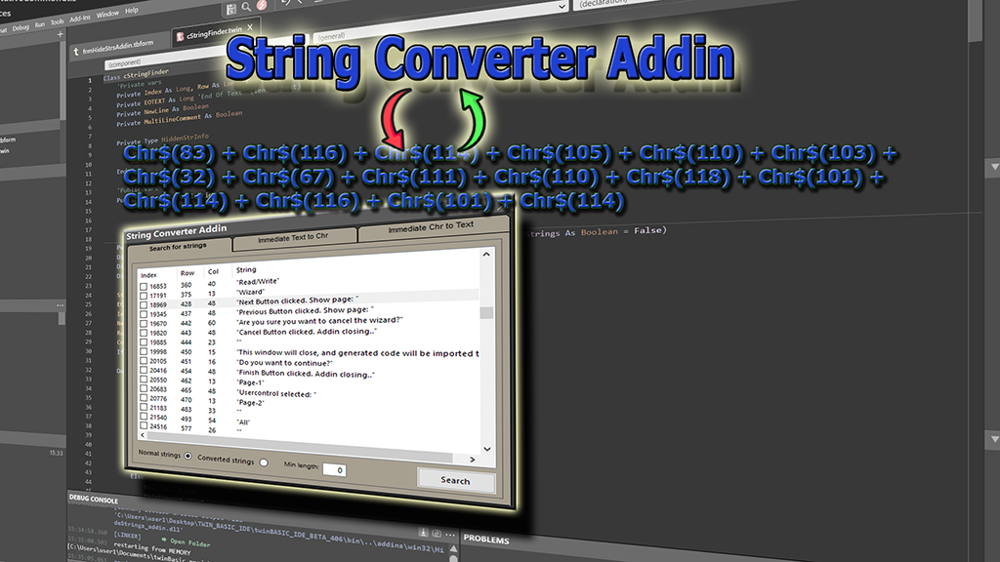

## String Converter

String converter addin is designed to hide your strings inside the compiled .exe, to prevent someone from changing them with a hex editor.
This addin, parses your source code and finds all strings occurances, avoiding the ones inside comments (single or multi line), Dll Declares and Attributes.
Then it can subtitute the strings with constructed strings using the `ChrW$()` function.
This way the strings are "invisible" if you try to search them with a hex editor.
String converter can also do the reverse job, i.e. convert the multiple uses of Chr() function, back to normal string.
You can use the immediate convertion if you want to check normal or converted text.

This project essentially consists of three separate projects, which were combined to create the final addin.
- The Parser, gaves me the opportunity to work on parsing techniques, and use them from inside TwinBasic.
- The xTabbedControl, a usercontrol that hoppefuly will replace the MS Tabbed control.
- The custom Msgbox (MsgForm), a themed message dialog.

> Latest Release: [v2.2.0.0](https://github.com/sokinkeso/String-Converter-Addin-for-twinBasic/releases/tag/v2.2.0.0)

Developer: @sokinkeso (Community)

### Features

- Search for normal strings in twinBasic code editor
- Search for "hidden" strings with chrw$ function
- Minimum string length
- Immediate Text to ChrW$ conversion
- Immediate ChrW$ to text conversion

> [!IMPORTANT]  
> **To install this addin in TwinBasic, just unzip and copy each architecture dll in the corresponding folder**
> \twinBASIC_IDE_BETA_xxx\addins\win32\
> \twinBASIC_IDE_BETA_xxx\addins\win64\

## Download

- https://github.com/sokinkeso/String-Converter-Addin-for-twinBasic/releases

## Links

- https://github.com/sokinkeso/String-Converter-Addin-for-twinBasic
