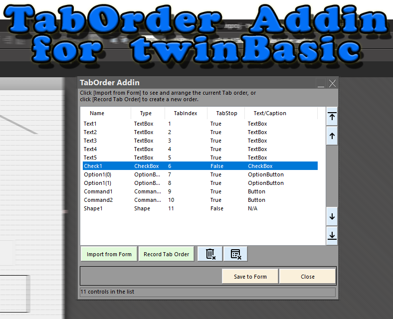

## Tab Order

With this addin, you can call any of your favorite tools from inside the twinBasic IDE,
like: Hex editors, debuggers, console window, zip/unzip tools, calculators, versioning control tools, and many other!

With this addin, you can easily fix the controls TabOrder inside a Form/Usercontrol designer of the twinBasic IDE.
In this first release two modes are available:
1) Import the form controls in the list and move each control in the desired order using the Move buttons on the right of the list.
2) Record a new TabOrder. Clear the list and click the [Record Tab Order] button. Then click the controls on the form with the desired order.

> Latest Release: [v0.9.54](https://github.com/sokinkeso/TabOrder-Addin-for-twinBASIC/releases/tag/v0.9.54)

Developer: @sokinkeso (Community)

### Features

- List with the controls on the form. The list has 5 columns:
  Name: The control Name  
  Type: The control type (or class name)  
  TabIndex: The control tabIndex  
  TabStop : The control TabStop property value (True, False OR N/A)  
  Text/Caption: The value of the Text/Caption property, if it exists (N/A  if not exist)  

- Change TabOrder buttons (on the right of the list)
  [Move to The top] : moves the selected control to the top of the list  
  [Move up] : moves the selected control one position up  
  [Move down] : moves the selected control one position down  
  [Move to The bottom] : moves the selected control to the bottom of the list  

- Delete selected control from the list (Bin delete button)

- Delete all controls from the list (Clear list button)

- [Import from Form] button, reads all the controls of the form and show them in the list.
  When this button is clicked, after the controls are imported, any duplicate or non-continuous indices are fixed.  

- [Record Tab Order] button, when active (turns Red color) clicking on the controls of the form each clicked control appears in the list.

- [Auto TabOrder] button, automatically sets the TabIndex property of the controls, based on their position on the form. For better results, first make any necessary alignments.

- Chekcbox for including controls without TabStop property. Use this option, to include controls like:
  Label, Frame etc, that don't have the TabStop property.  
  (TabIndex of these controls is used with mnemonics)  

- [Save to form] button, saves the current list TabOrder and TabStop status in the form.
  This action can be undone, pressing the Undo button of the IDE  

- [Close] button, closes the addin form.

- Addin form's position and size is saved.

Remarks: 
--------
- The IDE properties sheet is hidden while the addin form is open
- Changing designer while the addin is open, will reset the list
- You cannot have all designers closed while the addin is open
- Adding/Removing/Pasting controls in the form, will reset the list
- Compatible with twinBasic BETA 700 and later.

> [!IMPORTANT]  
> **To install this addin in TwinBasic, just unzip and copy each architecture dll in the corresponding folder**
> \twinBASIC_IDE_BETA_xxx\addins\win32\
> \twinBASIC_IDE_BETA_xxx\addins\win64\

## Download

- https://github.com/sokinkeso/TabOrder-Addin-for-twinBASIC/releases

## Links

- https://github.com/sokinkeso/TabOrder-Addin-for-twinBASIC
