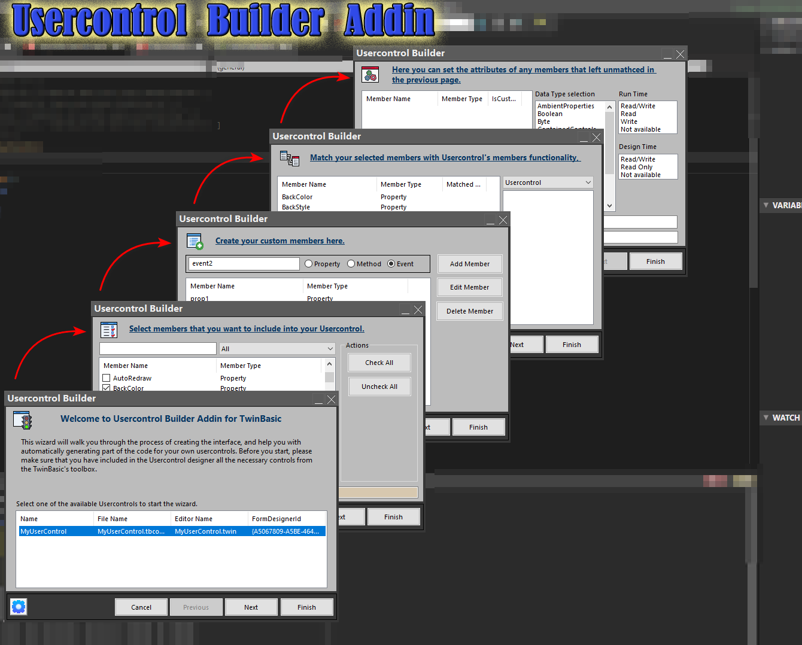

## UserControl Builder

Back in 90's when I was doing my first steps with vb6, ActiveX Control Interface Wizard was my favorite addin.

Thanks to the new Add-in subsystem of TwinBasic, I started creating my "Usercontrol Builder" addin.

> Latest Release: [v3.2.0.2](https://github.com/sokinkeso/Usercontrol-Builder-for-TwinBASIC/releases/tag/v3.2.0.2)

Developer: @sokinkeso (Community)

### Features

- Wizard includes 6 pages (steps)
  - Page_1: Select one of the available usercontrols in your project. You can use the filters above the list for finding the desired members (if no usercontrols exist, the wizard will not open)
  - Page_2: Select from the list on the left, the built-in members that you want to include in your UC.
  - Page_3: Create your custom members. Write the name of the member in the text box, select its type and press [Add Member]. You can also edit or delete any of your custom members.
  - Page_4: Map any of the selected members (built-in or custom) with members of included controls in the Usercontrol.
  - Page_5: Fill in any extra info for the unmapped members.
  - Page_6: Pressing [Finish], the generated code will be inserted in the UC's codeEditor, at the top lines. You can see a summary or the generated code (and copy it to the clipboard), before pressing the [Finish].

 > [!IMPORTANT]  
> **About mapping:**
> - if you map a built-in member with the same member of a control, your UC will use the implementation of the included control.
> - if you map a custom member, with an existing member of a control, your UC will use the implementation of the included control but will be exposed with a different name (the name of the custom member)
> - if you map a built-in member with a different member on a control, the implementation of the control's member will be used. In this case the wizard will also generate a warning, to avoid wrong mapping.

New features compared to VB6: 
------------------------------
- Continuous mapping. Holding down the Ctrl key, you can map members to the last successful mapped control.
- Settings page
- UserControl Builder, includes tB's new data types (LongLong, LongPtr, Decimal)
- You can press the [Finish] button at any page of the wizard. (included in Settings)

Notes
-----
- Supported controls for mapping (until now):
Usercontrol, Checkbox, ComboBox, CommandButton, DirList, DriveList, FileList, Frame, HScrollBar, Image, Label, Line, ListBox, OptionButton, PictureBox, Shape, TextBox, VScrollBar
- Important note: The Builder does not read (for now) any pre-existing code. It works one way (only generating code, not replacing)
- There are some known issues (like tabIndex) that will be solved in the future.

Release History

15-9-2023  alpha 11
--------- 
- wizard pages 1-2 implemented

16-9-2023  alpha 12
---------
- wizard page 3 implemented
- icons added to pages

17-9-2023  alpha 13
---------
- new wizard page 1 (all other moved one page up), selecting Usercontrol
- JSON parser added for reading Usercontrol designer file

18-9-2023  alpha 14
---------
- check if usercontrols exist in project before showing the addin window
- open the selected Usercontrol editor after finishing the wizard

19-9-2023  alpha 15
---------
- page titles fixed as not underlined
- typo in page 5 fixed
- page title labels aligned
- sub FillDataTypes fixed to fill the listbox according to member TypeName (methods can return "Empty")
- Listbox   ListDataTypes, Click_event implemented

20-9-2023  alpha 16
---------
- fixed: page-4 , cmbMatching  now showing available controls
- fixed: page-4 , lstMatching , showing correct values depending on cmbMatching and LV3 
- fixed: CodeBuilder fixed  when member matched with a control's member with different name
- added: listboxes are filled with LockWindowUpdate enabled to avoid flickering
- fixed: codebuilder , adds " around string default values, and # around Date default values

22-9-2023  alpha 18
---------
- cMemberInfo class : new field : IsVisible  , for the members that vb6 does not show in the starting list
- code builder  fixed some issues, mapped member is used now too.
- Lookup data table, new column, (IsVisible)

22-9-2023  Beta 1
---------
- Fixed: member mapping, not correctly choose the parameters
- Added: CheckBox , ComboBox  members
- Fixed: runtime and design time states, now is stored and retrieved
- Fixed: FindInListbox function not returning the correct item
- Added: runtime and design time  error.raise  in properties
- Fixed: Code builder, now handles properties with parameters
- Fixed: members data alphabeticlly stored

30-9-2023  Beta 2
---------
- Fixed: unmapping a control in page-3, was appearing in page-4
- Added: New sub ResetBuildInMember() , for reseting a member when it is deselected in page-2
- Fixed: selection issue on page-4, when deselect on page-2
- Added: New page-6 ,  summary of the wizard
- Added: twinBasic's new data types
- Fixed: Properties with designTimeState=NotAvailable , did not have the attribute  [Hidden]
- Fixed: CodeBuilder, was not using the mapped member parameters
- Improved: Page selection, bypass page-5 if no unmapped members exist
- Fixed: CodeBuilder was not correclty inserting the default value of mapped properties
- Added: Data for : Checkbox, ComboBox, CommandButton, DirList, DriveList, FileList, Frame,HScrollBar, Image, Label, Line, ListBox, OptionButton, PictureBox, Shape, TextBox, Timer, VScrollBar
- added: custom member name validation
- improved: select the correct control on page change
- added: Continuous mapping ( after mapping one member, holding down Ctrl key and clicking the next member maps automatically to the last control if this member name exists)
- improved: page-3, add new/edit member with [Enter] key
- fixed: click on form caption while combobox is droped down, form "shake" happens
- fixed: disable form close [X] button , while settings Frame is visible.

1-10-2023  Beta 3
---------
- Fixed: codebuilder falsly inserts to all properties the last selection of RunTimeState and DesignTimeState
- Fixed: Design Time state error raising, not imported correctly
- Added: Settings page

7-10-2023
---------
- Improved: AddinSettings variable goes global
- Improved: WriteLog sub goes global
- Added: More Log points
- Fixed: Copymemory declared to run on x64 too.
- Imporved: x64 version compiled successfully !
- Fixed: Code not imported when ActiveX control template was used (@fafalone)
- Added: Custom Msgbox window, to bypass built-in msgbox issues.

2-4-2024 v3.2.0.2
------------------
- Fixed x64 issue with addin owned window
- Fixed uc not recognized after Beta 423
- Fixed addin button id

## Download

- https://github.com/sokinkeso/Usercontrol-Builder-for-TwinBASIC/releases

## Links

- https://github.com/sokinkeso/Usercontrol-Builder-for-TwinBASIC
