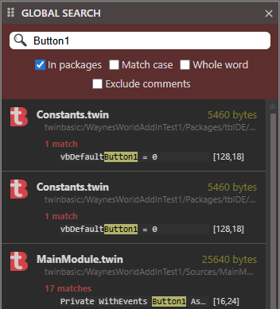

## Global Search

This AddIn is supplied with the twinBASIC IDE.

> Latest Release: v1.0.0.0

Developer: twinBASIC

The global search add in will contain a [Toolbar](/tB/IDE/Project/Toolbar) item.

")

Options

- In packages
- Match case
- Whole word
- Exclude comments

Type a search term i.e. Button1 into the text field and a list of matches will be returned.

## Download

- https://github.com/twinbasic/twinbasic/releases

## Links

- https://github.com/twinbasic/twinbasic
