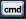

# CommandButton

This object corresponds to a command button. A command button on a form can start an action or a set of actions. For example, you could create a command button that opens another form. To make a command button do something, you write an event procedure and attach it to the button's `Click` property.

| VB6 | VBA        | .NET       |
| --- | ---------- | ---------- |
|     | [vba][vba] | [net][net] |

<!-- [vb6]:  "" -->
[vba]: https://learn.microsoft.com/en-us/office/vba/api/access.commandbutton "CommandButton object (Access)"
[net]: https://learn.microsoft.com/en-us/dotnet/api/system.windows.controls.button?view=windowsdesktop-10.0 "Button Class"
<!-- [tb]:  "" -->

<!-- Represents a Windows button control. -->
<!-- [net]: https://learn.microsoft.com/en-us/dotnet/api/system.windows.forms.button?view=windowsdesktop-10.0 "Button Class" -->
