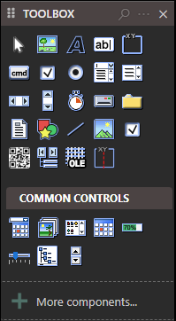

# Introduction

> [!WARNING]
>
> Pardon, we have not fully documented all the controls yet.

twinBASIC supports a number of controls out of the box. See associated pages for more info.

- Pointer
- PictureBox
- Label
- TextBox
- Frame
- CommandButton
- CheckBox
- ComboBox
- ListBox
- HScrollBar
- VScrollBar
- Timer
- DriveListBox
- DirListBox
- FileListBox
- Shape
- Line
- Image
- CheckMark
- QRCode
- Data
- OLE
- MultiFrame

## Common Controls

- DTPicker
- ImageList
- ListView
- MonthView
- ProgressBar
- Slider
- TreeView
- UpDown
