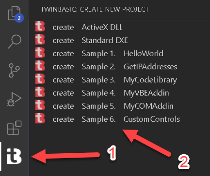
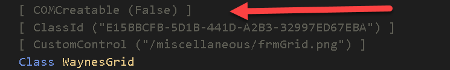
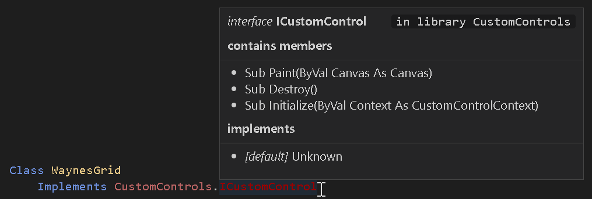

# Defining a CustomControl
A CustomControl is simply an ordinary twinBASIC class, with a few extra attributes and requirements.

> [!TIP]
> It is highly advisable to look at and experiment with the sample project provided with twinBASIC before trying to implement your own CustomControl.



***
## CustomControl() attribute


This is a required attribute for all CustomControls.  You must provide the relative path to an image file within your project that can be used to identify your control in the form designer toolbox.  We recommend that you put the image file in the Miscellaneous folder in your project.


***
##  ClassId() attribute


This is a required attribute for all CustomControls.  You must provide a unique CLSID (GUID) in order for the form engine to work with your control. 

> [!TIP]
> If you enter `[ ClassId () ]` twinBASIC helps you out - just press the 'insert a randomly generated GUID' text:


***
##  COMCreatable() attribute


This is an optional attribute, but it is usually advisable to set this attribute to False, as you don't need to instantiate CustomControls from external COM environments.

***
## Must implement ICustomControl


All CustomControls *must* implement CustomControls.ICustomControl.  This interface currently has 3 methods that you must implement:

``` vb
Sub Initialize(ByVal Context As CustomControlContext)
```

This method is called when your control is attached to a form.  You must store the provided Context object in a class field as it offers a `Repaint()` method for informing the form engine that something in your control has changed and needs to be repainted.

``` vb
Sub Destroy()
```

This method is called when your control is detached from a form.  This allows an opportunity to break circular references so that your object instance can be destructed properly.   The implementation for this can often be left empty provided you don't create circular references in objects.

``` vb
Sub Paint(ByVal Canvas As Canvas)
```

This is the most interesting part for a CustomControl.  As such, it gets its own section, see [Painting / drawing to your control](/CustomControls/Painting)

***
## Minimum set of properties
As twinBASIC doesn't yet support inheritance, you must expose a set of common properties (class fields) for all CustomControls:

``` vb
Public Name As String
Public Left As CustomControls.PixelCount
Public Top As CustomControls.PixelCount
Public Width As CustomControls.PixelCount
Public Height As CustomControls.PixelCount
Public Anchors As Anchors = New Anchors
Public Dock As CustomControls.DockMode
Public Visible As Boolean
```

The form designer and the form engine work with these properties, so it is important to include them in your CustomControl class.

Note that the form designer works with pixel values which are not DPI-scaled.  So the Left/Top/Width/Height properties of your control do not reflect DPI scaling.  For example, if your control has a width of 50 pixels, then at DPI 150%, then the actual drawing width is 75 pixels ( see [Painting / drawing to your control](/CustomControls/Painting)).

***
## Must have a serialization constructor
CustomControls *must* offer a serialization constructor:

``` vb
Public Sub New(Serializer As SerializationInfo)
```

The passed in Serializer object offers a `Deserialize()` method that you call in order to load the properties that have been set for your control via the form designer.  See [Property Sheet and Object Serialization](/CustomControls/Properties) for further information.