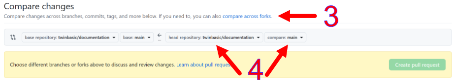
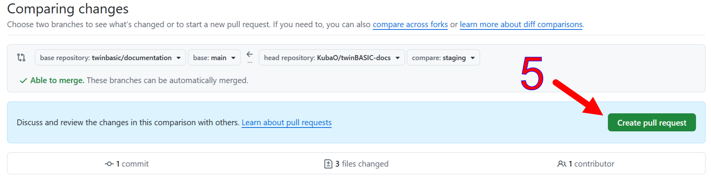
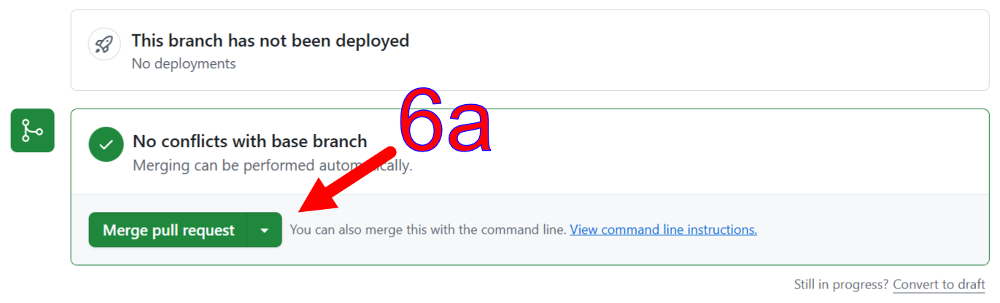
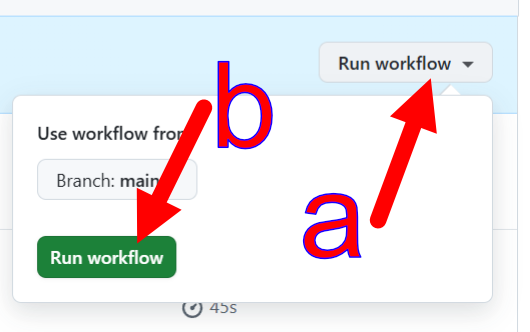

# Building and Deployment
{: .no_toc }

The day-to-day workflow for editing documentation: requirements, building, serving locally, link checking, Graphviz diagrams, screenshots, and the deployment to [docs.twinbasic.com](https://docs.twinbasic.com). Aimed at content contributors --- if you are modifying the build pipeline itself, see [tbdocs Internals](Builder) instead.

* TOC goes here
{:toc}

## Development environment

The documentation is rendered to HTML by `tbdocs`, a custom Node.js static site generator that lives under [`builder/`](https://github.com/twinbasic/documentation/tree/main/builder). The day-to-day commands below are Windows batch files that wrap the generator; their POSIX equivalents are listed alongside.

1. Ensure the [requirements](#requirements) below are met.

2. Fork [https://github.com/twinbasic/documentation][docs-repo] to your own GitHub account if you plan on making any changes, or for convenience. Skip this if you only want to build the docs locally without contributing changes.

3. Clone either your fork or the [documentation repository itself][docs-repo].

### Requirements

- **Node.js 22+** for `tbdocs` itself.
- **`npm ci`** at the repository root installs everything: the static site generator's deps and the PDF renderer's deps. A single `package.json` at the repo root carries the whole dependency set. The `build.bat` / `serve.bat` wrappers assume the install has run.
- **Chromium** is required only when the PDF book is rendered. It is downloaded once by `npx puppeteer browsers install chrome --install-deps`. The day-to-day `build.bat` / `serve.bat` flow does not need it.

## Building

To render the documentation from `.md` files into the `_site/` (online), `_site-offline/` (offline mirror), and `_site-pdf/` (sparse PDF source) folders:

    build.bat

or directly:

    node builder\tbdocs.mjs --src docs

A single `tbdocs` run produces all three trees. The `also_build_offline` and `also_build_pdf` keys in `_config.yml` toggle the sibling outputs; the `--no-offline` and `--no-pdf` flags do the same from the command line if you only want `_site/`.

The full set of `tbdocs` CLI flags --- every flag, what each one does, when to use it --- lives on the [Tools and Scripts](Tools#tbdocs) page.

## Building and local serving

The simplest local preview is `build.bat` followed by opening the rendered files in any browser. To get a localhost server instead:

    serve.bat

This runs `tbdocs --serve`: after an initial build, an HTTP server binds to port 4000 (pass `--port <N>` to use a different port), a recursive source-tree watcher fires a debounced rebuild on each file change, and any browser tab open on the page auto-reloads via SSE after each successful rebuild. Only failures (4xx, 5xx, server exceptions) are logged --- successful requests are silent. Ctrl+C exits cleanly.

Serve writes to `docs/_serve/`, completely disjoint from `build.bat`'s `_site/` family. That separation means a one-off `build.bat` invocation (e.g., to refresh `_site-pdf/` for `book.bat`, or to re-check `_site-offline/` link integrity) never touches the tree the live preview is serving, and the preview keeps showing whatever serve last rebuilt.

## Checking link integrity

Before checking link integrity, the documentation must be built:

    check.bat

This runs two passes of `scripts/check_links.mjs`: one against `_site/` (the online tree) and one against `_site-offline/` (the `file://`-browsable mirror) with `--forbid 'https://docs.twinbasic.com'` to also flag any surviving live-site link --- the offline mirror should never navigate back to the live docs site. Both checks also assert HTML well-formedness, duplicate-`id` detection, anchor resolution, accessibility hints, and (for the online tree) the sitemap and search-index integrity. The same two checks run in CI on every pull request and on every push to `staging`.

A clean `check.bat` run is the bar for "ready to commit".

## Graphviz/DOT diagrams

Diagrams live as `.dot` source files under `docs/assets/images/dot/` and are referenced from markdown as `.svg`:

    

`tbdocs` regenerates each `.svg` from its `.dot` sibling when the SVG is missing or older than its source --- editing a `.dot` by one character regenerates the SVG on the next build. Both files belong in git; the `.dot` is the canonical source, the `.svg` is the build artifact.

At render time, any markdown image reference to a build-local `.svg` is replaced with the SVG content inlined directly in the HTML. Each inlined SVG gets a click-to-zoom overlay and four control links (Download SVG, Copy SVG, Download PNG, Copy PNG). The controls are hidden in print output. See the [SVG inlining](Builder#svg-inlining) section of the Builder page for the implementation details.

The renderer drives `@hpcc-js/wasm-graphviz` directly: one WASM module load (~50 ms) covers the whole batch, then each diagram is a synchronous `gv.dot(src)` call. No headless browser, no in-tree patches, no Chromium dependency for diagrams. Two failure modes are handled distinctly:

- **Setup failures** (`@hpcc-js/wasm-graphviz` not installed, WASM load fails) emit a one-line warning, retain the existing on-disk SVGs, and let the build exit 0 --- a fresh checkout without `npm install` still builds against the committed SVGs.
- **Content failures** (broken DOT syntax, render throws) emit the error verbatim, leave that diagram's previous SVG in place, continue rendering the rest of the batch, and flip `process.exitCode = 1` so CI catches the bad diagram.

In serve mode the watcher ignores writes to `assets/images/dot/*.svg`. The `.dot` is the source of truth; the `.svg` is the build artifact the renderer emits back under `srcRoot`. Without the filter, each `.dot` edit would fire two rebuilds (one on the edit, one on the SVG write) and the browser would reload twice for one user change.

## Deploying to docs.twinbasic.com

1. Push your changes to your GitHub fork of the [documentation repository][docs-repo].

2. [Open a new pull request in the documentation repository][docs-pr].

3. Click **compare across forks**.

4. Select your repository and branch to merge from.

   

5. Create the pull request.

   

   A maintainer will merge the pull request into the documentation repository. You may wish to mention an outstanding request on the [#docs][hash-docs] channel, although the [#github-docs][hash-github-docs] channel provides automated notifications of pull requests. Normally, a maintainer will get a notification of a new pull request via Discord, and will merge it or comment with a request for changes.

   **The steps below are done by maintainers.**

6. Review, then merge the pull request or comment with required changes.

   

   

7. Select the **Build & deploy docs** action.
   {:width="75%"}

8. Manually run the build and deployment workflow if a release snapshot is needed. (Pushes to `staging` deploy to Pages automatically; only the manual run additionally cuts a GitHub release with the offline-browsable site copy attached as a zip and the PDF book attached.)
   {:width="50%"}

## Editing screenshots

One way to edit screenshots is to use an integrated vector / pixel program like [Affinity][af]1. A possible workflow:

1. <kbd>PrtSc</kbd> to capture the screenshot.

2. In Affinity, <kbd>Ctrl-Alt-Shift-N</kbd> (File, New from Clipboard) to get the entire screenshot into the program.

3. Use the Vector Crop tool (from the Vector studio) to crop the screenshot down to the relevant part.

    

4. Select the cropped image and copy it to the clipboard with <kbd>Ctrl-C</kbd>.

5. Create a new file from clipboard again to open a document with just the cropped screenshot <kbd>Ctrl-Alt-Shift-N</kbd> (File, New from Clipboard).

6. Close the file you opened in step 2.

7. Add arrows and labels as needed. Those can be copy-pasted from other `.af` files in this repository.

8. Export to PNG via <kbd>Ctrl-Alt-Shift-W</kbd> (File, Export, Export...).

> [!NOTE]
> It is a convention to put the `.af` ("source") files in the `_Images` folder, and the exported `.png` files in the `Images` folder. Only the latter is published to the website. The former is preserved as the source for easy editing and updates.

---

1 Affinity is a free-as-in-beer suite that combines a vector editor, a bitmap editor, and a publishing layout editor. A Canva account is required to download; the accounts are free.

[af]: https://www.affinity.studio/download
[docs-pr]: https://github.com/twinbasic/documentation/compare
[docs-repo]: https://github.com/twinbasic/documentation
[hash-docs]: https://discord.com/channels/927638153546829845/1021635324809596988
[hash-github-docs]: https://discord.com/channels/927638153546829845/1111554338221989908
