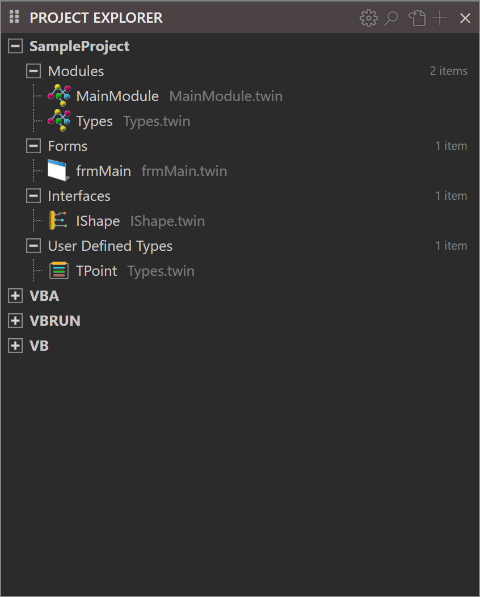
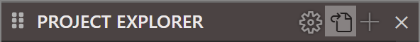
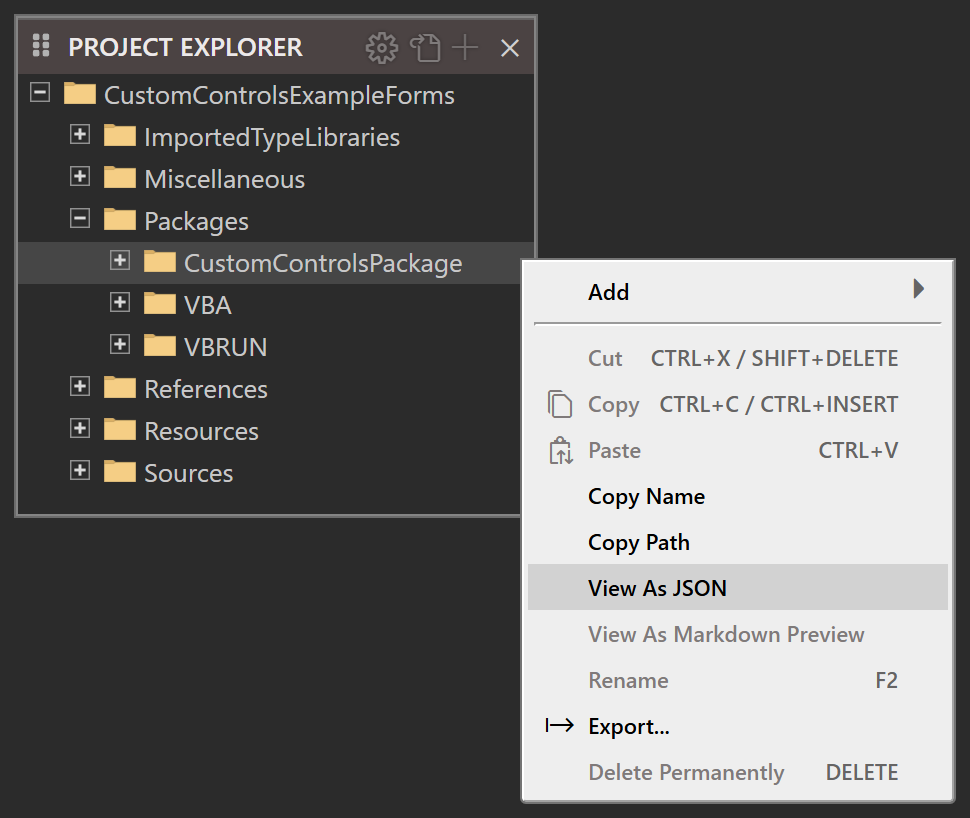
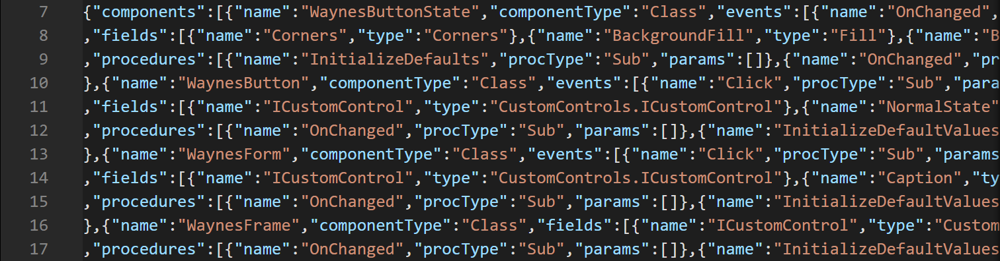

# Modern IDE Features

While the twinBASIC IDE still has a lot of work planned, it already includes a number of features that make life much easier found in other modern IDE, but not the ancient VBx IDEs.

## Theme System
{: index="dark mode" }

Fully theme-able, with Dark (default), Light, and Classic (Light) built in, and an easy inheritance-based system to add your own themes via CSS files.

## Code Navigation and Structure

- **Code folding**, with foldable custom-defined regions via `#Region "name" ... #End Region` blocks.
- **Sticky-scroll**, which keeps context lines at the top showing major sections of code like module, region, method, `With` blocks, etc.
- **Indent guides**, lines drawn along common indent points to help line things up right.
- **Code mini-map**, shows a graphics overview of the code structure alongside the scroll bar, helping to guide your scrolling.

## Editing Features

- **Fully customizable keyboard shortcuts** covering all commands, with ability to save and switch between different sets.
- **Auto-indent on paste**.
- **Paste as comment**.
- **Inline code hints**, which provide annotations at the end of blocks for what the block is (see picture).
- **Color-matching** for parentheses and brackets.

## Advanced Features

- **Full Unicode support** in .twin files, so you can use the full Unicode range of the font in your comments and strings.
- **Advanced Information popup**, which shows offsets for UDT members, their total size via both `Len()` plus `LenB()`, and their alignment; and v-table entry offsets for interfaces and classes, as well as their inheritance chain.
- **A type library viewer** for controls and TLB files that displays the full contents in twinBASIC-style syntax rather than ODL.

## Panels and Windows

- **A History panel** containing a list of recently modified methods.
- **An Outline panel** with selectable categories.
- **A Diagnostics panel** (the Problems panel), which lists all current errors and warnings (you can filter to show only one or the other).

## Form Designer Enhancements

On the Form Designer, control with `Visible = False` are faded to visually indicate this. Also, pressing and holding Control shows the tab index of each tab stop.

![The whole twinBASIC IDE window with a class open in the editor and twelve labels, each with an arrow: Sticky scroll at the class and function lines held at the top of the editor, Colour matching at a line of nested brackets, Unicode in the editor at a string holding an emoji and Japanese text, Indent guides at the guide line through an empty line inside an If block, Inline code hints at the hint after Next, Advanced info popup at the hover over a user-defined type that lists its members' offsets, its Len and LenB and its alignment, Mini-map at the code overview at the editor's right, Folding controls at a fold arrow beside a function, Memory usage and object counts at the status bar, and Outline, History and Diagnostics at those panels down the left of the window](../Images/IDE-FeatureMap.png){:width="1440" height="900"}
[Full size](../Images/IDE-FeatureMap.png)

### New Code-Based Project Explorer

A new code structure based Project Explorer:

{:width="423" height="526"}

The classic file-based view is still used by default, you can activate the new view with a toggle button:

{:width="296" height="30"}

## View Forms and Packages as JSON

Project forms and packages are stored as JSON format data, and you can view this by right-click in Project Explorer and selecting **View As JSON**. This is particularly interesting for packages as it exposes the entire code in a more parseable format.

{:width="485" height="409"}

{:width="756" height="198"}
