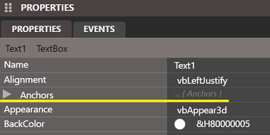
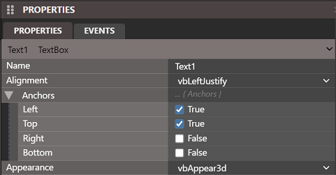
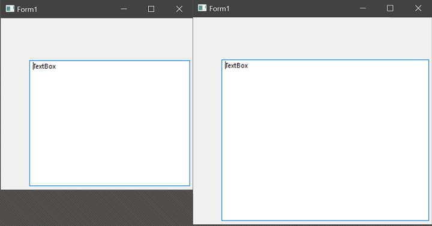
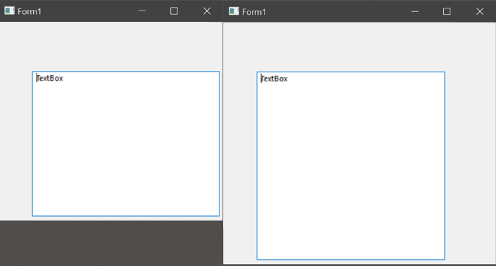
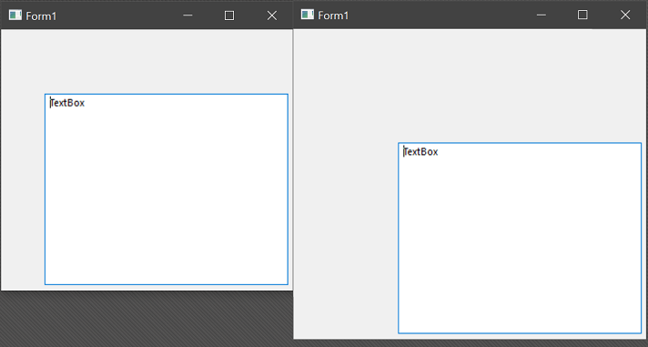
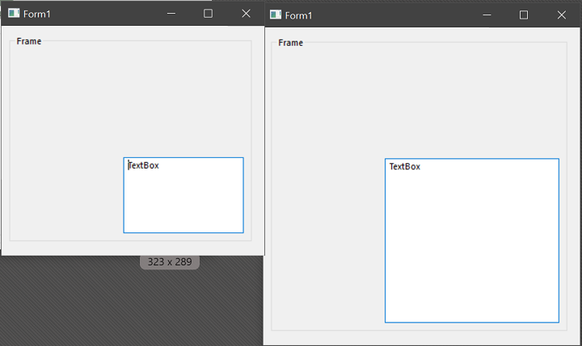
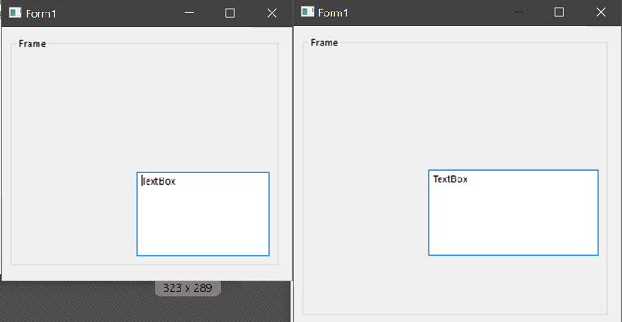
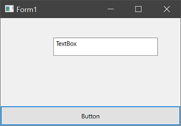
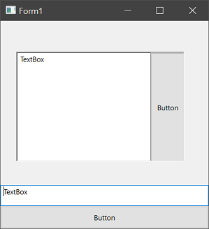

# Anchoring

One of the new form designer features you see in twinBASIC is the 'Anchors' property:

Clicking the arrow on the left expands it to provide 4 options:

These control whether the position of each point relative to the borders of their parent form or control container are maintained when the form is resized. By default it behaves in the expected manner; the top and left stay the same, and the control is not resized or moved with the form unless you do this manually with code, typically in the `Form_Resize` event. These provide an alternative to handle sizing and moving automatically.

If a control is anchored at all 4 positions, it will be resized in both dimensions along with the form:

As you can see, all anchor points were kept a constant distant from the edge, resulting in the control being resized. If you anchored only the Top, Left, and Bottom, it will be resized vertically, but not horizontally:

Right was not anchored to the edge, so it didn't move with the edge.

If you remove the anchors to the Top and Left (False) but maintain the Right and Bottom anchors (True), the control will move with the Bottom and Right:

The control stayed the same size, and because the Right and Bottom were anchored to the edge, they moved with the form, resulting in the whole control moving.

### Control Containers

The above examples illustrate how this works with controls directly on a Form. But what if they're inside a Frame or other control container? The anchors are relative to their parent, so resizing a Form won't resize or move a control inside a Frame unless the Frame is also anchored in a way that changes its size/position.

For example, if a TextBox is anchored at all 4 points, inside a Frame anchored at all 4 points, then it will resize along with the Frame:

If we remove the Bottom anchor from the TextBox, but not the Frame, the Frame will be resize along the bottom, but the TextBox will not:

Using these 4 points you can automatically maintain a relative size, position, or both, without having to manually code any of it.

> [!TIP]
> Reminder, twinBASIC also adds `MinWidth`, `MinHeight`, `MaxWidth`, and `MaxHeight` properties to a Form, so those can also be automatically managed in combination with control anchors. You may want to set a minimum size so that controls do not disappear.

# Docking

Similar to anchoring but slightly different, tB also offers a 'Dock' property:

You might already be familiar with how a StatusBar control locks itself to the bottom of a form; that's the kind of positioning this property controls. A control can be docked on any side, and it will stay sized to the full width or height, and move with, that side of the Form or parent container. For example, a CommandButton with `vbDockBottom`:

Besides the four sides, there's a final option: `vbDockFill`. This will have the control fill its entire parent area. This is most useful when used with a container such as a PictureBox or Frame control-- it will fill only that container when its a child of it, not the whole form.

`vbDockFill` will exclude other docked controls, so you could for instance have one control with `vbDockRight` and another with `vbDockFill` that covers the rest of the Form or container while the first control stays in position on the right.

### Multiple Controls

As the end of the last section suggests, it's possible to dock more than one control to the same location, such as a CommandButton and TextBox docked to the bottom. The following example also shows a PictureBox control with the `vbDockRight` + `vbDockFill` example from above:

> [!TIP]
> The order of two (or more) controls docked in the same position is determined by which was set first. Currently they can't be dragged to rearranged, but you can set the Dock property back to none, and re-do them in the desired order.

