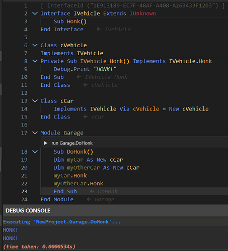

# Inheritance

twinBASIC provides several mechanisms for inheritance to support both simple and complete object-oriented programming patterns: **Implements**, **Implements Via** and **Inherits**.

## Enhancements to **Implements**

`Implements` in twinBASIC has several enhancements:

### Inherited Interfaces

`Implements` in twinBASIC is allowed on inherited interfaces -- for instance, if you have `Interface IFoo2 Extends IFoo`, you then use `Implements IFoo2` in a class, where in VBx this would not be allowed. You'll need to provide methods for all inherited interfaces (besides `IDispatch` and `IUnknown`). The class will mark all interfaces as available-- you don't need a separate statement for `IFoo`, it will be passed through `Set` statements (and their underlying `QueryInterface` calls) automatically.

### Multiple Implementations

If you have an interface that multiple others extend from, you can write multiple implementations, or specify one implementation for all. For example:

```tb inert=external
IOleWindow_GetWindow() As LongPtr _
    Implements IOleWindow.GetWindow, IShellBrowser.GetWindow, IShellView2.GetWindow
```

### 'As Any' Parameters in Interfaces

`Implements` is allowed on interfaces with 'As Any' parameters: In VBx, you'd get an error if you attempted to use any interface containing a member with an `As Any` argument. With twinBASIC, this is allowed if you substitute `As LongPtr` for `As Any`, for example:

```tb check_build
Interface IFoo Extends IUnknown
    Sub Bar(ppv As Any)
End Interface

Class MyClass
    Implements IFoo

    Private Sub IFoo_Bar(ppv As LongPtr) Implements IFoo.Bar

    End Sub
End Class
```

## **Implements Via** for Basic Inheritance

tB allows simple inheritance among classes. For example, if you have class cVehicle which implements IVehicle containing method Honk, you could create child classes like cCar or cTruck, which inherit the methods of the original, so you could call cCar.Honk without writing a separate implementation.



You can see that the Honk method is only implemented by the parent class, then called from the child class when you click the CodeLens button to run the sub in place from the IDE.

## **Inherits** for Complete OOP

This option supports full inheritance and OOP: `Protected` methods and variables accessible to derived classes (but not outside callers), `Overridable` and `Overrides` syntax, multiple inheritance, and explicit base class constructors.

### Example: Animal Class Hierarchy

> [!IMPORTANT]
> Every class in this example is declared `Private Class`, because each one has a `Sub New` that takes arguments. A class that is not `Private` is exposed to COM, and COM creates objects without arguments. So a public class --- base or derived --- whose `Sub New` takes arguments fails to compile with TB5135, unless it also has a constructor that takes none. There are three fixes: declare the class `Private`, add the `[COMCreatable(False)]` attribute, or add a constructor without arguments, such as `Class_Initialize`. See [Parameterized Class Constructors](../Advanced/Classes-and-Modules#parameterized-class-constructors).

Starting with a base class:

```tb check_build projname=inheritance-animals
Private Class Animal
    Protected _name As String
    Protected _dob As Date  ' date of birth

    Public Event Spoke(ByVal sound As String)

    Public Sub New(name As String, dob As Date)
        _name = name
        _dob = dob
    End Sub

    Public Property Get Name() As String
        Name = _name
    End Property

    Public Property Get DOB() As Date
        DOB = _dob
    End Property

    ' Age in whole years based on DOB and today's date
    Public Function AgeYears() As Long
        Dim y As Long
        y = DateDiff("yyyy", _dob, Date)
        If DateSerial(Year(Date), Month(_dob), Day(_dob)) > Date Then y = y - 1
        AgeYears = y
    End Function

    Public Sub Speak()
        Dim s As String
        s = GetSound()
        RaiseEvent Spoke(s)
        Debug.Print _name & " says: " & s
    End Sub

    ' --- Overridable hook for derived classes ---
    Protected Overridable Function GetSound() As String
        GetSound = ""
    End Function
End Class
```

Others can inherit. Constructors are not inherited, so each derived class declares its own `Sub New`. Without one, a `Cat` cannot be created with arguments: `New Cat("Misty", #20-Nov-2022#)` fails with TB5030, *Unexpected call arguments*.

When the base class's `Sub New` takes arguments, the derived class's `Sub New` must call it --- `Dog` calls `Animal.New` below, and `GuardDog` calls `Dog.New`. Nothing else calls it. If the call is left out --- or the derived class has no `Sub New` and is created without arguments --- the code still compiles and runs. The base constructor never runs, and the fields it sets keep their default values. No error or warning reports it. A base `Sub New` that takes no arguments is different: it runs automatically, before the derived class's `Sub New`.

```tb check_build projname=inheritance-animals
' ===== Derived: Dog =====
Private Class Dog
    Inherits Animal

    Protected _breed As String

    Public Sub New(name As String, dob As Date, breed As String)
        Animal.New(name, dob)               ' required: nothing else runs Animal's constructor
        _breed = breed
    End Sub

    Public Property Get Breed() As String
        Breed = _breed
    End Property

    ' Override:
    Protected Overridable Function GetSound() As String Overrides Animal.GetSound
        GetSound = "woof"
    End Function
End Class

' ===== Further derived: GuardDog (Dog → GuardDog) =====
Private Class GuardDog
    Inherits Dog

    Protected _onDuty As Boolean

    Public Sub New(name As String, dob As Date, breed As String)
        Dog.New(name, dob, breed)           ' required: runs Dog's constructor, which runs Animal's
        _onDuty = True
    End Sub

    Public Property Get OnDuty() As Boolean
        OnDuty = _onDuty
    End Property
    Public Property Let OnDuty(ByVal v As Boolean)
        _onDuty = v
    End Property

    ' Multi-level override (overriding Dog's override):
    Protected Function GetSound() As String Overrides Dog.GetSound
        If _onDuty Then
            GetSound = "WOOF!"
        Else
            GetSound = "woof"
        End If
    End Function
End Class

' ===== Derived: Cat =====
Private Class Cat
    Inherits Animal

    Public Sub New(name As String, dob As Date)
        Animal.New(name, dob)               ' required, although Cat adds no fields of its own
    End Sub

    Protected Function GetSound() As String Overrides Animal.GetSound
        GetSound = "meow"
    End Function
End Class
```

`Dog`'s `GetSound` is marked `Overridable` as well as `Overrides`, and that is what lets `GuardDog` override it again. `Cat`'s is not, so a class that inherits `Cat` cannot override `GetSound`: the compiler reports TB5068, *procedure is not marked as Overridable*.

Code that uses the classes goes in a `Module`. A procedure written at the top level of a `.twin` file, outside any `Module` or `Class`, does not compile: every line of it fails with TB5182, *Syntax error. No handler for this symbol*. This routine holds each animal in an `Animal` variable, and each call to `Speak` still uses the `GetSound` of the object's own class:

```tb check_build projname=inheritance-animals
Module AnimalsDemoMod
    Public Sub DemoAnimals()
        Dim pets(2) As Animal
        Set pets(0) = New Dog("Rex", #10-Feb-2019#, "Labrador")
        Set pets(1) = New GuardDog("Rover", #01-Jun-2018#, "German Shepherd")
        Set pets(2) = New Cat("Misty", #20-Nov-2022#)

        Dim i As Long
        For i = 0 To UBound(pets)
            pets(i).Speak
        Next i
    End Sub
End Module
```

Running `DemoAnimals` --- for example from its [CodeLens](../Compiler-IDE/CodeLens) bar --- prints this to the Debug Console:

```text
Rex says: woof
Rover says: WOOF!
Misty says: meow
```

The classes come from Sample 23, which also has an `AnimalWatcher` class that handles the `Spoke` event, and a longer demonstration routine. To open it, choose **File → New Project**, then the **Samples** tab, and pick **Sample 23. OOP Inheritance Example (Animals)**. The [New Project](../../tB/IDE/Project/New#samples) page lists every sample.
