# Overview

This page is intended to list and briefly describe all new features that twinBASIC brings compared to VBx, and assumes existing familiarity with the principles of programming in the BASIC language. They are categorized into the following sections:

* [Attributes](#attributes)
* [64bit Compilation](#64bit-compilation)
* [Language Syntax](#language-syntax)
* [Project Configuration](#project-configuration)
* [Standard Library Enhancement](#standard-library-enhancements)
* [GUI components](#gui-components) (e.g. controls and forms)
* [Design Experience and Compiler Features](#design-experience-and-compiler-features)

# Attributes
Attributes have two major functions: 

* they can act as instructions to compiler to influence how code is generated, or 

* to annotate Forms, Modules, Classes, Types, Enums, Declares, and [procedures](../tB/Gloss#procedure) i.e. Subs/Functions/Properties. 

Previously in VBx, these attributes, such as procedure description, hidden, default member, and others, were set via hidden text the IDE's editor didn't show you, configured via the Procedure Attributes dialog or some other places. In tB, these are all visible in the code editor. The legacy ones from VBx are supported for compatibility, but new attributes utilize the following syntax:\
    `[Attribute]` or `[Attribute(value)]`

Many new attributes enable the powerful additional language features twinBASIC provides, so some of the following items have their associated attributes included in their description. 

See also [the comprehensive reference for attributes](../tB/Core/Attributes).

# 64bit Compilation

twinBASIC can compile native 64bit executables in addition to 32bit. The syntax is compatible with VBA7 for this: the `LongPtr` data type and the standard to mark APIs `PtrSafe`, e.g.:\
`Public Declare PtrSafe Sub foo Lib "bar" (ByVal hWnd As LongPtr)`

> [!IMPORTANT]
> There is a lot more required to get most 32bit apps to work properly as 64bit. Only some `Long` variables are to be changed, and this is determined by their C/C++ data types, of which there are many. Examples that need to be `LongPtr` include handles like `HWND, HBITMAP, HICON,` and `HANDLE`; pointers like `void*, PVOID, ULONG_PTR, DWORD_PTR,` and `LPWSTR/PWSTR/LPCWSTR/WCHAR*` when passed as `Long`; and the `SIZE_T` type found in CopyMemory and memory allocation functions. While the `PtrSafe` keyword is not mandatory, these changes still must be made.\
> Additionally, any code working with memory pointers must account for the fact all the types mentioned (and the many more not), as well as v-table entries, are now either 4 or 8 bytes, when most programmers have traditionally hard coded 4 bytes. There are also UDT alignment issues more frequently. This is all very complex and you should seek resources and advice when moving to 64bit (though remember, 32bit is still supported so this isn't a requirement). For common Windows APIs and COM interfaces, a community-developed package is available that provides 64bit compatible definitions: [Windows Development Library for twinBASIC (WinDevLib)](https://github.com/fafalone/WinDevLib).

# Language Syntax

## New data types
* `LongPtr` Meant primarily to handle pointers, `LongPtr` is a 4-byte (32 bits) signed integer in 32bit mode, and a signed 8-byte integer (64 bits) in 64bit mode.
* `LongLong` A signed 8-byte (64 bits) integer, ranging from -9,223,372,036,854,775,808 to 9,223,372,036,854,775,807. Note that this type is available in both 32bit and 64bit mode (VBA restricts it to 64bit mode). 
* `Decimal` In twinBASIC, `Decimal` is implementented as a full, regular data type, in addition to use within a `Variant`. This is a 16-byte (128 bits) type which holds a 12-byte (96 bits) integer with variable decimal point scaling and sign bit information. Values range from -79,228,162,514,264,337,593,543,950,335 to 79,228,162,514,264,337,593,543,950,335.
* All of the datatype management features also exist for these types: `DefDec`/`DefLngLng`/`DefLongPtr`, `CDec`/`CLngLng`/`CLongPtr`, and `vbDecimal`/`vbLongLong`/`vbLongPtr` constants for type checking.

## Interfaces, coclasses, and aliases

twinBASIC supports these features as native language syntax where in VBx they were only supported via Type Libraries.

### Defining interfaces
twinBASIC supports defining COM interfaces using BASIC syntax, rather than needing an type library with IDL and C++. These are only supported in .twin files, not in legacy .bas or .cls files. They must appear *before* the `Class` or `Module` statement, and will always have a project-wide scope. the The generic form for this is as follows:

```
[InterfaceId ("00000000-0000-0000-0000-000000000000")]
*<attributes>*
Interface <name> Extends <base-interface>
    *<attributes>*
    <method 1>
    *<attributes>*
    <method 2>
    ...
End Interface
```
Methods can be any of the following: `Sub`, `Function`, `Property Get`, `Property Let`, or `Property Set`, with arguments following the standard syntax, and with the standard attributes available. These cannot be modified with `Public/Private/Friend`. `End <method>` is not used, as these are prototype definitions only. 

Available attributes for interfaces currently include:
* `[Description("text")]` - Provides a description in information popups, and is exported as a `helpstring` attribute in the type library (if applicable).

* `[Hidden]` - Hides the interface from certain Intellisense and other lists.

* `[Restricted]` - Restricts the interface methods from being called in most contexts.

* `[OleAutomation(True/False)]` - Controls whether this attribute is applied in the typelibrary. This attribute is set to **True** by default.

* `[ComImport]` - Specifies that an interface is an import from an external COM library, for instance, the Windows shell.

* `[ComExtensible(True/False)]` - Specifies whether new members added at runtime can be called by name through an interface implementing IDispatch. This attribute is set to **False** by default.

Available attributes for methods currently include:

* `[Description("text")]` - See above.

* `[PreserveSig]` - For COM interfaces, normally methods return an HRESULT that the language hides from you. The `[ PreserveSig ]` attribute overrides this behavior and defines the function exactly as you provide. This is neccessary if you need to define it as returning something other than a 4-byte `Long`, or want to handle the result yourself, bypassing the normal runtime error raised if the return value is negative (this is helpful when a negative value indicates an expected, acceptable failure, rather than a true error, like when an enum interface is out of items).

* `[DispId(number)]` - Defines a dispatch ID associated with the method.

#### Example 

```
[InterfaceId("E7064791-0E4A-425B-8C8F-08802AAFEE61")]
[Description("Defines the IFoo interface")]
[OleAutomation(False)]
Interface IFoo Extends IUnknown
    Sub MySub(Arg1 As Long)
    Function Clone() As IFoo
    [PreserveSig]
    Function MyFunc([TypeHint(MyEnum)] Arg1 As Variant) As Boolean
End Interface 
```
(Where MyEnum is a standard `Enum ... End Enum` block.


### Defining coclasses
In addition to interfaces, twinBASIC also allows defining coclasses -- creatable classes that implement one or more defined interfaces. Like interfaces, these too must be in .twin files and not legacy .bas/.cls files, and must appear prior to the `Class` or `Module` statement. The generic form is:

```
[CoClassId("00000000-0000-0000-0000-000000000000")]
*<attributes>*
CoClass <name>
    [Default] Interface <interface name>
    *[Default, Source] Interface <event interface name>*
    *<additional Interface items>*
End CoClass
```

Each coclass must specify at least one interface but may have several more. It can optionally mark an interface as default or a source. It is typical and highly recommended that an interface be marked with `[Default]` attribute and in cases where it has events to also specify `[Default, Source]` to indicate the default interface used for events. Each represents a contract that the class will provide an implementation of the given interface. Note that at this time, twinBASIC does not yet support defining `dispinterface` interfaces (aka, dispatch-only interface) the usual form of source interfaces for events.

The attributes available for coclasses are as follows:
* `[Description("text")]` - Provides a description in info popups and other places.
* `[ComCreatable(True/False)]` - Indicates that this coclass can be created with the `New` keyword. This is *True* by default. 
* `[AppObject]` - Indicates the class is part of the global namespace. You should not include this attribute without a full understanding of the meaning.
* `[Hidden]` - Hides the coclass from appearing in certain places. 
* `[CoClassCustomConstructor("fully qualified path to factory method")]` - Allows custom logic for creating and returning a new instance of the coclass' implementation.

#### Example

```
[CoClassId("52112FA1-FBE4-11CA-B5DD-0020AFE7292D")]
CoClass Foo
   [Default] Interface IFoo
   Interface IBar
End CoClass
```
Where `IFoo` and `IBar` are interface defined with the `Interface` syntax described earlier.

For custom constructor, you should provide a method on a module to create the instance. Here's an example of how this can be achieved.

```
[InterfaceId("016BC30A-A8E0-4AAF-93AE-13BD838A149E"))]
Public Interface IFoo
    Sub Foo()
End Interface

[InterfaceId("2A20E655-30A4-4534-86BC-6A7E281C425D")]
Public Interface IBar
    Sub Bar()
End Interface

[CoClassId("7980D953-10BF-478C-93BB-DD0093315D96")]
[CoClassCustomConstructor("FooFactory.CreateFoo")]
[COMCreatable(True)]
Public CoClass Foo
    [Default] Interface IFoo
    Interface IBar
End CoClass

' The implementation do not have to be exposed. The coclass is a sufficient description
' and we should implement the interfaces that the coclass exposes.
Private Class FooImpl
    Implements IFoo
    Implements IBar
    
    Public Sub Foo() Implements IFoo.Foo
        Debug.Print "Foo ran"
    End Sub

    Public Sub Bar() Implements IBar.Bar
        Debug.Print "Bar ran"
    End Sub
End Class

Public Module FooFactory
    ' The signature must be "preserved", returning a HRESULT
    ' and the new instance via the "out" parameter. 
    ' Note that we new up the FooImpl but return the Foo coclass.
    Public Function CreateFoo(ByRef RHS As Foo) As Long
        Set RHS = New FooImpl
        Return 0 ' S_OK
    End Function
End Module

Public Module Test
    Public Sub DoIt()
        Dim MyFoo As Foo
        ' create a new instance of coclass Foo 
        ' this implicilty calls the custom constructor
        ' in the FooFactory.
        Set MyFoo = New Foo
        MyFoo.Foo
    End Sub
End Module
```

### Defining Aliases

An alias is an alternative name for a User-Defined Type, intrinsic type, or interface. This is similar to C/C++'s `typedef` statement. These can then be used in place of the original type and will be treated as if the original was used (would not be a type mismatch).

`[Public|Private] Alias AltName As OrigName`

#### Example

With intrinsic types, or if you have a type such as 

```vb
Public Type POINT
    x As Long
    y As Long
End Type
```
You can create aliases:

```vb
Public Alias POINTAPI As POINT

Public Alias CBoolean As Byte

Public Alias KAFFINITY As LongPtr
```

Like interfaces and coclasses, these must be placed in a .twin file, outside of `Module` and `Class` blocks. You can create aliases of other aliases. The optional `Public` and `Private` modifiers determine whether the alias is exported to the Type Library of an ActiveX DLL or Control. A `Private` alias would result in usage of it being replaced with the original type.


### Enhancements to `Implements`
* `Implements` in twinBASIC is allowed on inherited interfaces-- for instance, if you have `Interface IFoo2 Extends IFoo`, you then use `Implements IFoo2` in a class, where in VBx this would not be allowed. You'll need to provide methods for all inherited interfaces (besides `IDispatch` and `IUnknown`). The class will mark all interfaces as available-- you don't need a separate statement for `IFoo`, it will be passed through `Set` statements (and their underlying `QueryInterface` calls) automatically.

* If you have an interface multiple others extend from, you can write multiple implementations, or specify one implementation for all. For example: 

  ``` vb
  IOleWindow_GetWindow() As LongPtr _
    Implements IOleWindow.GetWindow, IShellBrowser.GetWindow, IShellView2.GetWindow
  ```

* `Implements` allowed on interfaces with 'As Any' parameters: In VBx, you'd get an error if you attempted to use any interface containing a member with an `As Any` argument. With twinBASIC, this is allowed if you substitute `As LongPtr` for `As Any`, for example:

  ``` vb
  Interface IFoo Extends IUnknown
      Sub Bar(ppv As Any)
  End Interface
    
  Class MyClass
  Implements IFoo
    
  Private Sub IFoo_Bar(ppv As LongPtr) Implements IFoo.Bar
    
  End Sub
  ```

### `Implements Via` for basic inheritance and `Inherits` for complete inheritance and full Object-Oriented Programming (OOP)

#### `Implements Via`

tB allows simple inheritance among classes. For example, if you have class cVehicle which implements IVehicle containing method Honk, you could create child classes like cCar or cTruck, which inherit the methods of the original, so you could call cCar.Honk without writing a separate implementation. Here's what this looks like as code:

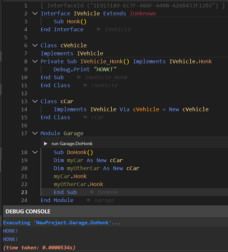

You can see that the Honk method is only implemented by the parent class, then called from the child class when you click the CodeLens button to run the sub in place from the IDE.

#### `Inherits`

This is a more robust option for full inheritance and OOP. It supports `Protected` methods and variables that are accessible to derived classes but not outside callers, `Overridable` and `Overrides` syntax, multiple inheritance, and explicit base class constructors. Sample 23 demonstrates this:

Starting with a base class,

``` vb
Private Class Animal
    Protected _name As String
    Protected _dob As Date  ' date of birth

    Public Event Spoke(ByVal sound As String)

    Public Sub New(name As String, dob As Date)
        _name = name
        _dob = dob
    End Sub

    Public Property Get Name() As String
        Name = _name
    End Property

    Public Property Get DOB() As Date
        DOB = _dob
    End Property

    ' Age in whole years based on DOB and today's date
    Public Function AgeYears() As Long
        Dim y As Long
        y = DateDiff("yyyy", _dob, Date)
        If DateSerial(Year(Date), Month(_dob), Day(_dob)) > Date Then y = y - 1
        AgeYears = y
    End Function

    Public Sub Speak()
        Dim s As String
        s = GetSound()
        RaiseEvent Spoke(s)
        Debug.Print _name & " says: " & s
    End Sub

    ' --- Overridable hook for derived classes ---
    Protected Overridable Function GetSound() As String
        GetSound = ""
    End Function
End Class
```

others can inherit:

``` vb
' ===== Derived: Dog =====
Private Class Dog
    Inherits Animal

    Protected _breed As String

    Public Sub New(name As String, dob As Date, breed As String)
        Animal.New(name, dob)               ' we can explicitly call base constructors from within our constructor
        _breed = breed
    End Sub

    Public Property Get Breed() As String
        Breed = _breed
    End Property

    ' Override:
    Protected Overridable Function GetSound() As String Overrides Animal.GetSound
        GetSound = "woof"
    End Function
End Class

' ===== Further derived: GuardDog (Dog → GuardDog) =====
Private Class GuardDog
    Inherits Dog

    Protected _onDuty As Boolean

    Public Sub New(name As String, dob As Date, breed As String)
        Dog.New(name, dob, breed)           ' we can explicitly call base constructors from within our constructor
        _onDuty = True
    End Sub

    Public Property Get OnDuty() As Boolean
        OnDuty = _onDuty
    End Property
    Public Property Let OnDuty(ByVal v As Boolean)
        _onDuty = v
    End Property

    ' Multi-level override (overriding Dog's override):
    Protected Function GetSound() As String Overrides Dog.GetSound
        If _onDuty Then
            GetSound = "WOOF!"
        Else
            GetSound = "woof"
        End If
    End Function
End Class
```

This is just an excerpt, see the full Sample 23 for additional classes, usage, and information about inheritance in twinBASIC.


## Delegate types for Call By Pointer

There is native support for calling a function by pointer, by way of `Delegate` syntax. A delegate in twinBASIC is a function pointer type that's compatible with LongPtr. `AddressOf` returns a delegate type, that's also backwards compatible with `LongPtr`.

The syntax looks like this:

``` vb
    Private Delegate Function Delegate1 (ByVal A As Long, ByVal B As Long) As Long
    
    Private Sub Command1_Click()
        Dim myDelegate As Delegate1 = AddressOf Addition
        MsgBox "Answer: " & myDelegate(5, 6)
    End Sub
    
    Public Function Addition(ByVal A As Long, ByVal B As Long) As Long
        Return A + B
    End Function
```

The delegate type can also be used in interface/API declarations and as members of a User-defined type, for example, the `ChooseColor` API:

``` vb
Public Delegate Function CCHookProc (ByVal hwnd As LongPtr, ByVal uMsg As Long, ByVal wParam As LongPtr, ByVal lParam As LongPtr) As LongPtr
Public Type CHOOSECOLOR
    lStructSize As Long
    hwndOwner As LongPtr
    hInstance As LongPtr
    rgbResult As Long
    lpCustColors As LongPtr
    Flags As ChooseColorFlags
    lCustData As LongPtr
    lpfnHook As CCHookProc 'Delegate function pointer type instead of LongPtr
    lpTemplateName As LongPtr
End Type
```

If you already have code assigning a `Long`/`LongPtr` to the `lpfnHook` member, it will continue to work normally, but now you can also have the type safety benefits of setting it to a method matching the Delegate:

``` vb
Dim tCC As CHOOSECOLOR
tCC.lpfnHook = AddressOf ChooseColorHookProc

'...

Public Function ChooseColorHookProc(ByVal hwnd As LongPtr, ByVal uMsg As Long, ByVal wParam As LongPtr, ByVal lParam As LongPtr) As LongPtr

End Function
```


## Static linking of OBJ and LIB files

tB allows you to use properly compiled .lib and .obj files as statically linked libraries, using declares similar to DLLs, only referring a lib/obj file in your Miscellaneous files folder of your project. Once the file is in the project, it's set up with this syntax outside of declares, example from the sqlite sample:

``` vb
#If Win64 Then
    Import Library "/Miscellaneous/sqlite3_64.obj" As SQLITE3 Link "stdlib", "kernel32"
#Else
    Import Library "/Miscellaneous/sqlite3_32.obj" As SQLITE3 Link "stdlib", "kernel32"
#End If

Generically:

    Import Libary "Relative resource path" As NAMESPACE Link "dependency1", "dependency2", '...
```

After that, you can use NAMESPACE in place of a DLL name, inside class/module declares:

``` vb
' Compiled sqlite-amalgamation-3440200 (v3.44.2) 
'   using cmdline (MSVC):  cl /c /Gw /Gy /GS- /DSQLITE_OMIT_SEH sqlite3.c
#If Win64 Then
    Import Library "/Miscellaneous/sqlite3_64.obj" As SQLITE3 Link "stdlib", "kernel32"
#Else
    Import Library "/Miscellaneous/sqlite3_32.obj" As SQLITE3 Link "stdlib", "kernel32"
#End If

Module MainModule
    
    Declare PtrSafe Function sqlite3_open CDecl Lib SQLITE3 (ByVal filename As String, ByRef ppDb As LongPtr) As Long
    Declare PtrSafe Function sqlite3_exec CDecl Lib SQLITE3 (ByVal pDb As LongPtr, ByVal sql As String, ByVal exec_callback As LongPtr, ByVal udp As LongPtr, ByRef errmsg As LongPtr) As Long
'...
```

> [!NOTE]
> StdCall names will be mangled with argument sizes, e.g. `int myfunc(int x, short y);` would be `myfunc@6`. It therefore may be better to use `CDecl`.

A documentation page will be dedicated to more fully explaining this in the future; for now if you need help with it, visit the tB Discord or Discussions section of the GitHub repository and ask.

## `Emit()` and Naked functions to insert assembly directly into exe/dll

Raw bytecode can be inserted into a binary with tB's `Emit()` function. To support this functions can be marked as `Naked` to remove hidden tB code. 

For example, the following is an implementation of the InterlockedIncrement compiler intrinsic that replaces the API in Microsoft C/C++ (adds one to `Addend` and returns the result, as an atomic operation which isn't guaranteed with regular code):

``` vb
Public Function InlineInterlockedIncrement CDecl Naked(Addend As Long) As Long
#If Win64 Then
    Emit(&Hb8, &H01, &H00, &H00, &H00) ' mov    eax,0x1
    Emit(&Hf0, &H0f, &Hc1, &H41, &H00) ' lock xadd DWORD PTR [rcx+0x4],eax
    Emit(&Hff, &Hc0)                   ' inc    eax
    Emit(&Hc3)                         ' ret 
#Else
    Emit(&H8b, &H4c, &H24, &H04)       ' mov     ecx, DWORD PTR _Addend$[esp-4]
    Emit(&Hb8, &H01, &H00, &H00, &H00) ' mov     eax, 1
    Emit(&Hf0, &H0f, &Hc1, &H01)       ' lock xadd DWORD PTR [ecx], eax
    Emit(&H40)                         ' inc     eax
    Emit(&Hc3)                         ' ret     0
#End If
End Function
```
(Note: The `CDecl` calling convention is optional; you can write x86 assembly using `_stdcall` and simply omit the notation.)

## Type Inference

Variables can now be declared `As Any` and their type will be inferred, similar to C++'s `auto`.\
`Dim x As Any = 5&` would result in x being a `Long`. 

This is only for the `Dim` statement; arguments cannot be `As Any` except in API declarations.

## New operators
* Bitshift operators ``<<`` and ``>>`` perform left-shift and right-shift operations on a numeric variable. Note that shifts beyond available size result in 0, not wrapping.   

* `vbNullPtr` - Allows passing null pointers to UDT members of APIs/interfaces. The equivalent behavior in VBx is to declare them `As Any` and then pass `ByVal 0` at call sites.

  **Example**
  ``` vb
  Type Foo
     bar As Long
  End Type
  Public Declare PtrSafe Function MyFunc Lib "MyDLL" (pFoo As Foo) As Long
  
  Private Sub CallMyFunc()
      Dim ret As Long = MyFunc(vbNullPtr)
  End Sub
  ```

Additionally, while not strictly new syntax, twinBASIC also adds support for `ByVal Nothing`, to override a `ByRef <interface>` argument and pass a null pointer there.

* Short-circuit conditional operators `OrElse` and `AndAlso`. With the regular `Or` and `And` statements, both sides are evaluated, even when not necessary. With a short circuit operator, if the condition is resolved by the first side, the other side is not evaluated. So if you have:
`If Condition1 OrElse Condition2 Then`, if Condition1 is `True`, then `Condition2` will not be evaluated, and any code called by it will not run. 

* Short-circuit `If()` operator with syntax identical to the tradition `IIf`. This has the additional benefit of not converting variables into a `Variant` if they're the same type; i.e. `If(condition, Long, Long)` the `Long` variables will never become a `Variant`. 

* New assignment operators: `+= -= /= *= ^= &= <<= >>=`

    These are the equivalent of `var = var (operand) (var2)`. So `i += 1` is the equivalent of `i = i + 1`. 

* `IsNot` operator: The logical opposite of the *Is* operator for testing object equivalence. For example, instead of `If (object Is Nothing) = False` you could now write `If object IsNot Nothing Then`. 

## New literals notation

### Binary literals
In addition to `&H` for hexadecimal literals and `&O` for octal notation, twinBASIC also provides `&B` for binary notation. For example, `Dim b As Long = &B010110` is valid syntax, and b = 22.

### Digit grouping
The `&H`, `&O`, and `&B` literals can all be grouped using an underscore, for example, grouping a `Long` by it's constituent binary byte groups: `&B10110101_10100011_10000011_01101110`, or grouping a `LongLong` as two `Long` groups: `&H01234567_89ABCDEF`.

## Thread safety/multithreading support
While there's no native language syntax yet (planned), you can call `CreateThread` directly with no hacks. Previously, VBx and other BASIC languages typically required elaborate workarounds to be able to use `CreateThread` for anything but some specialized, extremely simple things. In twinBASIC, you can call it and all other threading APIs without any special steps, other than of course the careful management of doing threading at a low level like this. 

### Example

In a new Standard EXE project, add a CommandButton and TextBox to your form:

``` vb
Private Declare PtrSafe Function GetCurrentThreadId Lib "kernel32" () As Long

Private Declare PtrSafe Function CreateThread Lib "kernel32" ( _
                        ByRef lpThreadAttributes As Any, _
                        ByVal dwStackSize As Long, _
                        ByVal lpStartAddress As LongPtr, _
                        ByRef lpParameter As Any, _
                        ByVal dwCreationFlags As Long, _
                        ByRef lpThreadId As Long) As LongPtr

Private Declare PtrSafe Function WaitForSingleObject Lib "kernel32" ( _
                        ByVal hHandle As LongPtr, _
                        ByVal dwMilliseconds As Long) As Long

 
    
Private Const INFINITE = -1&
    
Private Sub Command1_Click() Handles Command1.Click
    Dim lTID As Long
    Dim lCurTID As Long
    Dim hThreadNew As LongPtr
    lCurTID = GetCurrentThreadId()
    hThreadNew = CreateThread(ByVal 0, 0, AddressOf TestThread, ByVal 0, 0, lTID)
    Text1.Text = "Thread " & lCurTID & " is waiting on thread " & lTID
    Dim hr As Long
    hr = WaitForSingleObject(hThreadNew, 30000&) 'Wait 30s as a default. You can use INFINITE instead if you never want to time out.
    Text1.Text = "Wait end code " & CStr(hr)
End Sub

Public Sub TestThread()
    MsgBox "Hello thread"
End Sub
```
Under a single-threaded code, if you called `TestThread` before updating `Text1.Text`, the text wouldn't update until you clicked ok on the message box. But here, the message box in launched in a separate thread, so execution continues and updates the text, after which we manually choose to wait for the message box thread to exit.


## Improvements to `AddressOf` 
`AddressOf` can be now be used on class/form/usercontrol members, including from outside the class by specifying the instance. Also, no need for `FARPROC`-type functions, you can use it like `Ptr = AddressOf Func`. So if you have class `CFoo` with member function `bar`, the following is valid:

``` vb
Dim foo1 As New CFoo
Dim lpfn As LongPtr = AddressOf foo1.bar
```

## Enhanced pointer functionality

### `CType(Of )`
The `CType(Of <type>)` operator specifies an explicit intent to cast one type to another. This can be used for casting `LongPtr` (or `Long` on 32bit/`LongLong` on 64bit) to a custom user-defined type, with or without making a copy of it, depending on the usage. This allows not just for casting directly without a `CopyMemory` call, but also, setting the members of a UDT represented only by a pointer, without copying memory back and forth.

Consider the following UDTs:

``` vb
Private Type foo
    a As Long
    b As Long
    pfizz As LongPtr 'A pointer to a variable of type fizz
End Type
Private Type bar
    pfoo As LongPtr 'A pointer to a variable of type foo
End Type
Private Type fizz
    c As Long
End Type
```

The following codes examples work to manipulate the pointers:

``` vb
Sub call1()
    Dim f As foo
    test1 VarPtr(f)
    Debug.Print f.a, f.b
End Sub
Sub test1(ByVal ptr As LongPtr)
    With CType(Of foo)(ptr)
        .a = 1
        .b = 2
    End With
End Sub
```

This will print `1  2`.

``` vb
Sub call2()
    Dim f As foo, b As bar
    b.pfoo = VarPtr(f)
    test2 b
    Debug.Print f.a, f.b
End Sub
Sub test2(b As bar)
    With CType(Of foo)(b.pfoo)
        .a = 3
        .b = 4
    End With
End Sub
```
This will print `3  4`

``` vb
Sub call3()
    Dim f As foo, b As bar, z As fizz
    f.pfizz = VarPtr(z)
    b.pfoo = VarPtr(f)
    test3 b
    Debug.Print z.c
End Sub
Sub test3(b As bar)
    CType(Of fizz)(CType(Of foo)(b.pfoo).pfizz).c = 4
End Sub
```

Free standing use and nesting is also allowed; the above will print `4`. While the examples here are local code only, this is particularly useful for APIs, where you're forced to work with pointers extensively.

### Substitute pointers for UDTs

In both APIs and local methods, any argument taking a user-defined type can instead be passed a `ByVal LongPtr`, with the new special constant `vbNullPtr` used for a null pointer:

``` vb
Public Declare PtrSafe Function CreateFileW Lib "kernel32" (ByVal lpFileName As LongPtr, ByVal dwDesiredAccess As Long, ByVal dwShareMode As Long, lpSecurityAttributes As SECURITY_ATTRIBUTES, ByVal dwCreationDisposition As Long, ByVal dwFlagsAndAttributes As Long, ByVal hTemplateFile As LongPtr) As LongPtr

hFile = CreateFileW(StrPtr("name"), 0, 0, ByVal vbNullPtr, '...)
'---or---
Dim pSec As SECURITY_ATTRIBUTES
Dim lPtr As LongPtr = VarPtr(pSec)
hFile = CreateFileW(StrPtr("name"), 0, 0, ByVal lPtr, '...)
```


## `Len/LenB(Of <type>)` Support
The classic `Len` and `LenB` functions can now be used to directly get the length/size of a type, both intrinsic and user-defined, without needing have declared a variable of that type. For instance, to know the pointer size, you can use `LenB(Of LongPtr)`. 

## Overloading

twinBASIC supports overloading in two ways:

### Overloading by type of argument
The following Subs are valid together in a module/class/etc:

``` vb
Sub foo(bar As Integer)
'...
End Sub

Sub foo(bar As Long)
'...
End Sub

Sub foo(bar As Double)
'...
End Sub
```
The compiler will automatically pick which one is called by the data type.

### Overloading by number of arguments
In addition to the above, you could also add the following:

``` vb
Sub Foo(bar1 As Integer)
'...
End Sub
Sub Foo(bar1 As Integer, bar2 As Integer)
'...
End Sub
```
The compiler will automatically pick which one is called by the number and/or types of arguments.

## Inline variable initialization
You can now set initial values for variables inline, without needing a line-continuation character.

**Examples**

``` vb
Dim i As Long = 1
Dim foo As Boolean = bar()
Dim arr As Variant = Array(1, 2, 3)
Dim strArr(2) As String = Array("a", "b", "c")
Dim cMC As cMyClass = New cMyClass(customConstructorArgs)
```

## Inline variable declaration for `For`
You now no longer need a separate `Dim` statement for counter variables:

``` vb
For i As Long = 0 To 10
    '...
Next
```
is now valid syntax. You can use any type, not just `Long`.

## Generics
Generics have basic support in methods and classes.

``` vb
Public Function TCast(Of T)(ByRef Expression As T) As T
    Return Expression
End Function
```
Which could be used e.g. to return a `Date` typed variable with `TCast(Of Date)("2021-01-01")`

A Class generic allows the type in methods throughout the class. The following example shows this to make a generic List class:

```
[COMCreatable(False)]
Class List(Of T)    
    Private src() As T
    Private c As Long
    Sub New(p() As T)
        src = p
    End Sub
    [DefaultMember]
    Function GetAt(ByVal idx As Long) As T
        Return src(idx)
    End Function
    Public Property Get Count() As Long
        Return c
    End Property
End Class
```

This could then be used as follows:

``` vb
Private Sub TestListGenericClass()
    Dim names As List(Of String) = New List(Of String)(Array("John", "Smith", "Kane", "Tessa", "Yoland", "Royce", "Samuel"))
    Dim s As String = names(0)
    Debug.Print s
End Sub
```

## Enhancements to API/method declarations
### `DeclareWide` 
The `DeclareWide` keyword, in place of `Declare`, disables ANSI<->Unicode conversion for API calls. This applies both directly to arguments, and to String arguments inside a UDT. For example, the following are equivalent in functionality:

``` vb
Public Declare PtrSafe Sub FooW Lib "some.dll" (ByVal bar As LongPtr)
Public DeclareWide PtrSafe Sub Foo Lib "some.dll" Alias "FooW" (ByVal bar As String)
```
Both represent a fully Unicode operation, but the allows direct use of the `String` datatype without requiring the use of `StrPtr` to prevent conversion. 

> [!WARNING]
> This does **not** change the underlying data types-- the `String` type is a `BSTR`, not an `LPWSTR`, so in the event an API returns a pre-allocated `LPWSTR`, rather than filling a buffer you have created, it will not provide a valid `String` type. This would be the case where an API parameter is given as `[out] LPWSTR *arg`.

### `CDecl` support
The cdecl calling convention is supported both for API declares and methods in your code. This includes DLL exports in standard DLLs. Examples:

``` vb
Private DeclareWide PtrSafe Function _wtoi64 CDecl Lib "msvcrt" (ByVal psz As String) As LongLong`
```

```
[ DllExport ]
Public Function MyExportedFunction CDecl(foo As Long, Bar As Long) As Long
```

Support for callbacks using `CDecl` is also available. You would pass a delegate that includes `CDecl` as the definition in the prototype. Here is an example code that performs a quicksort using the [`qsort` function](https://learn.microsoft.com/en-us/windows/win32/api/winuser/nf-winuser-wsprintfw):

``` vb
Private Delegate Function LongComparator CDecl ( _
    ByRef a As Long, _
    ByRef b As Long _
) As Long

Private Declare PtrSafe Sub qsort CDecl _
Lib "msvcrt" ( _
    ByRef pFirst As Any, _
    ByVal lNumber As Long, _
    ByVal lSize As Long, _
    ByVal pfnComparator As LongComparator _
)

Public Sub CallMe()
    Dim z() As Long
    Dim i As Long
    Dim s As String
    
    ReDim z(10) As Long
    For i = 0 To UBound(z)
        z(i) = Int(Rnd * 1000)
    Next i
    qsort z(0), UBound(z) + 1, LenB(z(0)), AddressOf Comparator
    For i = 0 To UBound(z)
        s = s & CStr(z(i)) & vbNewLine
    Next i
    MsgBox s
End Sub

Private Function Comparator CDecl( _
    ByRef a As Long, _
    ByRef b As Long _
) As Long
    Comparator = a - b
End Function
```

### Support for passing User-Defined Types ByVal

Simple UDTs can now be passed ByVal in APIs, interfaces, and any other method. In VBx this previously required workarounds like passing each argument separately.

```vb
Public Declare PtrSafe Function LBItemFromPt Lib "comctl32" (ByVal hLB As LongPtr, ByVal PXY As POINT, ByVal bAutoScroll As BOOL) As Long

Interface IDropTarget Extends stdole.IUnknown
    Sub DragEnter(ByVal pDataObject As IDataObject, ByVal grfKeyState As KeyStateMouse, ByVal pt As POINT, pdwEffect As DROPEFFECTS)
```

and so on. For this feature, a "simple" UDT is one that does not have members that are reference counted or are otherwise managed in the background, so may not contain interface, String, or Variant types. They may contain other UDTs.

### Variadic Arguments support
With `cdecl` calling convention fully supported, twinBASIC can also handle variadic functions. In C/C++, those functions contain an ellipsis `...` as part of their arguments. This is represented in tB As `{ByRef | ByVal} ParamArray ... As Any()`. Note that `ByRef` or `ByVal` must be explicitly marked; implicit `ByRef` is not allowed.

Using the [given C/C++ prototype](https://learn.microsoft.com/en-us/windows/win32/api/winuser/nf-winuser-wsprintfw):

``` cpp
int WINAPIV wsprintfW(
  [out] LPWSTR  unnamedParam1,
  [in]  LPCWSTR unnamedParam2,
        ...     
);
```

The twinBASIC declaration and function using it can be written as shown:

``` vb
Private DeclareWide PtrSafe Function wsprintfW CDecl _
Lib "user32" ( _
  ByVal buf As String, _
  ByVal format As String, _
  ByVal ParamArray args As Any() _
) As Long
    
Private Sub Test()
  Dim buf As String = Space(1024)
  wsprintfW(buf, "%d %d %d", 1, 2, 3)
  MsgBox buf
End Sub
```

For functions which contain the `va_list` type as part of their arguments the ParamArray declaration must be `ByRef`

### `[PreserveSig]`
The `[PreserveSig]` attribute was described earlier for COM methods, but it can also be used on API declares. For APIs, the default is `True`. So therefore, you can specify `False` in order to rewrite the last parameter as a return. Example:

``` vb
Public Declare PtrSafe Function SHGetDesktopFolder Lib "shell32" (ppshf As IShellFolder) As Long
```
can be rewritten as
```
[PreserveSig(False)] 
Public Declare PtrSafe Function SHGetDesktopFolder Lib "shell32" () As IShellFolder`
```


## Loop control
The following new statements are available for controlling the procession of loops:

* `Continue For` - Proceed to the next iteration (or end) of `For` loop.
* `Continue While` - Proceed to the next iteration (or end) of `While` loop.
* `Continue Do` - Proceed to the next iteration of `Do` loop.
* `Exit While` - Exit a `While` loop immediately.

## `Return` syntax for functions.
You can now combine assigning a return value and exiting a function into a single statement like many other languages allow. This is accomplished with the `Return` keyword:

``` vb
Private Function Foo() As Long
Dim i As Long = 1
If i Then
    Return i
End If
End Function
```
this is the equivalent of

``` vb
Private Function Foo() As Long
Dim i As Long = 1
If i Then
    Foo = i
    Exit Function
End If
End Function
```
`Return` can be used for objects as well. It is currently only valid with a value specified and within a function; you cannot use `Return` without anything after it in a sub.

## New class member handler syntax
You can now separate the name of method from the class member it applies to.

### `Handles` for events
For events events on Forms, UserControls, and event-raising objects, you can define any method as the handler, rather than need to name it as `Object_Event()`, by following it with `Handles Object.Event`. For example, in a form, instead of `Private Sub Form_Load()` you could handle the `Load` event with `Private Sub OnLoad() Handles Form.Load`. 

### `Implements` for interfaces
Similar to the above, for forms/UCs/classes that use `Implements`, you can use `Sub Bar() Implements IFoo.Bar`. Note that you can specify more than one implemented method; for more information, see the Enhancements to Implements subsection of the Interfaces and Coclasses section detailing the new in-language syntax for defining these.

> [!NOTE]
> These are opt-in and optional\
> For compatibility, twinBASIC will always continue to support the traditional syntax for event handling and Implements, and you're not required to use this new syntax (or *any* of the additions described in this article). Whether or not automatically created prototypes use this syntax is controlled via IDE Options: "IDE: Use new handles/implements syntax".

## Enhancements to user-defined types (UDTs)

### Procedures and events

You can now place methods inside UDTs, as well as API declarations. With APIs, if the first parameter is named `Me` and is the same type as the UDT, it's treated as an implicit member call,

``` vb
Type HWND
   Value As LongPtr ' the raw HWND
   Public DeclareWide PtrSafe Function BringWindowToTop Lib "user32" (ByVal Me As HWND) As Long
End Type
'...
myHwnd.BringWindowToTop()
```

There's also associated events, including a constructor and destructor that make it possible to create lightweight objects, like a C++ class;
``` vb
Type myType
    a As Long

    Private Sub Type_Initialize()
        ' NOTE: currently you can only access the UDT members using the "Me." prefix
    End Sub

    Private Sub Type_Assignment(ByVal RHS As Variant)    ' TIP: You can change the RHS type, and you can define multiple assignment functions
        ' NOTE: currently you can only access the UDT members using the "Me." prefix
    End Sub

    Private Function Type_Conversion() As Variant ' TIP: you can change the return type here, and you can define multiple conversion functions
        ' NOTE: currently you can only access the UDT members using the "Me." prefix
    End Function

    Private Function Type_DebugView() As String
        ' NOTE: currently you can only access the UDT members using the "Me." prefix
    End Function

    Private Sub Type_Terminate()
        ' NOTE: currently you can only access the UDT members using the "Me." prefix
    End Sub

End Type
```

UDTs of these types are still stack allocated structs that can be used with standard Win32 APIs.


### Custom UDT packing
If you've done extensive work with the Windows API, every so often you'll come across user-defined types that have an extraneous member added called pad, padding, reserved, etc, that doesn't appear in the documentation for that type. This is the result of the UDT applying packing rules different from the default. By default, UDTs have hidden spacing bytes that make their largest sized member appear at a multiple of it's size, and making the entire UDT be a multiple of that size. Consider the following UDT:
``` vb
Private Type MyUDT
    x As Integer
    y As Long
    z As Integer
End Type
Private t As MyUDT
```
If you ask for `Len(t)`, you get 8-- the sum of 2x2-byte Integers and 1 4-byte Long. But if you ask for `LenB(t)`, you get 12. This is because the largest size type is 4, so that's the packing alignment number. Each Long must appear at a multiple of 4 bytes, so 2 byte of hidden padding is inserted between x and y. You can see this for yourself by checking `VarPtr(t.y) - VarPtr(t)`. This gives you the starting offset of `y`-- which is 4, not 2 like you'd get if it immediately followed `x`. Finally, with the hidden 2 bytes, we're now up to 10 bytes. But the total UDT size must be a multiple of 4, so 2 more hidden bytes are added on the end.\
Some API UDTs will look like `MyUDT` is correct, but you'll see it defined in VBx as 2 Longs-- which gets the required 8 bytes, with some special handling for the first member. If you refer back to the original C/C++ header, you'll find, for this situation, something like `#include <pshpack1.h>` or `#pragma pack(push,1)` somewhere before the UDT. This manually alters the packing rule to insert no hidden bytes anywhere.\
In twinBASIC, instead of two Longs and having to worry about getting the first one right when it's not an Integer, you can use the original definition with:
```
[PackingAlignment(1)]
Private Type MyUDT
    x As Integer
    y As Long
    z As Integer
End Type
Private t As MyUDT
```
You'll now find that both `Len(t)` and `LenB(t)` are 8. **NOTE:** Alignment, not packing alignment, is not set this way-- specifying 16 would not get you a 16-byte structure for `t`. twinBASIC does not currently have an equivalent for `__declspec_align(n)`, but such a feature is planned. This is very, very rare outside kernel mode programming.

## Block and inline comments

You can now use `/* */` syntax. For example, `Sub Foo(bar As Long /* out */)` or:

```c
/*
Everything here is
a comment until:
*/
```


## Destructuring assignment support for arrays
This feature allows you to assign the contents of an array to multiple variables in a single line:

``` vb
    Dim a As Long, b As Long, c As Long
    Dim d(2) As Long
    d(0) = 1
    d(1) = 2
    d(2) = 3
    Array(a, b, c) = d
    Debug.Print a, b, c
```

This would print `1   2   3`. You could also assign multiple variables at once like this and get the same result:

``` vb
    Dim a As Long, b As Long, c As Long
    Array(a, b, c) = Array(1, 2, 3)
    Debug.Print a, b, c
```

You can now also do assignments like this:

``` vb
    Dim a As Long = 9
    Dim b As Long = 7
    Dim c() As Long = Array(a, b)
    Debug.Print c(1), UBound(c)
```

Which prints `7    1`.


## Direct access to COM error handling
You can retrieve the last `HRESULT` to a COM interface call via `Err.LastHResult`; these are usually hidden and mapped to internal errors-- everything in a COM interface normally called a `Sub` is actually an `HRESULT`-returning function.

More importantly, you can now **set** the `HRESULT` in interface implementations with `Err.ReturnHResult`. This was a critical missing feature for which sometimes Err.Raise would work, but mostly programmers resorted to complicated vtable-swapping code to redirect to a standard module function. For instance you can now return `S_FALSE` where expected with `Err.ReturnHResult = S_FALSE`.

## Module-level definitions not limited to top
It's now possible to insert module-level code in between methods or properties. Where previously all `Declare` statements, `Enum`, `Type`, etc had to appear prior to the first `Sub/Function/Property`, the following would now be valid:

``` vb
Private Const foo = "foo"
Sub SomeMethod()
'...
End Sub
Private Const bar = "bar"
Sub SomeOtherMethod()
'...
End Sub
```

## Preset methods for code part names
The following can be used and what they represent will be automatically inserted as a `String`:

* `CurrentComponentName`, e.g. "Form1"
* `CurrentProcedureName`, e.g. "Foo" when in `Sub Foo()`
* `CurrentProjectName`, 
* `CurrentSourceFile`
* `CurrentComponentCLSID`


## Removal of limits on line continuations, procedure size, etc.
twinBASIC imposes no artificial limitations on those, number of controls on a form, module size, and more.

## Parameterized class constructors.
Classes now support a `New` sub with ability to add arguments, called as the class is constructed prior to the `Class_Initialize` event. For example a class can have:

```
[ComCreatable(False)]
Class MyClass
Private MyClassVar As Long
Sub New(Value As Long)
MyClassVar = Value
End Sub
End Class
```

then created by `Dim mc As MyClass = New MyClass(123)` which sets `MyClassVar` on create. Note: Classes using this must be private, have the `[ComCreatable(False)]` attribute, or also contain `Class_Initialize()`. `Class_Initialize()` will replace `New` in callers of a compiled OCX. Within the project, only `New` will be used if present.

## `Private`/`Public` modifiers for modules and classes
A private module or class won't have it's members entered into the type library in an ActiveX project.

## `ReadOnly` variables
In a class, module-level variables can be declared as `ReadOnly`, e.g. `Private ReadOnly mStartDate As Date`. This allows more complex constant assignments: you can use a function return to set it inline, `Private ReadOnly mStartDate As Date = Now()`, or `ReadOnly` constants can be set in `Class_Initialize` or `Sub New(...)` (see parameterized class constructors above), but everywhere else, they can only be read, not changed.

## Exported Functions and Variables
It's possible to export a function or variable from standard modules, including with CDecl, e.g.

```
[DllExport]
Public Const MyExportedSymbol As Long = &H00000001

[DllExport]
Public Function MyExportedFunction(ByVal arg As Long) As Long

[DllExport]
Public Function MyCDeclExport CDecl(ByVal arg As Long)
```

This is primary used to create Standard DLLs (see next section), but this functionality is also available in Standard EXE and other compiled project types.

# Project Configuration
## Built in support for making Standard DLLs
While it was possible to accomplish this via hacks previously, tB offers it as a built in project type. You can choose this project type at startup, then you simply need to mark functions with `[DllExport]` when you want them exported. The name will be used as-is, it will not be mangled. The `CDecl` calling convention is supported with the normal syntax, e.g. `Public Function foo CDecl(bar As Long) As Long`.\
Standard DLLs in twinBASIC can still specify a startup point; each export will then check if this code has run yet, and if not, run it.

## Built in support for making Console Applications
This project type allows making a true console project rather than a GUI project.  Helpfully, it will also add a default `Console` class for reading/writing console IO and provided debug console.

## Built in support for easily making services.
tB has a services package (WinServicesLib) that makes creating full featured true services a breeze. It simplifies use of MESSAGETABLE resources, multiple services per exe, named pipes for IPC, and more. See samples 21-22.

## Built in support for making Kernel-Mode Drivers.
Kernel mode drivers can only access a very limited subset of the API, and can't call usermode DLLs like a runtime. So it would typically require elaborate hacks and dramatically limit what you could do in prior BASIC products, if possible at all. And of course, there's no WOW64 layer for kernel mode, so tB is the first BASIC product to support making drivers for 64bit Windows. This is controlled by the 'Project: Native subsystem' option, as well as the following two features.

## Built in support for overriding entry point.
BASIC applications typically have a hidden entry point that is the first to run, before `Sub Main` or the startup form's `Form_Load`. This sets up features of the app like initializing COM. twinBASIC supports overriding this and setting one of your own procedures as the true entry point. This is mostly useful for kernel mode projects, which must have a specific kind of entry point and can't call the normal APIs in the default. But there are other reasons you might want to use this option, but be warned: Many things will break in a normal application if you don't do the initialization procedures yourself or understand precisely what you can't use. 

## Place API declares in the IAT
tB has the option to put all API declares in the import address table rather than call them at runtime via `LoadLibrary/GetProcAddress` like VBx (which puts TLB-declared APIs in the import table; tB replicates this too but further provides an option for in-project declares).

This has a small performance advantage in that it's loaded  and bound at startup rather than on the first call, but the primary use is for kernel mode, which cannot call `LoadLibrary` and other user mode APIs to use late binding.


## Register ActiveX builds to `HKEY_LOCAL_MACHINE` or `HKEY_CURRENT_USER` option.
While modern applications use `HKEY_CURRENT_USER`, for VBx compatibility components must be registered to `HKEY_LOCAL_MACHINE`. Note that this requires running as admin when registering.

## Registration at build time is optional
tB provides the Project: Register DLL after build option so you can disable automatic registration, if for example you wanted to move the file first.


# Standard Library Enhancements

## Unicode support
Native functions that take string arguments, such as `MsgBox` and FileSystem functions (e.g. `Open`, `Dir`, `Mkdir`, `Kill`, and `RmDir`) now support Unicode. Additionally, .twin files make this easy to use as the editor supports Unicode as well. So you can paste a Unicode string in the editor, see it appear correctly, then have the same string correctly displayed by tB functions and controls.

### Encoding options for file i/o

The `Open` statement supports Unicode through the use of a new `Encoding` keyword and variable, and allows you to specify a wide range of encoding options in addition to standard Unicode options.

Usage example:

``` vb
Open "C:\MyFile.txt" For Input Encoding utf-8 As #1
```

The full list of encoding options currently defined (and don't worry, these will come up in Intellisense) is: `default_system_ansi`, `utf_7`, `utf_7_bom`, `utf_8`, `utf_8_bom`, `utf_16`, `utf_16_bom`, `us_ascii`, `koi8_u`, `koi8_r`, `big5`, `iso_8859_1_latin1`, `iso_8859_2_latin2`, `iso_8859_3_latin3`, `iso_8859_4_latin4`, `iso_8859_5_cyrillic`, `iso_8859_6_arabic`, `iso_8859_7_greek`, `iso_8859_8_hebrew`, `iso_8859_9_latin5_turkish`, `iso_8859_10_latin6_nordic`, `iso_8859_11_thai`, `iso_8859_13_latin8_baltic`, `iso_8859_14_latin8_celtic`, `iso_8859_15_latin9_euro`, `iso_8859_16_latin10_balkan`, `windows_1250_central_europe`, `windows_1251_cyrillic`, `windows_1252_western`, `windows_1253_greek`, `windows_1254_turkish`, `windows_1255_hebrew`, `windows_1256_arabic`, `windows_1257_baltic`, `windows_1258_vietnamese`, `ibm_850_western_europe`, `ibm_852_central_and_eastern_europe`, `ibm_855_cyrillic`, `ibm_856_hebrew`, `ibm_857_turkish`, `ibm_858_western_europe`, `ibm_860_portuguese`, `ibm_861_icelandic`, `ibm_862_hebrew`, `ibm_863_canadian`, `ibm_865_danish`, `ibm_866_cyrillic`, `ibm_869_greek`, `ibm_932_japanese`, and `ibm_949_korean`.

Others with a similar format should be accepted depending on system support.

## New Built-in functions:

In addition to the new datatype-related and component name functions already described, the standard builtin `VBA` library now includes:

* `IsArrayInitialized(variable)` - Determines if an array is initialized. Note: A `Variant` declared as empty array with `Array()` will return `True`. 
* `RGBA(r, g, b, a)` - Like the `RBG()` function, only including the alpha channel.
* `RBG_R(rgba)`, `RGB_B(rgba)`, `RBG_G(rgba)`, and `RGBA_A(rgba)` - Get the values for individual channels.
* `TranslateColor(ColorValue, Optional Palette)` - Translates an OLE color value to an RGB color.
* `ProcessorArchitecture()` - Returns either `vbArchWin32` or `vbArchWin64`, depending on application bitness.
* `CallByDispId(Object, DispId, CallType, Arguments)` - Similar to `CallByName()`, but uses the dispatch id instead of method name.
* `RaiseEventByName(Object, Name, Args)` - Invokes an event on class, using arguments specified as a single `Variant` containing an array.
* `RaiseEventByName2(Object, Name, Arg1, Arg2, ...)` - Invokes an event on class, using arguments specified as a ParamArray.
* `PictureToByteArray(StdPicture)` - Converts a picture to a byte array; Global.LoadPicture supports loading from byte arrays.
* `CreateGUID()` - Returns a string with a freshly generated GUID.
* `AllocMem(size)` and `FreeMem` - allocate and free memory from the process heap.
* `Int3Breakpoint` - Inserts a true breakpoint helpful for attached external debuggers.
* `GetDeclaredTypeProgId(Of T)` / `GetDeclaredTypeClsid(Of T)` generics for getting strings of ProgID/CLSID.
* `GetDeclaredMinEnumValue(Of T)` / `GetDeclaredMaxEnumValue(Of T)` generics
* Some `Interlocked*` functions

### Built in runtime functions and redirects from msvbvm60.dll

tB has built in support for some of the most commonly used runtime functions, for compatibility. These all support both 32 and 64bit. Unless otherwise noted, all of these function in two ways: First, built in native versions that are always present (unless you remove the basic compiler packages), with the most common arrangements of arguments. These don't require a `Declare` statement. If you *do* provide a `Declare` version, tB will allow whatever arrangements of arguments you specify (e.g. `As Any` instead of `As LongPtr`), mapped to an alias if provided.

* Memory functions: `GetMem1`, `GetMem2`, `GetMem4`, `GetMem8`, `PutMem1`, `PutMem2`, `PutMem4`, `PutMem8` with new additions `GetMemPtr` and `PutMemPtr` pegged to the current pointer size.
* `vbaObjSet`, `vbaObjSetAddref`, `vbaCastObj`, and `vbaObjAddref` for manipulating object assignments through pointers.
* `vbaCopyBytes` and `vbaCopyBytesZero`
* `vbaAryMove` and `vbaRefVarAry` (currently only with a `Declare` statement).
* tB also has an instrinsic `VarPtr` but will still redirect calls via a declare statement, e.g. aliases used for arrays (though tB's `VarPtr` supports arrays natively).

### New `App` object properties

* `App.IsInIDE` - `True` when running from the IDE.
* `App.IsElevated` - Returns whether the program is currently running with administrator rights.
* `App.LastBuildPath` - Returns the full path of the last build. Does not persist between compiler/IDE restarts.
* `App.Build` - For the additional version number field.
* `App.ModulePath` - Returns the full path of the currently executing module. For example, if placed in a DLL and called from an EXE, the path of the DLL would be returned. Also, the twinBASIC debugger DLL is given when running from the IDE, when the method is in the app itself.

# GUI components 

## Support for modern image formats
You no longer face an incredibly limited format selection for images in tB Forms and Controls; not only do the Bitmap and Icon formats support the full range of formats for those, you can additionally load PNG Images, JPEG Images, Metafiles (.emf/.wmf), and SVG Vector Graphics (.svg). 

### Improved `LoadPicture`
Additionally, `LoadPicture` can load all image types directly from a byte array, rather than requiring a file on disk. You can use this to load images from resource files or other sources. Note that if your projects references stdole2.tlb (most do), currently you must qualify it as `Global.LoadPicture` to get tB's custom binding that supports byte arrays.

### High quality scaling in Image controls
Image controls now offer a `StretchMode` property that allows you to choose Bilinear, Bicubic, Lanczos3 and Lanczos8 strectching algorithms, which are far superior to the default stretching algorithm. These use built in algorithms so do not add additional depencies or API calls.

## Transparency and Alpha Blending on Forms

## Form.TransparencyKey
This new property specifies a color that will be transparent to the window below it in the z-order (all windows, not just in your project). Setting this property will cause the specified color to be 100% transparent. A Shape control with a solid `FillStyle` is a helpful tool to color the areas of the form in the key color.

## Form.Opacity

This sets an alpha blending level for the entire form. Like transparency, this is to all windows immediately underneath it. Note that any areas covered by the `TransparencyKey` color will remain 100% transparent.

The following image shows a Form with a `TransparencyKey` of Red, using a Shape control to define the transparent area, while also specifying 75% `Opacity` for the entire form:

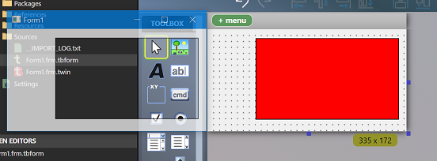

## Additional Form features

In addition to the above, forms have:

* `DpiScaleX`/`DpiScaleY` properties to retrieve the current values 
* `.MinWidth`, `.MinHeight`, `.MaxWidth`, and `.MaxHeight` properties so subclassing isn't needed for this 
* `Form.TopMost` property.
* Control anchoring: control x/y/cx/cy can made relative, so they're automatically moved/resized with the Form. For example if you put a TextBox in the bottom right, then check the Right and Bottom anchors (in addition to Top and Left), the bottom right will size with the form on resize. This saves a lot of boiler-plate sizing code. 
* Control docking: Controls can be fixed along one of the sides of the Form (or container), or made to fill the whole Form/container. Multiple controls can be combined and mixed/matched in docking positions.

For more information on Control Anchoring and Control Docking, see the Wiki entry [Control Anchoring and Docking ‐ Automatic size and position management](Anchoring-Docking).

## Unicode support
All tB-implemented controls support Unicode, both in the code editor and when displayed.

**Important:** If you subclass controls, note that this means you will receive the Unicode (W) version of window messages, e.g. ListViews will send `LVN_GETDISPINFOW (LVN_FIRST - 77)` instead of `LVN_GETDISPINFOA (LVN_FIRST - 50)`. 

## UserControl Enhancements

The UserControl object now provides the new Boolean property `PreKeyEvents` that enables corresponding new events `PreKeyDown` and `PreKeyUp`. These allow handling special keys like tab, arrows, etc without OS or COM hooks (for example, based on the `IOleInPlaceActiveObject` interface). These work with all child windows inside the UserControl, including ones created by `CreateWindowEx`. You can also access raw message data in the `PreKeyDown`/`PreKeyUp` event handlers with the new `PreKeyWParam`/`PreKeyLParam` and `PreKeyTargetHwnd` UserControl properties.


## Control Modernization

tB will eventually replace all built in controls that you're used to, for now the ones available are: CommandButton, TextBox, ComboBox, CheckBox, OptionButton, Label, Frame, PictureBox, Line, Shape, VScrollBar, HScrollBar, Timer, DriveListBox, DirListBox, FileListBox, Image, and Data from the basic set; then, ListView, TreeView, ProgressBar, DTPicker, MonthView, Slider, and UpDown from the Common Controls.

* Controls support x64: Every control can be compiled both as 32bit and 64bit without changing anything.\
* Controls are DPI aware: They will automatically size correctly when dpi awareness is enabled for your app.\
* Controls support Visual Styles per-control: Comctl6 styles can be applied, or not, on a control-by-control basis with the `.VisualStyles` property.

### Alternatives for unimplemented controls

The best option is Krool's VBCCR and VBFlexGrid projects. These are now available [from the Package Server](../Packages/Importing-TWINSERV/) in x64-compatible form, and are also DPI aware and support Visual Styles. 

Additionally, the original OCX controls provided by Microsoft will work fine; however, they're mostly 32-bit only. The x64 version of `MSComCtl.ocx` doesn't come with Windows and isn't legally redistributable but if you have Office 64bit, it works in tB.

## Misc additional control properties and enhancements

* `TextBox.NumbersOnly` property: Restricts input to 0-9 by setting the `ES_NUMBER` style on the underlying control.

* `TextBox.TextHint` property: Sets the light gray hint text in an empty TextBox (`EM_SETCUEBANNER`). 

* `PictureDpiScaling` property for forms, usercontrols and pictureboxes: PictureDpiScaling property allows you to turn off DPI scaling of images so that they display at 1:1 rather than allowing the OS to stretch them.  The idea being you may want to choose a different bitmap manually, rather than apply the somewhat limited OS-stretching.

* `Label.VerticalAlignment` property: Defaults to Top.

* `Label.LineSpacing` property (in twips, default is 0)

* `Label.Angle` property (in degrees, rotates the label text)

* `Label.BorderCustom` property (has suboptions to set size, padding and color of borders independently for each side). 

* `Timer.Interval` can now be set to any positive `Long` instead of being limited to 65,535.

* `StrConv()` now has `vbUTF8` / `vbFromUTF8`

## New Controls

### QR Code Control
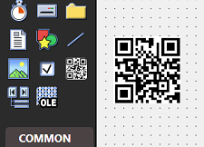

Easily display custom QR codes with a native control.

### Multiframe Control
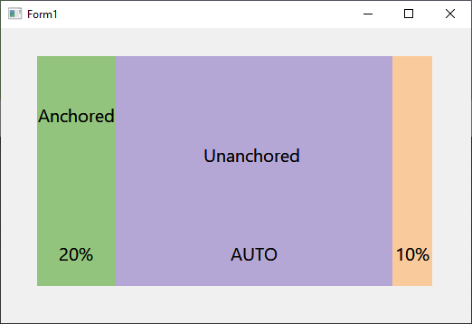

This control allows you to create a number of frames within it with their size specified as a percentage, such that as the control is resized the frames within expand proportionally. For details and a video demonstration, Mike Wolfe's twinBASIC Weekly Update [covered it when released](https://nolongerset.com/twinbasic-update-april-29-2025/#experimental-multi-frame-control).\
Combined with anchors and docking, this allows designing highly functional and complex layouts visually, without writing any code to handling resizing.

### CheckMark Control
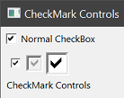

Primarily intended for reports but available in Forms and UserControls as well, the CheckMark control provides a scalable check component where this is fixed to a single size in a normal CheckBox control.

# Design Experience and Compiler Features

## Customize COM initialization 
You can specify the call used by the hidden entry point with the following options: `CoInitialize STA`, `CoInitializeEx MTA`, `OleInitialize STA`. If you don't know the difference, don't change it from the default.

## Customize symbol table parameters

You can adjust the following parameters: Max Size Raw, Max Size Lookup, and Data Type Lookup. These options allow for compiling very large projects that would otherwise have issues, and the compiler will notify you if these values need to be increased.

## Sanitize Boolean types
Under the hood, a Boolean is a 2-byte type. With memory APIs, or when receiving these from outside code, it's possible to store values other than the ones representing `True` and `False`. This option validates Booleans from external sources, e.g. COM objects and APIs, to ensure only the two supported values are stored.

## Stale/dangling pointer detection

Bugs result from using Strings and Variants after they have been freed. It may not be noticed immediately if the memory has not been overwritten, but it's sometimes hard to detect and can cause issues like a String displaying it's previous value or garbage. This debugging option detects use-after-free, and replaces the data with a special symbol indicating the problem. Below shows an example where the ListView ColumnHeader text had been set by previously-freed string and detected by this feature:

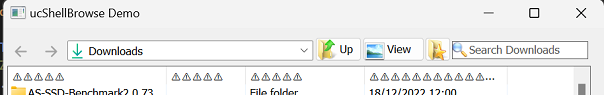

Previously, it had shown the same text for every column-- but only under certain circumstances, leading to the issue being overlooking for a long time. 

## Additional compiler options

- Projects can be marked `LARGEADDRESSAWARE`.

- A manual base address can be specified

- Option to strip PE relocation symbols 

### Exploit mitigation

You can enable the following:

Data execution prevention (DEP)

Address-space layout randomization (ASLR)

## Debug Trace Logger
New to the debugging experience is a powerful trace logging feature that can automatically create detailed logs to either the debug console or a file. Messages can be output to the new system with `Debug.TracePrint`. The logger works both when running from the IDE and in compiled executables.

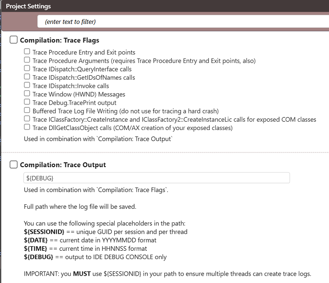

## Compiler Warnings

twinBASIC provides compiler warnings during design time for common bad practices or likely oversights, including:
*  Warnings for likely-incorrect hex literals\
Non-explicit values are coerced into the lowest possible type first. So if you declare a constant as `&H8000`, the compiler sees it as an -32,768 `Integer`, and when you're putting that into a `Long` you almost certainly do not want -32,768, you want **positive** 32,768, which requires you to instead use `&H8000&`.\
This warning is supplied for `&H8000`-`&HFFFF` and `&H80000000`-`&HFFFFFFFF`.

*  Warnings for implicit variable creation with `ReDim`.\
When you use `ReDim myArray(1)`, the `myArray` variable is created for you, when it's good practice to declare all variables first.

*  Warnings for use of `DefType`\
This feature is discouraged for it making code difficult to read and prone to difficult to debug errors.

The full list can be found in your project's Settings page:\
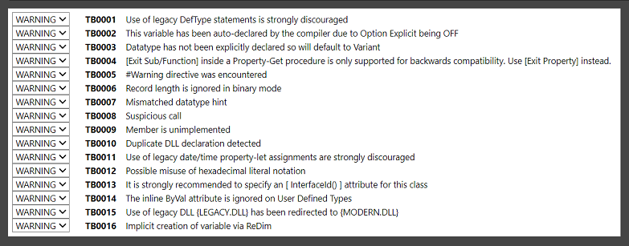

### Adjusting warnings
Each warning has the ability to set them to ignore or turn them into an error both project-wide via the Settings page, and per-module/class, and per-procedure with `[IgnoreWarnings(TB___)]`, `[EnforceWarnings(TB____)]`, and `[EnforceErrors(TB____)]` attributes, where the underscores are replaced with the **full** number, e.g. `[IgnoreWarnings(TB0001)]`; the leading zeroes must be included.

### Strict mode

twinBASIC has added the following warning messages to support something similar to .NET's Strict Mode, where certain implicit conversions are not allowed and must be made explicit. By default, these are all set to be ignored, and must be enabled in the "Compiler Warnings" section of Project Settings or per-module/procedure with `[EnforceWarnings()]`. All of these can be configured individually and ignored for procedure/module scope with `[IgnoreWarnings()]`

**TB0018: Impicit narrowing conversion**\
Such as converting a Long to Integer; if you have `Dim i As Integer, l As Long` then `i = l` will trigger the warning, and `i = CInt(l)` would be required to avoid it.

**TB0019: Implicit enumeration conversion**\
When assigning a member of one Enum to a variabled typed as another, such as `Dim day As VbDayOfWeek: day = vbBlack`. The `CType(Of <type>)` operator whose use in pointers was described in the previous section is also used to specify an explicit type conversion in this case; the warning would not be triggered by `day = CType(Of VbDayOfWeek)(vbBlack)`.

**TB0020: Suspicious interface conversion**\
If a declared coclass doesn't explicitly name an interface as supported, converting to it will trigger this warning, e.g.

``` vb
Dim myPic As StdPicture
Dim myFont As StdFont
Set myFont = myPic
```

You'd use `Set myFont = CType(OfStdFont)(myPic)` to avoid this warning.

**TB0021: Implicit enumeration conversion to/from numeric**
Triggered by assigning a numeric literal to a variabled typed as an Enum, such as `Dim day As VbDayOfWeek: day = 1`. To avoid it you'd use `day = CType(Of VbDayOfWeek)(1)`.

## Run some Subs from the IDE

The CodeLens feature allows running Subs and Functions, with no arguments and in modules (but not classes/Forms/UserControls) right from the editor without starting the full program. It has robust access to your code; it can access constants, call other functions both instrinsic and user-define, call APIs, and print to the Debug Console.\
Methods eligible to run with CodeLens (when enabled), have a bar above them that you can click to run:\
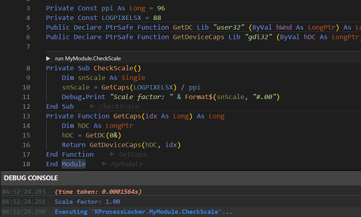


## Modern IDE features

While the twinBASIC IDE still has a lot of work planned, it already includes a number of features that make life much easier found in other modern IDE, but not the ancient VBx IDEs, including:

* Fully theme-able, with Dark (default), Light, and Classic (Light) built in, and an easy inheritance-based system to add your own themes via CSS files.

* Code folding, with foldable custom-defined regions via `#Region "name" ... #End Region` blocks.

* Fully customizable keyboard shortcuts covering all commands, with ability to save and switch between different sets.

* Sticky-scroll, which keeps context lines at the top showing major sections of code like module, region, method, `With` blocks, etc.

* Indent guides, lines drawn along common indent points to help line things up right.

* Auto-indent on paste.

* Paste as comment.

* Full Unicode support in .twin files, so you can use the full Unicode range of the font in your comments and strings.

* Inline code hints, which provide annotations at the end of blocks for what the block is (see picture).

* Code mini-map, shows a graphics overview of the code structure alongside the scroll bar, helping to guide your scrolling.

* Advanced Information popup, which shows offsets for UDT members, their total size via both `Len()` plus `LenB()`, and their alignment; and v-table entry offsets for interfaces and classes, as well as their inheritance chain.

* A type library viewer for controls and TLB files that displays the full contents in twinBASIC-style syntax rather than ODL.

* Color-matching for parentheses and brackets.

* A History panel containing a list of recently modified methods.

* An Outline panel with selectable categories.

* Problems panel, provides a list of all current errors and warnings (you can filter to show only one or the other).

* On the Form Designer, control with `Visible = False` are faded to visually indicate this. Also, pressing and holding Control shows the tab index of each tab stop.

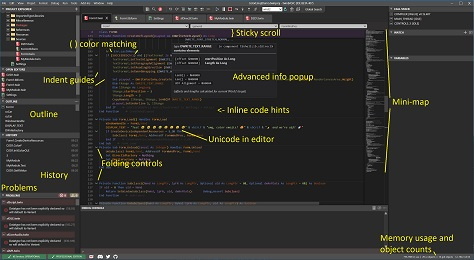\
[Full size](Images/fafaloneIDEscreenshot1.png)

* New code structure based Project Explorer:\
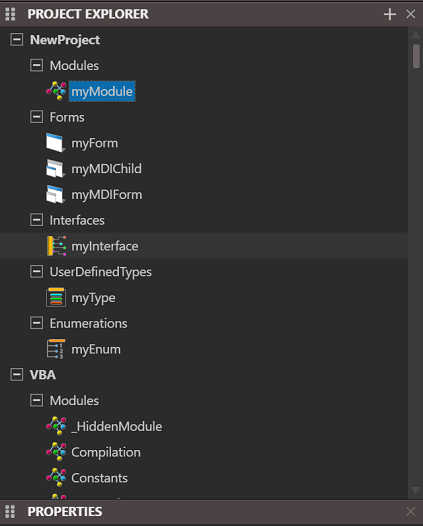

The classic file-based view is still used by default, you can activate the new view with a toggle button:\


## Package Server

Code can be grouped as a package, and published to an online server. You can have Private packages, visible only to you, or Public packages, visible to everyone.

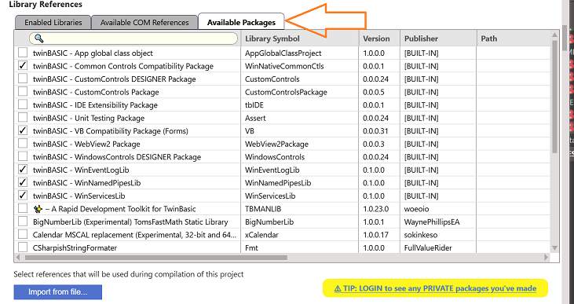

For more information, see the following pages:

[What is a package](../Packages/What-Is)

[Creating a TWINPACK package](../Packages/Creating-TWINPACK)

[Importing a package from a TWINPACK file](../Packages/Importing-TWINPACK)

[Importing a package from TWINSERV](../Packages/Importing-TWINSERV)

[Updating a package](../Packages/Updating)

## View Forms and Packages as JSON
Project forms and packages are stored as JSON format data, and you can view this by right-click in Project Explorer and selecting 'View as JSON'. This is particularly interesting for packages as it exposes the entire code in a much more easily parsed format.

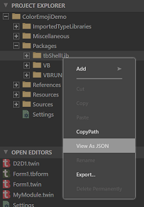

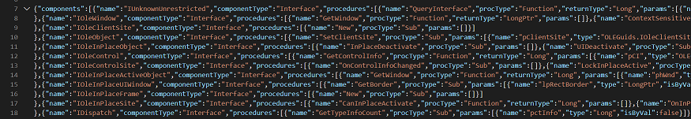


---

# Many more to come!

This list has covered all new features at the present time. There's many more planned, including built-in multithreading syntax, unsigned variable types, cross-platform compilation, and more! If there's a feature you'd like to see, please feel welcome to make a feature request by [posting an issue in the main twinBASIC GitHub repository](https://github.com/twinbasic/twinbasic/issues).
