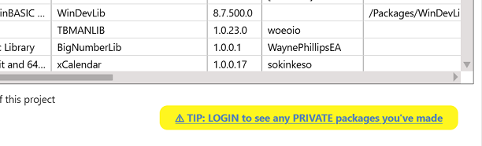

# Importing a package from TWINSERV

Open the project from which you want to use a package, open the `Settings` file within it and navigate to the References section.   Select the 'Available Packages' button, and all packages that are on the server should be shown:

 
 

If you tick one of the available packages, it will be downloaded and imported into the project:

 
 

Once you're finished, save and close the Settings file which will cause the compiler to be restarted.  Now you're ready to use the package!  In the example shown above I added a reference to the CSharpishStringFormater package, and I can now confirm that I can access components from the package in my code:

 
 

Note: If you have any PRIVATE packages that you have published, they are only available when signed in.   If you are not already signed in, you will see a warning link that you can click to login:

 
 

After logging in, press the 'Available' button again to refresh the list.