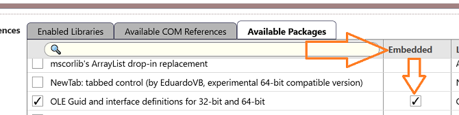
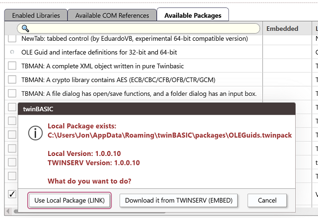
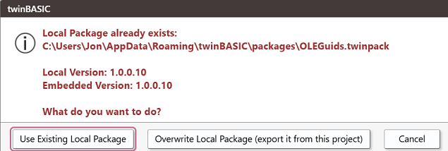
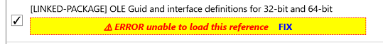

# Linked Packages

In addition to the standard usage described so far in this section, a package may also be **linked**. When a package is linked, it is not embedded in the .twinproj file-- it is instead stored in a common location accessible to all projects. This has multiple benefits. Some packages are very large, so not storing a copy in every .twinproj file makes them easier to share. Additionally, it allows multiple projects to share the same files, at least in read-only form.\
While built in compiler packages are linked, this article concerns 3rd party packages.

## Downloading a package for the first time

When you check the box for a package for the first time on the current machine, it is **Embedded** by default. You'll see a column with that name next to the package name:

Uncheck the Embedded column and it will be converted to a linked package. A .twinpack file for the package is created in `%APPDATA%\Roaming\twinBASIC\packages`, where it can remain available across tB IDE updates.

## Adding a package that has been linked

Once you've performed the steps above in one project, the linked package is available to all projects. You add the reference in the same way, through Available Packages, only now you'll be prompted to ask if you want the linked version already on your system, or to redownload it from TWINSERV:

This prompt provides the versions of both, which allows for updating the package if desired. If you do choose to download it again, you'll need to uncheck Embed again to keep it as a linked package. When you do, you'll be prompted to confirm you want to overwrite the local linked copy with the version newly downloaded from the package server:

## Opening a project with missing linked package

Sometimes you may want to open a .twinproj that refers to a linked package you do not currently have a copy of. If this happens, you'll see the standard missing reference message: 

And it's handled in the same way. **Uncheck the reference** -- "Fix" is not currently implemented. Then, go to the Available Packages tab and select the package-- and as described above, uncheck Embed to convert to a linked package.

## Manual management

You can make packages available, delete them, back them up, etc, via the linked packages folder: `%APPDATA%\Roaming\twinBASIC\packages`

If you copy a .twinpack file (or a .twinproj) to that location, it will be available as a linked package without needing to be downloaded from the package server. It does not need to exist on the server at all, allowing fully private, local linked packages.

