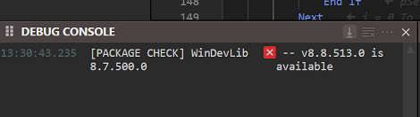

# Updating a package

The compiler will notify you if a newer version of a package in your project is available on TWINSERV when you load your project:

If you find an updated package is available on TWINSERV, you must first remove the old package from your project by deselecting it. Open Settings to References and untick the box. You will then be prompted to remove it from the filesystem:

 
 
 

select "Remove it".

Then go to the Available Packages tab and check the box for the latest version and **after it's done** downloading, which may take a few seconds since some packages are a few MB, Save Changes. In the Debug Console you'll first see

`[PACKAGES] downloading package '{1FCDB98D-617D-4995-9736-2ED0E4746A10}/8/7/0/498' from the online database... `

then it's done and ready to be saved when a second message saying

`[PACKAGES] downloading package '{1FCDB98D-617D-4995-9736-2ED0E4746A10}/8/7/0/498' from the online database... [DONE]`

comes up. It will also go from the checkbox spinning to the entry being moved to the top (below built in packages) with `[IMPORTED]` prepended to it.

Restart the compiler if it doesn't on its own after saving, but it usually does.

**NOTE:** In the future there will be a simple update option. Keep an eye out for that change.