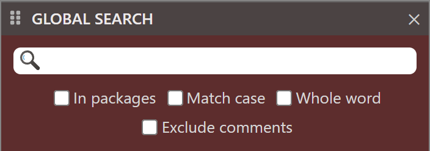

## Global Search

This AddIn is supplied with the twinBASIC IDE.

Latest Release
: v1.0.0.0

Developer
: twinBASIC

The global search add in will contain a [Toolbar](../Project/Toolbar) item.

{:width="101" height="35"}

{:width="352" height="124"}

Options

- In packages
- Match case
- Whole word
- Exclude comments

Type a search term, such as Button1, into the text box, and the add-in lists the matches.

{:width="352" height="389"}

## Download

This add-in is bundled with twinBASIC. You can download it from [https://github.com/twinbasic/twinbasic/releases][tB]

[tB]: https://github.com/twinbasic/twinbasic/releases