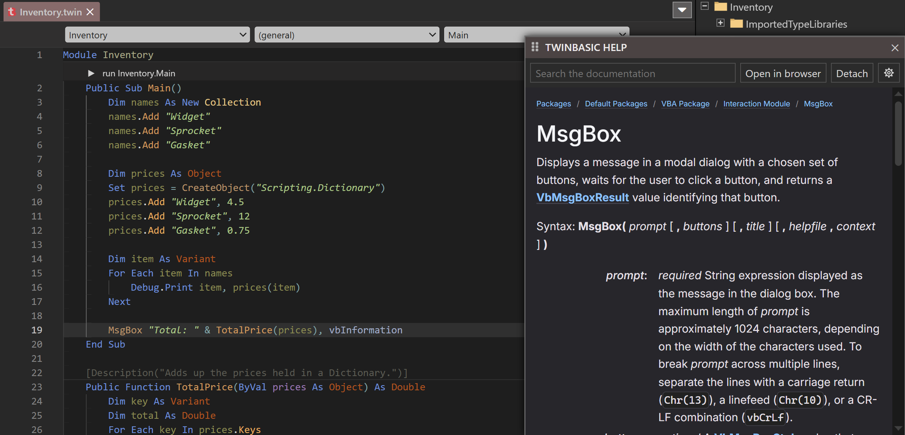
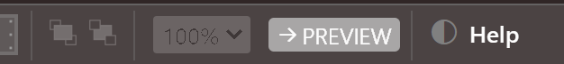
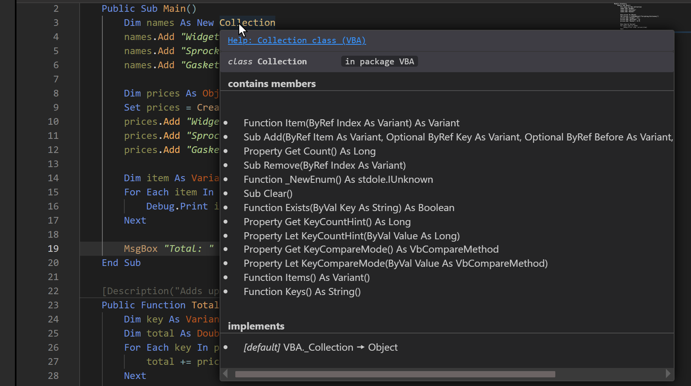
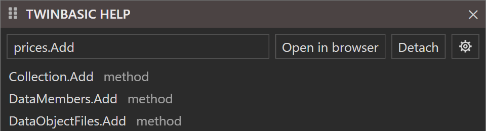
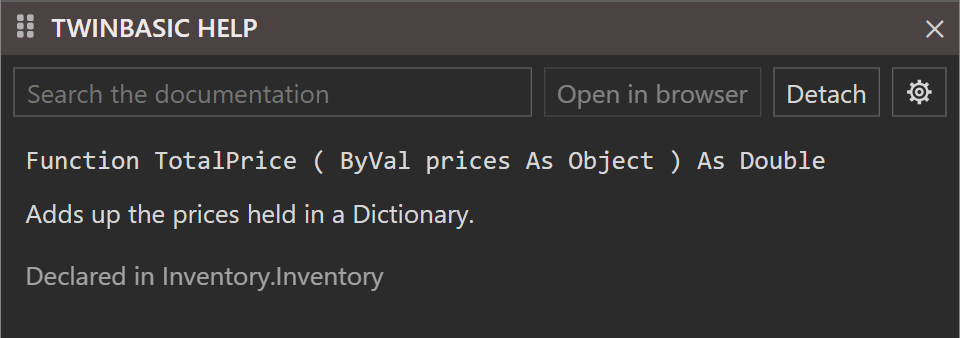
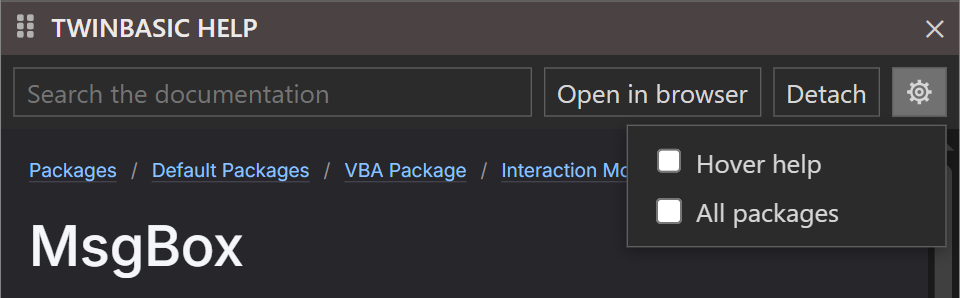
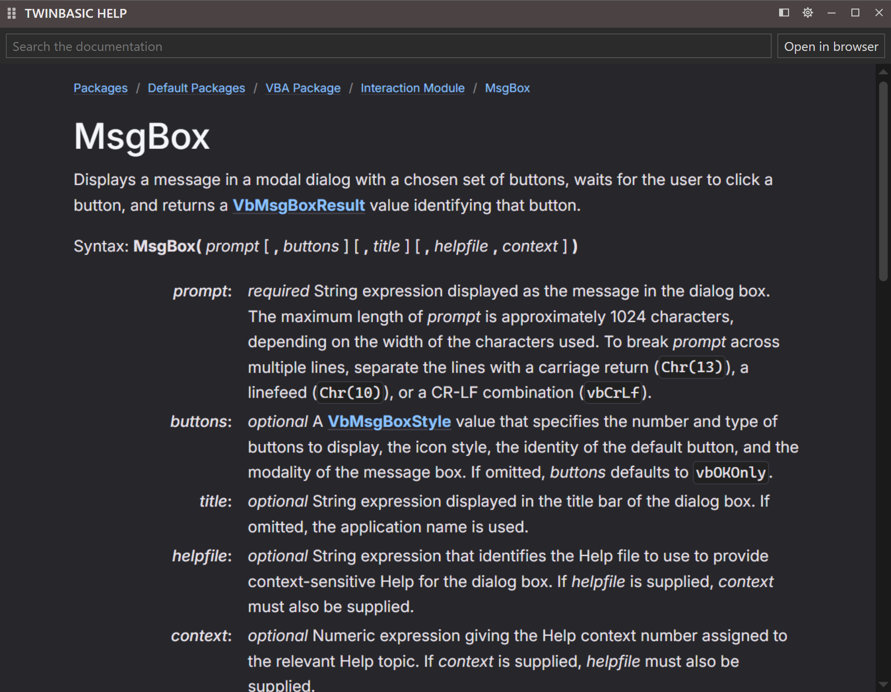

# Help Add-In

Shows this documentation inside the IDE: press F1 on a name in the code editor, and its reference page opens in a tool window beside the code.

The add-in is named *twinBASIC Documentation Help* in the IDE. It works from an index of every symbol this documentation describes, built with the documentation itself, so it knows which page documents each function, statement, class and member. With the compiler's help it also tells apart names that are spelled the same: `c.Add` on a **Collection** opens **Collection.Add**, and a bare `Close` opens the **Close** statement.

## F1 and the help pane

Put the cursor on a name and press F1. The page that documents the name opens in the **TWINBASIC HELP** tool window. The cursor can be anywhere in the name, or just after it, as it is after typing the name.

{:width="1143" height="550"}

The help pane is an ordinary IDE tool window: it can float, or be docked like the other tool windows. The page in it follows the IDE's theme, dark or light, and its links work as they do on the website. Above the page are a search box and three buttons:

**Open in browser**
: Opens the page on [docs.twinbasic.com](https://docs.twinbasic.com) in the default web browser.

**Detach**
: Moves the help into a window of its own --- see [The help window](#the-help-window).

The gear
: Opens the [settings](#settings).

The **Help** button the add-in adds to the IDE's [toolbar](../Project/Toolbar) shows the pane and puts the cursor in its search box, ready to type.

{:width="313" height="36"}

F1 takes the whole dotted name to the left of the cursor, up to the end of the name the cursor is in: with the cursor on `Add` in `Host.ToolWindows.Add(Name, Id)`, it looks up `Host.ToolWindows.Add`. A selection on one line is looked up exactly as it is selected. F1 on an empty spot shows the pane and puts the cursor in its search box.

When no page documents the name, the pane stays as it is, and a notification says so: *No help for 'Name'*.

> [!NOTE]
> F1 also expands or collapses the IDE's signature help when it is showing. F1 does nothing while the keyboard focus is inside the page in the pane: click in the code editor first.

## Hover help

With **Hover help** ticked in the [settings](#settings), the information box the IDE shows when the mouse rests on a name gains a link to the name's page, at its top. Clicking the link shows the page in the pane, as F1 does.

{:width="881" height="492"}

A link names the symbol, its kind and where it is declared: *Help: MsgBox function (VBA.Interaction)*. A name that several pages document gets a link for each, up to five. A name without a page gets no link. Hover help is off until it is ticked.

## Searching

Type in the search box to find a page by its symbol's name. The list shows the names that start with the text first, then those that contain it, with each one's kind. Text with a dot in it is matched against qualified names such as `Collection.Add`. Click a name to show its page, or press Enter for the first one. The clear button at the right of the box empties it and hides the list.

{:width="480" height="262"}

The search finds symbols, not words in the pages: to search the text of the documentation, use the search on the website.

## When F1 finds several pages

Sometimes the name alone cannot say which page is meant. A member called through a variable declared **As Object** is the common case: the object's type is known only when the program runs. F1 then puts the name in the search box and lists every page that documents it, and the page in the pane stays as it was. Click the one that applies.

{:width="480" height="130"}

## Your own procedures

F1 on a name declared in the project itself, or in a package or type library this documentation does not cover, shows a summary in place of a page. The summary gives the declaration, the text of the procedure's [**Description**](../../Core/Attributes#description) attribute, and where the name is declared.

{:width="480" height="169"}

The summary for the procedure above comes from this code:

```tb
[Description("Adds up the prices held in a Dictionary.")]
Public Function TotalPrice(ByVal prices As Object) As Double
```

Without a **Description** attribute, the summary says *No description*. **Open in browser** is unavailable while a summary is shown.

## Settings

The gear opens the settings. A click anywhere else, or Esc, closes them.

{:width="480" height="149"}

**Hover help**
: Adds the links described under [Hover help](#hover-help). Off by default.

**All packages**
: Offers the pages of every package this documentation covers. Off by default: F1, the hover links and the search then offer only the language itself and the packages the project references, so that a name from a package the project does not use never hides the one it does. With this off, F1 on a name that only an unreferenced package documents says *No help for 'Name' in the packages this project references*.

The settings, the last page shown and the help window's place are kept in the registry, under `HKEY_CURRENT_USER\Software\VB and VBA Program Settings\tbDocsHelp`. After the IDE restarts, the pane shows the page it showed last.

## The help window

**Detach** moves the whole pane --- search box, buttons and page --- into a window of its own. The window has a button on the taskbar, can be moved to another monitor, and keeps its position and size from one session to the next. While it is detached, F1, the **Help** button and the hover links show their page in the window.

{:width="900" height="700"}

The window's title bar holds, from the left:

**Attach**
: Puts the help back in the pane in the IDE, with the same search text and page.

The gear
: Opens the [settings](#settings).

**Minimize**, **Maximize**, **Close**
: Work as in any window. **Close** only hides the window: the help stays detached, and the next F1 shows the window again.

The window is open again the next time the IDE starts, if it was open when the IDE closed. With **Show real OS titlebar** turned on in the IDE's options, the window has an ordinary Windows title bar instead, in the IDE's dark or light colours, and **Attach** and the gear move next to the search box.

## Getting the add-in

The add-in is built from its source code, which is in the `add-in` folder of the [documentation's repository](https://github.com/twinbasic/documentation). The folder holds the project's files, not a project file, so the first step makes one.

1. Pack the folder into a project file with the [Import/Export Tool](../../../Features/Packages/Import-Export-Tool), from the repository's root folder:

   ```batch
   python scripts/impexp.py import tbDocsHelp.twinproj add-in
   ```

2. Open `tbDocsHelp.twinproj` in the twinBASIC IDE and build it. Then set the build target to **win64** and build it again. The two DLLs, `tbDocsHelp_win32.dll` and `tbDocsHelp_win64.dll`, are written to a `Build` folder next to the project file.
3. Copy each DLL to the matching `win32` or `win64` add-ins folder, as [Add Ins](../AddIns/) describes, and restart the IDE.

An add-in built this way shows the pages from [docs.twinbasic.com](https://docs.twinbasic.com), so the pane needs an internet connection.

**For help that works offline**, build the documentation before step 1, as [Building and Deployment](../../../Documentation/Development/Building) describes. The build writes a copy of the whole site into the add-in's source folder, `add-in\Resources\HELP\site.zip`, about 24 MB. A DLL built with that file in place serves the pages itself, without the internet. **Open in browser** still opens the website.

## See Also

- [Add Ins](../AddIns/) -- installing and loading add-ins
- [Global Search](GlobalSearch) add-in
- [tbIDE Package](../../Packages/tbIDE/) -- the API an add-in is written against
