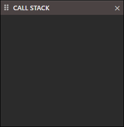

# Call Stack

The Call Stack pane lists the active chain of procedure calls at the current execution point during a debugging session, with the most recent call at the top. Clicking an entry in the list navigates the editor to that call site.
