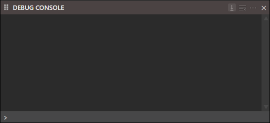
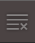
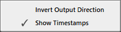
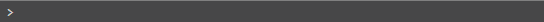

# Debug Console

The Debug Console captures output from `Debug.Print` statements and other debug-layer messages written at runtime, displaying them in a scrollable log.

##  Auto Scroll

##  Clear Debug Console

##  Options

- Invert Output Direction
- Show Timestamps

##  Input
