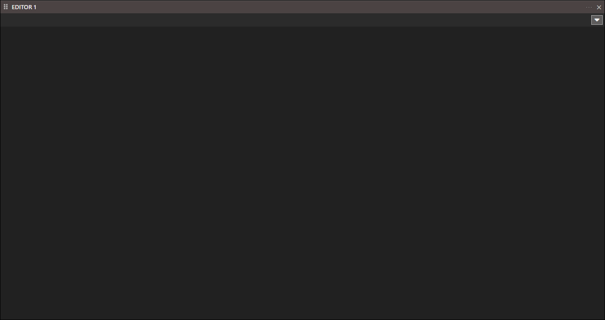
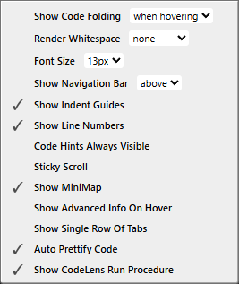
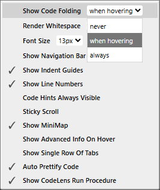
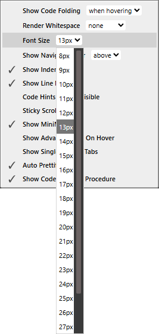
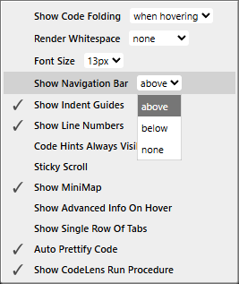
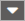
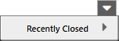
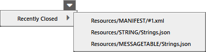

# Editor

## Options

")

- Show Code Folding (when hovering)
- Render Whitespace (none)
- Font Size (13px)
- Show Navigation Bar (above)
- ✔ Show Indent Guides
- ✔ Show Line Numbers
- Code Hints Always Visible
- Sticky Scroll
- ✔ Show MiniMap
- Show Advanced Info On Hover
- Show Single Row Of Tabs
- ✔ Auto Pretify Code
- ✔ Show CodeLens Run Procedure

### Show Code Folding

- never 
- when hovering
- always

### Render Whitespace

- all
- none
- boundary
- selection
- trailing

### Font Size

- 8px
- ...
- 30px

Show Navigation Bar (above)

- above
- below
- none

### Show Indent Guides

### Show Line Numbers

### Code Hints Always Visible

### Sticky Scroll

### Show MiniMap

### Show Advanced Info On Hover

### Show Single Row Of Tabs

### Auto Pretify Code

### Show CodeLens Run Procedure

## Tabs List

When a file is open in the _Editor_ it will be listed in the _Tabs List_ and you can jump between them here. 

")

_Recently Closed_.

_Recently Closed - List_

