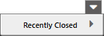
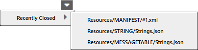

# Editor

## Options

- Show Code Folding
  - never 
  - *when hovering*
  - always

- Render Whitespace
  - all
  - *none*
  - boundary
  - selection
  - trailing

- Font Size
  - 8px
  - ...
  - *13px*
  - ...
  - 30px
- Show Navigation Bar
  - above
  - below
  - none
- ✓ Show Indent Guides
- ✓ Show Line Numbers
- Code Hints Always Visible
- Sticky Scroll
- ✓ Show MiniMap
- Show Advanced Info On Hover
- Show Single Row Of Tabs
- ✓ Auto Prettify Code
- ✓ Show CodeLens Run Procedure

## Tabs List

When a file is open in the _Editor_ it will be listed in the _Tabs List_ and you can jump between them here. 

_Recently Closed_.

_Recently Closed - List_

