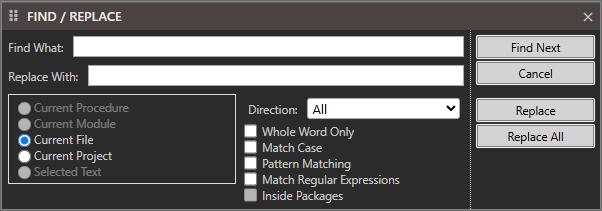
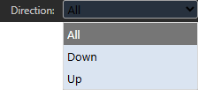

# Find / Replace

Find What

Replace With

- Current Procedure
- Current Module
- Current File
- Current Project
- Selected Text

Direction: All / Down / Up

- Whole Word Only
- Match Case
- Pattern Matching
- Match Regular Expressions
- Inside Packages

Find Next

Cancel

Replace

Replace All
