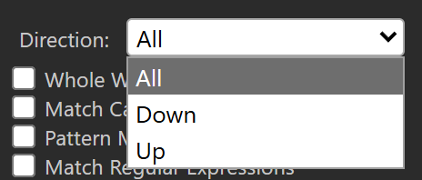

# Find / Replace

{:width="600" height="209"}

Find What

Replace With

- Current Procedure
- Current Module
- Current File
- Current Project
- Selected Text

Direction: All / Down / Up

{:width="232" height="99"}

- Whole Word Only
- Match Case
- Pattern Matching
- Match Regular Expressions
- Inside Packages

Find Next

Cancel

Replace

Replace All
