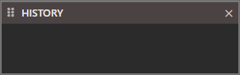
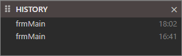
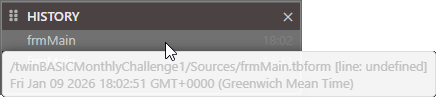
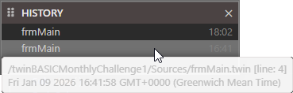

# History

When a project isn't open this will be empty.

Once you open a project

If you hover on an item it will show you the path of the file.

If it's a code file (i.e. `.twin`) it will show the "line: #".

You can also click on an item to open it.
