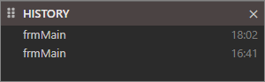

# History

When a project isn't open this will be empty.

Once you open a project

If you hover on an item it will show you the path of the file.

![The pointer resting on the 18:02 frmMain entry, which raises a tooltip reading /twinBASICMonthlyChallenge1/Sources/frmMain.tbform [line: undefined] above a second line giving Fri Jan 09 2026 18:02:51 GMT+0000 (Greenwich Mean Time).](Images/History_2.png)

If it's a code file (i.e. `.twin`) it will show the "line: #".

![The pointer on the 16:41 entry instead, its tooltip reading /twinBASICMonthlyChallenge1/Sources/frmMain.twin [line: 4] above Fri Jan 09 2026 16:41:58 GMT+0000 (Greenwich Mean Time).](Images/History_3.png)

You can also click on an item to open it.
