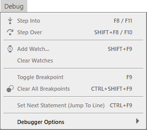
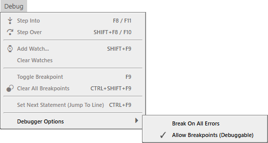
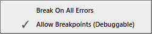

# Debug Menu

- Step Into <kbd>F8</kbd> / <kbd>F11</kbd>
- Step Over <kbd>SHIFT</kbd> + <kbd>F8</kbd> / <kbd>F10</kbd>
---
- Add Watch... <kbd>SHIFT</kbd> + <kbd>F9</kbd>
- Clear Watches
---
- Toggle Breakpoint <kbd>F9</kbd>
- Clear Al Breakpoints <kbd>CTRL</kbd> + <kbd>SHIFT</kbd> + <kbd>F9</kbd>
---
- Set Next Statement (Jump To Line) <kbd>CTRL</kbd> + <kbd>F9</kbd>
---
- Debugger Options

## Debugger Options

- Break On All Errors
- ✔ Allow Breakpoints (Debuggable)

