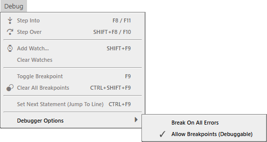
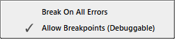

# Debug Menu


- Step Into <kbd>F8</kbd> / <kbd>F11</kbd>
- Step Over <kbd>SHIFT</kbd> + <kbd>F8</kbd> / <kbd>F10</kbd>

---
- Add Watch... <kbd>SHIFT</kbd> + <kbd>F9</kbd>
- Clear Watches

---
- Toggle Breakpoint <kbd>F9</kbd>
- Clear All Breakpoints <kbd>CTRL</kbd> + <kbd>SHIFT</kbd> + <kbd>F9</kbd>

---
- Set Next Statement (Jump To Line) <kbd>CTRL</kbd> + <kbd>F9</kbd>

---
- Debugger Options

## When a run-time error stops the program

A run-time error that no `On Error` statement handles stops the program on the line that raised it. It stops the same way whether the program was started with **Run → Start** (<kbd>F5</kbd>), from the **▶ run** link above a procedure, or by a `[RunAfterBuild]` procedure. With **Break On All Errors** on, a handled error stops it too; see [Debugger Options](#debugger-options).

The examples below use this procedure. On the fourth pass through the loop, `idx` is 7, past the last index of `a`, which is 5:

```tb check_build
Public Sub FillTable()
    Dim a(5) As Long
    Dim i As Long
    Dim idx As Long
    Dim total As Long
    For i = 1 To 6
        idx = Choose(i, 1, 3, 5, 7, 2, 4)
        a(idx) = i * 10
        total = total + i
        Debug.Print "i = " & i & ", idx = " & idx & ", total = " & total
    Next i
    Debug.Print "loop finished, i = " & i & ", total = " & total
End Sub
```

### Where it stopped, and what the variables hold

The editor opens the module, highlights the whole failing line, `a(idx) = i * 10`, and puts a yellow arrow in the margin beside it. Under the line, an error panel shows:

- **Run-time error -2147352565 (8002000B)**: the error number, then the same number in hexadecimal;
- **DESCRIPTION:** and the error's description, here *Invalid index.*;
- four buttons: **Try Again (Resume)**, **Ignore (Resume Next)**, **Stop** and **Search Online**.

The number is the one `Err.Number` holds, and for some errors it is not the number VBA uses: see [Error numbers that differ from VBA](../../../Modules/ErrObject/Number#error-numbers-that-differ-from-vba). Nothing about the error is written to the [Debug Console](../DebugConsole). The panel's **×** only hides the panel.

The other panes show the state of the program at the failing line:

- **[Call Stack](../CallStack)** lists the chain of calls, the failing procedure first, each with its file and its `line:column`. Here that is `FillTable`, then the procedure that called it, if there is one. Clicking a row opens that file at that line, and **Variables** then shows that procedure's variables.
- **[Variables](../Variables)** shows the failing procedure's *Locals*, already expanded: `i` is 4, `idx` is 7 and `total` is 6. The array shows as `{array of 6 elements}` until it is expanded.
- Holding the mouse pointer over a variable in the editor shows its value.

### Reading and changing values in the Debug Console

The input row at the bottom of the [Debug Console](../DebugConsole) runs a line of code inside the stopped procedure:

- `? i` prints `4`, with a `(time taken: …)` line after it. `Debug.Print i` does the same.
- `i` on its own is refused, with `(compile error: Expression is neither used nor assigned)`.
- `idx = 5` gives `idx` a new value, and **Variables** shows it.

Running any line in the console removes the error panel. The failing line stays highlighted, and the keys below still work.

### The four buttons

- **Try Again (Resume)** runs the failing line again. Unless a value it uses has changed, the error happens again at once. <kbd>F5</kbd> does the same, and still works after the panel has gone.
- **Ignore (Resume Next)** skips the failing line and goes on from the statement after it. Here the loop runs to the end, and prints `i = 4, idx = 7, total = 10` for the pass that failed. No menu command or key does this.
- **Stop** does not end the program at an error. See [Traps](#traps).
- **Search Online** opens a web search for the error's number and description in the default browser.

### Stepping on through the rest of the loop

**Step Into** (<kbd>F8</kbd> / <kbd>F11</kbd>) and **Step Over** (<kbd>SHIFT</kbd> + <kbd>F8</kbd> / <kbd>F10</kbd>) do not move past the failing line. They run it again, and the error happens again at once. To go on one line at a time, first do one of these, then step:

- **Correct the value in the console.** After `idx = 5`, <kbd>F8</kbd> runs the failing line without an error, and stops on the next one, `total = total + i`.
- **Move past the line with Set Next Statement.** Click in the next line and press <kbd>CTRL</kbd> + <kbd>F9</kbd>. The yellow arrow moves there without running the failing line, and the panel closes. <kbd>F8</kbd> then runs the line the arrow is on.

To run on to the end instead, correct the value and press <kbd>F5</kbd>, or press **Ignore (Resume Next)** while the panel is still there.

### Traps

- **The panel disappears, and Ignore with it.** Running a line in the Debug Console, or clicking another procedure in the Call Stack, removes the panel. <kbd>F5</kbd> brings it back only by running the failing line again. Set Next Statement onto the next line, then <kbd>F5</kbd>, does what **Ignore (Resume Next)** would have done.
- **A step key leaves a step waiting.** After <kbd>F8</kbd> on the failing line, **Ignore (Resume Next)** stops again on the next line instead of going on. Press <kbd>F5</kbd> to go on.
- **At an error, Stop ends only the procedure that failed.** The procedure that called it goes on from its next line: if `Sub Main` called `FillTable`, the rest of `Sub Main` still runs. The panel's **Stop**, the toolbar's **Stop** and **Run → End** all do this. At a failed **Assert** check, **Stop** ends only the check, and the test goes on past it as if the check had passed. To end the whole run, first move the arrow to a later line with <kbd>CTRL</kbd> + <kbd>F9</kbd>, then press **Stop**. Away from an error --- at a breakpoint, after a step, or after Set Next Statement --- **Stop** ends the run.

The last two are defects, as of BETA 983.

## Debugger Options



- Break On All Errors
- ✓ Allow Breakpoints (Debuggable)



**Break On All Errors** turns the project setting of the [same name](../Settings#break-on-all-errors) on and off. It is off by default, and then an error raised while `On Error Resume Next` or `On Error GoTo` is in effect goes to that handler, as usual. When it is on, the program stops at the failing line even there, with the same error panel as [an error that nothing handles](#when-a-run-time-error-stops-the-program). **Ignore (Resume Next)** then skips the line. Under `On Error Resume Next`, `Err.Number` still holds the error afterwards, so code that checks it sees the error. Under `On Error GoTo`, the handler never runs.
