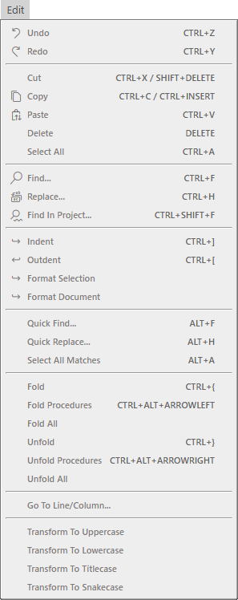

# Edit Menu

- Undo <kbd>CTRL</kbd> + <kbd>Z</kbd>
- Redo <kbd>CTRL</kbd> + <kbd>Y</kbd>
---
- Cut <kbd>CTRL</kbd> + <kbd>X</kbd> / <kbd>SHIFT</kbd> + <kbd>DELETE</kbd>
- Copy <kbd>CTRL</kbd> + <kbd>C</kbd> / <kbd>CTRL</kbd> + <kbd>INSERT</kbd>
- Paste <kbd>CTRL</kbd> + <kbd>V</kbd>
- Delete <kbd>DELETE</kbd>
- Select All <kbd>CTRL</kbd> + <kbd>A</kbd>
---
- Find... <kbd>CTRL</kbd> + <kbd>F</kbd>
- Replace... <kbd>CTRL</kbd> + <kbd>H</kbd>
- Find In Project... <kbd>CTRL</kbd> + <kbd>SHIFT</kbd> + <kbd>Y</kbd>
---
- Indent <kbd>CTRL</kbd> + <kbd>]</kbd>
- Outdent <kbd>CTRL</kbd> + <kbd>[</kbd>
- Format Selection
- Format Document
---
- Quick Find... <kbd>ALT</kbd> + <kbd>F</kbd>
- Quick Replace... <kbd>ALT</kbd> + <kbd>H</kbd>
- Select All Matchtes <kbd>ALT</kbd> + <kbd>A</kbd>
---
- Fold <kbd>CTRL</kbd> + <kbd>{</kbd>
- Fold Procedures <kbd>CTRL</kbd> + <kbd>ALT</kbd> + <kbd>ARROWLEFT</kbd>
- Fold All
- Unfold <kbd>CTRL</kbd> + <kbd>}</kbd>
- Unfold Procedures <kbd>CTRL</kbd> + <kbd>ALT</kbd> + <kbd>ARROWRIGHT</kbd>
- Unfold All
---
- Go To Line/Column...
---
- Transform To Uppercase
- Transform To Lowercase
- TransformTo Titlecase
- Transform To Snakecase