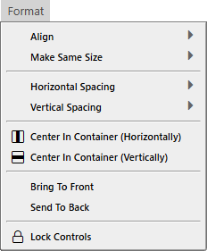
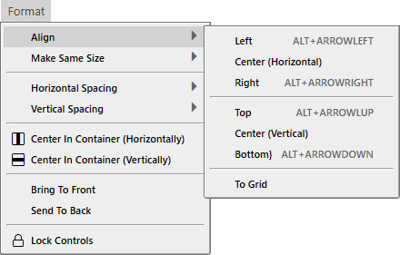
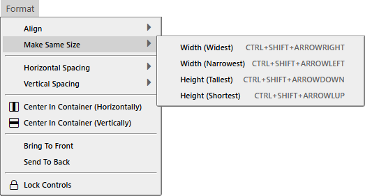
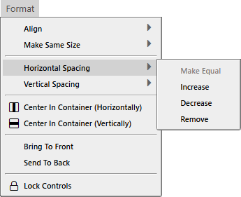
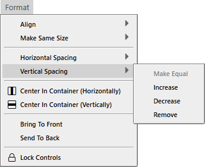

# Format Menu

- Align
- Make Same Size
---
- Horizontal Spacing
- Vertical Spacing
---
- Center In Container (Horizontally)
- Center In Container (Horizontally)
---
- Bring To Front
- Send To Back
---
- Lock Controls

- Left <kbd>ALT</kbd> + <kbd>ARROWLEFT</kbd>
- Center (Horizontal)
- Right <kbd>ALT</kbd> + <kbd>ARROWRIGHT</kbd>
---
- Top <kbd>ALT</kbd> + <kbd>ARROWUP</kbd>
- Center (Vertical)
- Bottom <kbd>ALT</kbd> + <kbd>ARROWDOWN</kbd>
---
- To Grid

- Width (Widest) <kbd>CTRL</kbd> + <kbd>SHIFT</kbd> + <kbd>ARROWRIGHT</kbd>
- Width (Narrowest) <kbd>CTRL</kbd> + <kbd>SHIFT</kbd> + <kbd>ARROWLEFT</kbd>
- Height (Tallest) <kbd>CTRL</kbd> + <kbd>SHIFT</kbd> + <kbd>ARROWDOWN</kbd>
- Height (Shortest) <kbd>CTRL</kbd> + <kbd>SHIFT</kbd> + <kbd>ARROWUP</kbd>

- Make Equal
- Increase
- Decrease
- Remove

- Make Equal
- Increase
- Decrease
- Remove
