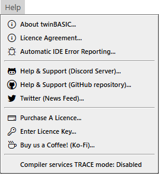
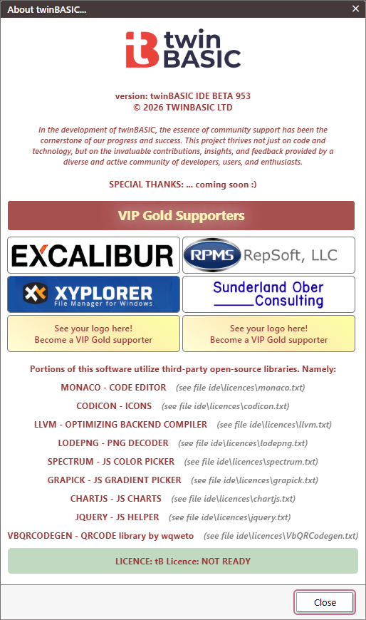

# Help Menu

- About twinBASIC...
- Licence Agreement...
- Automatic IDE Error Reporting...
---
- Help & Support (Discord Server)...
- Help & Support (GitHub repository)...
- Twitter (News Feed)...
---
- Purchase A Licence...
- Enter Licence Key...
- Buy us a Coffee! (Ko-Fi)...
---
- Compiler services TRACE mode: Disabled

> [!NOTE]
>
>  TODO: Add each Help Menu item.

## About twinBASIC...

## Licence Agreement...

## Automatic IDE Error Reporting...

## Help & Support (Discord Server)...

## Help & Support (GitHub repository)...

## Twitter (News Feed)...

## Purchase A Licence...

## Enter Licence Key...

## Buy us a Coffee! (Ko-Fi)...

## Compiler services TRACE mode: Disabled
