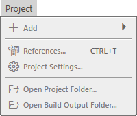

# Project Menu

- Add
---
- References
- Project Settings
---
- Open Project Folder...
- Open Build Output Folder...

## Add

**Add** is the same as Right Click Add on the [Project Explorer](../Project%20Explorer.md)

## References

See [Project Settings](../Project%20Settings.md) filtered by "project.references".

## Project Settings

See [Project Settings](../Project%20Settings.md).
