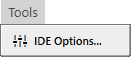

# Tools Menu

- IDE Options...
- Flush the LLVM compiler cache --- clears the cache of code compiled with [LLVM](../../../../LLVM/Getting-Started), so that the next build compiles everything.

![The twinBASIC IDE Options dialog: a scrolling list of right-aligned dark red labels against their controls. Tab Size reads 4, IDE Font Size and Code Editor Font Size both read 13px, IDE Font reads Segoe UI and Code Editor Font is empty, and the two drop-downs below them read above and none. A run of tick boxes follows, of which only Restore Editors State When Opening Project and File Explorer: Ask Before Delete Files are ticked. Change Licence sits at the bottom left, with a greyed-out Save Changes and a Close button at the right.](Images/Menu_Tools_IDEOptions.png)

> [!NOTE]
>
>  TODO: Add each IDE Option item.

| Option   | Value |
| -------- | ----- |
| Tab Size | 4     |

The three **LLVM Compiler** options are described in [Getting Started with LLVM](../../../../LLVM/Getting-Started#general-llvm-options).
