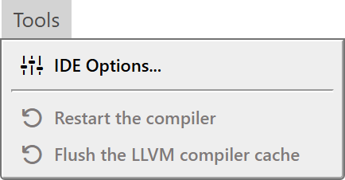

# Tools Menu

{:width="217" height="113"}

- IDE Options...
- Restart the compiler --- ends the compiler and starts a new one, which compiles the project again and loads the add-ins afresh.
- Flush the LLVM compiler cache --- clears the cache of code compiled with [LLVM](../../../../LLVM/Getting-Started), so that the next build compiles everything.

![The twinBASIC IDE Options dialog: a scrolling list of right-aligned dark red labels against their controls. Tab Size reads 4, IDE Font Size and Code Editor Font Size both read 13px, IDE Font reads Segoe UI and Code Editor Font is empty, and the two drop-downs below them read above and none. Three LLVM Compiler settings follow: a maximum of 1 thread, a complex procedure reporting threshold of 10000 milliseconds, and a ticked box to keep the cache process alive after exiting the IDE. Then comes a run of tick boxes, of which only Restore Editors State When Opening Project and File Explorer: Ask Before Delete Files are ticked. Change Licence sits at the bottom left, with a greyed-out Save Changes and a Close button at the right.](Images/Menu_Tools_IDEOptions.png){:width="628" height="594"}

> [!NOTE]
>
>  TODO: Add each IDE Option item.

| Option   | Value |
| -------- | ----- |
| Tab Size | 4     |

The three **LLVM Compiler** options are described in [Getting Started with LLVM](../../../../LLVM/Getting-Started#general-llvm-options).
