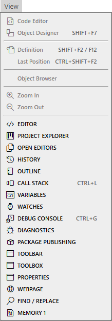

# View Menu

- Code Editor
- Object Designer <kbd>SHIFT</kbd> + <kbd>F7</kbd>
---
- Definition <kbd>SHIFT</kbd> + <kbd>F2</kbd> / <kbd>F12</kbd>
- Last Position <kbd>CTRL</kbd> + <kbd>SHIFT</kbd> + <kbd>F2</kbd>
---
- Object Browser
- Zoom In
- Zoom Out
---
- EDITOR
- PROJECT EXPLORER
- OPEN EDITORS
- HISTORY
- OUTLINE
- CALL STACK <kbd>CTRL</kbd> + <kbd>L</kbd>
- VARIABLES
- WATCHES
- DEBUG CONSOLE <kbd>CTRL</kbd> + <kbd>G</kbd>
- DIAGNOSTICS
- PACKAGE PUBLISHING
- TOOLBAR
- TOOLBOX
- PROPERTIES
- WEBPAGE
- FIND / REPLACE
- MEMORY 1
