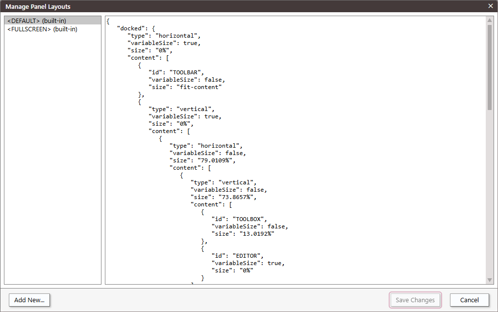
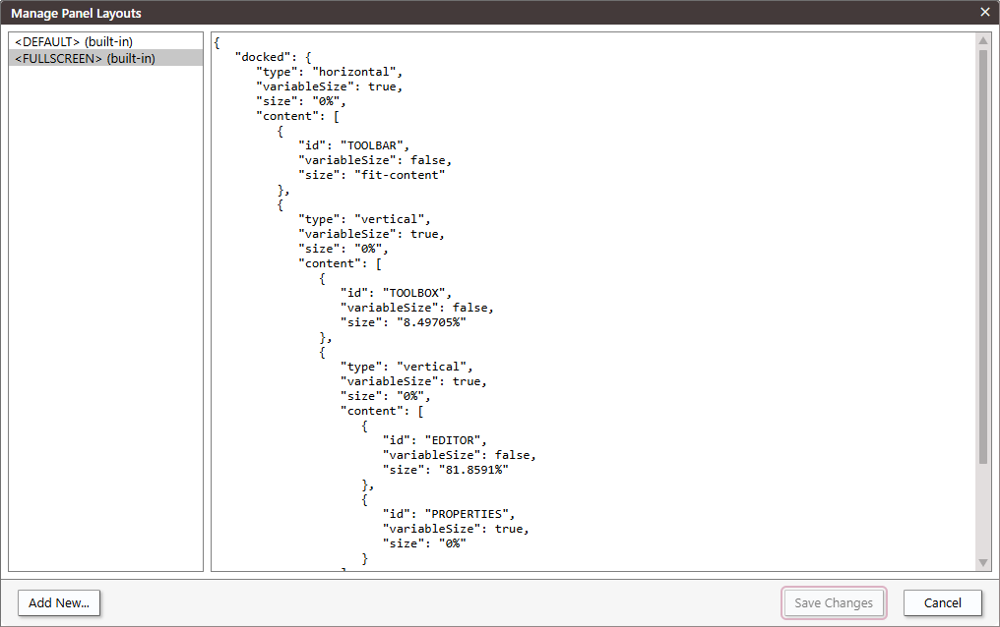
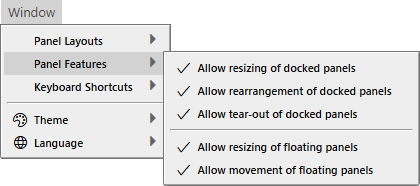
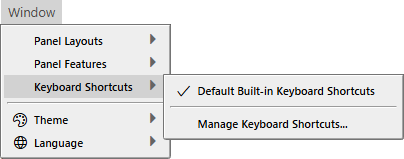
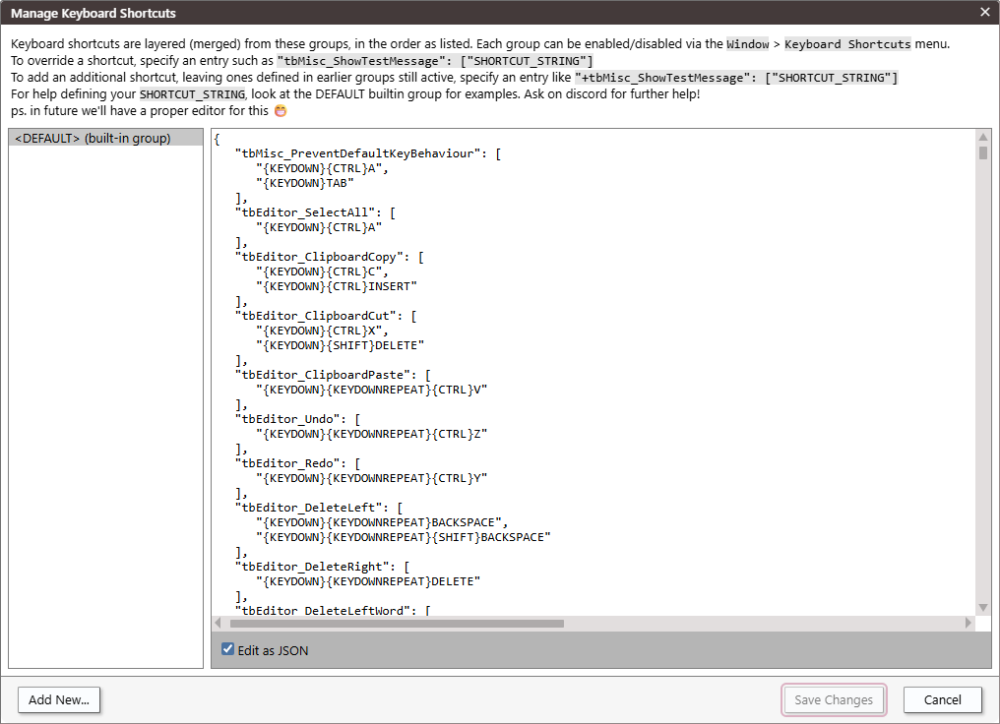
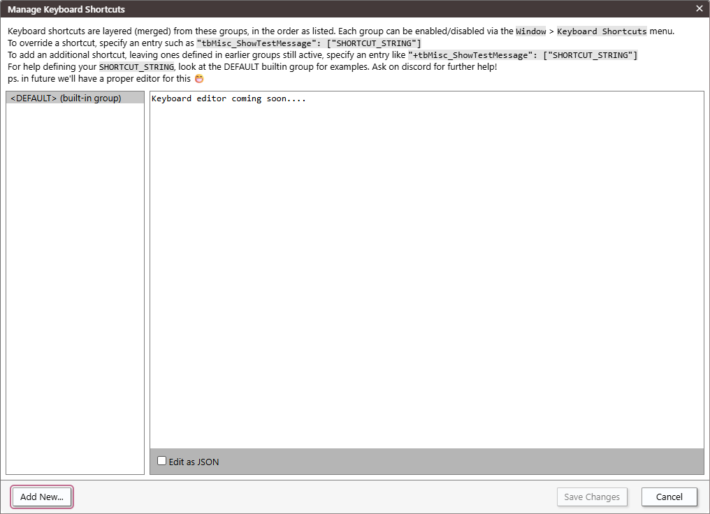
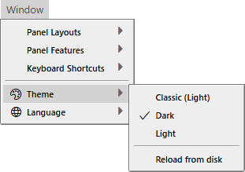
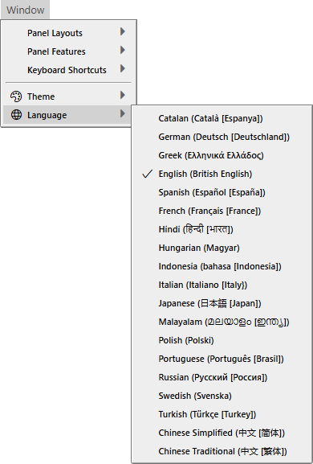

# Window Menu


- Panel Layouts
- Panel Features
- Keyboard Shortcuts
---
- Theme
- Language

## Panel Layouts


- Default Built-in Layout <kbd>CTRL</kbd> + <kbd>#</kbd>
- Full Screen Editor Layout
---
- ✔ Custom Layout (Unsaved)
---
- Save Current Panel Layout As...
- Manage Panel Layouts...


### Manage Panel Layouts...



<details>
<summary>&lt;DEFAULT&gt; (built-in)</summary>

```json
{
	"docked": {
		"type": "horizontal",
		"variableSize": true,
		"size": "0%",
		"content": [
			{
				"id": "TOOLBAR",
				"variableSize": false,
				"size": "fit-content"
			},
			{
				"type": "vertical",
				"variableSize": true,
				"size": "0%",
				"content": [
					{
						"type": "horizontal",
						"variableSize": false,
						"size": "79.0109%",
						"content": [
							{
								"type": "vertical",
								"variableSize": false,
								"size": "73.8657%",
								"content": [
									{
										"id": "TOOLBOX",
										"variableSize": false,
										"size": "13.0192%"
									},
									{
										"id": "EDITOR",
										"variableSize": true,
										"size": "0%"
									}
								]
							},
							{
								"type": "vertical",
								"variableSize": true,
								"size": "0%",
								"content": [
									{
										"type": "vertical",
										"variableSize": false,
										"size": "67.9395%",
										"content": [
											{
												"id": "DEBUG CONSOLE",
												"variableSize": false,
												"size": "53.0193%"
											},
											{
												"id": "PROBLEMS",
												"variableSize": true,
												"size": "0%"
											}
										]
									},
									{
										"type": "vertical",
										"variableSize": true,
										"size": "0%",
										"content": [
											{
												"id": "CALL STACK",
												"variableSize": true,
												"size": "0%"
											},
											{
												"id": "VARIABLES",
												"variableSize": true,
												"size": "0%"
											}
										]
									}
								]
							}
						]
					},
					{
						"type": "horizontal",
						"variableSize": true,
						"size": "0%",
						"content": [
							{
								"id": "PROJECT EXPLORER",
								"variableSize": false,
								"size": "60.4237%"
							},
							{
								"id": "PROPERTIES",
								"variableSize": true,
								"size": "0%"
							}
						]
					}
				]
			}
		]
	},
	"floating": []
}
```

</details>



<details>
<summary>&lt;FULLSCREEN&gt; (built-in)</summary>

```json
{
	"docked": {
		"type": "horizontal",
		"variableSize": true,
		"size": "0%",
		"content": [
			{
				"id": "TOOLBAR",
				"variableSize": false,
				"size": "fit-content"
			},
			{
				"type": "vertical",
				"variableSize": true,
				"size": "0%",
				"content": [
					{
						"id": "TOOLBOX",
						"variableSize": false,
						"size": "8.49705%"
					},
					{
						"type": "vertical",
						"variableSize": true,
						"size": "0%",
						"content": [
							{
								"id": "EDITOR",
								"variableSize": false,
								"size": "81.8591%"
							},
							{
								"id": "PROPERTIES",
								"variableSize": true,
								"size": "0%"
							}
						]
					}
				]
			}
		]
	},
	"floating": []
}
```

</details>

## Panel Features



- ✔ Allow resizing of docked panels
- ✔ Allow rearrangement of docked panels
- ✔ Allow tear-out of docked panels
---
- ✔ Allow resizing of floating panels
- ✔ Allow movement of floating panels

## Keyboard Shortcuts



- ✔ Default Built-in Keyboard Shortcuts
---
- Manage Keyboard Shortcuts

### Manage Keyboard Shortcuts





<details>
<summary>Options</summary>

```json
{
	"tbMisc_PreventDefaultKeyBehaviour": [
		"{KEYDOWN}{CTRL}A",
		"{KEYDOWN}TAB"
	],
	"tbEditor_SelectAll": [
		"{KEYDOWN}{CTRL}A"
	],
	"tbEditor_ClipboardCopy": [
		"{KEYDOWN}{CTRL}C",
		"{KEYDOWN}{CTRL}INSERT"
	],
	"tbEditor_ClipboardCut": [
		"{KEYDOWN}{CTRL}X",
		"{KEYDOWN}{SHIFT}DELETE"
	],
	"tbEditor_ClipboardPaste": [
		"{KEYDOWN}{KEYDOWNREPEAT}{CTRL}V"
	],
	"tbEditor_Undo": [
		"{KEYDOWN}{KEYDOWNREPEAT}{CTRL}Z"
	],
	"tbEditor_Redo": [
		"{KEYDOWN}{KEYDOWNREPEAT}{CTRL}Y"
	],
	"tbEditor_DeleteLeft": [
		"{KEYDOWN}{KEYDOWNREPEAT}BACKSPACE",
		"{KEYDOWN}{KEYDOWNREPEAT}{SHIFT}BACKSPACE"
	],
	"tbEditor_DeleteRight": [
		"{KEYDOWN}{KEYDOWNREPEAT}DELETE"
	],
	"tbEditor_DeleteLeftWord": [
		"{KEYDOWN}{KEYDOWNREPEAT}{CTRL}BACKSPACE"
	],
	"tbEditor_DeleteRightWord": [
		"{KEYDOWN}{KEYDOWNREPEAT}{CTRL}DELETE"
	],
	"tbEditor_DeleteLines": [
		"{KEYDOWN}{KEYDOWNREPEAT}{CTRL}{SHIFT}DELETE"
	],
	"tbEditor_CursorSelectLeft": [
		"{KEYDOWN}{KEYDOWNREPEAT}{SHIFT}ARROWLEFT"
	],
	"tbEditor_CursorSelectRight": [
		"{KEYDOWN}{KEYDOWNREPEAT}{SHIFT}ARROWRIGHT"
	],
	"tbEditor_CursorSelectUp": [
		"{KEYDOWN}{KEYDOWNREPEAT}{SHIFT}ARROWUP"
	],
	"tbEditor_CursorSelectDown": [
		"{KEYDOWN}{KEYDOWNREPEAT}{SHIFT}ARROWDOWN"
	],
	"tbEditor_CursorSelectLeftWord": [
		"{KEYDOWN}{KEYDOWNREPEAT}{CTRL}{SHIFT}ARROWLEFT"
	],
	"tbEditor_CursorSelectRightWord": [
		"{KEYDOWN}{KEYDOWNREPEAT}{CTRL}{SHIFT}ARROWRIGHT"
	],
	"tbEditor_CursorMoveLeft": [
		"{KEYDOWN}{KEYDOWNREPEAT}ARROWLEFT"
	],
	"tbEditor_CursorMoveRight": [
		"{KEYDOWN}{KEYDOWNREPEAT}ARROWRIGHT"
	],
	"tbEditor_CursorMoveUp": [
		"{KEYDOWN}{KEYDOWNREPEAT}ARROWUP"
	],
	"tbEditor_CursorMoveDown": [
		"{KEYDOWN}{KEYDOWNREPEAT}ARROWDOWN"
	],
	"tbEditor_CursorMoveLeftWord": [
		"{KEYDOWN}{KEYDOWNREPEAT}{CTRL}ARROWLEFT"
	],
	"tbEditor_CursorMoveRightWord": [
		"{KEYDOWN}{KEYDOWNREPEAT}{CTRL}ARROWRIGHT"
	],
	"tbEditor_CursorMoveStartOfLineHome": [
		"{KEYDOWN}HOME"
	],
	"tbEditor_CursorMoveEndOfLine": [
		"{KEYDOWN}END"
	],
	"tbEditor_CursorMoveTop": [
		"{KEYDOWN}{CTRL}HOME"
	],
	"tbEditor_CursorMoveBottom": [
		"{KEYDOWN}{CTRL}END"
	],
	"tbEditor_CursorSelectTop": [
		"{KEYDOWN}{CTRL}{SHIFT}HOME"
	],
	"tbEditor_CursorSelectBottom": [
		"{KEYDOWN}{CTRL}{SHIFT}END"
	],
	"tbEditor_CursorSelectLineStartHome": [
		"{KEYDOWN}{SHIFT}HOME"
	],
	"tbEditor_CursorSelectLineEnd": [
		"{KEYDOWN}{SHIFT}END"
	],
	"tbEditor_CursorMovePageUp": [
		"{KEYDOWN}{KEYDOWNREPEAT}PAGEUP"
	],
	"tbEditor_CursorMovePageDown": [
		"{KEYDOWN}{KEYDOWNREPEAT}PAGEDOWN"
	],
	"tbEditor_CursorSelectPageUp": [
		"{KEYDOWN}{KEYDOWNREPEAT}{SHIFT}PAGEUP"
	],
	"tbEditor_CursorSelectPageDown": [
		"{KEYDOWN}{KEYDOWNREPEAT}{SHIFT}PAGEDOWN"
	],
	"tbEditor_InsertLineBreak": [
		"{KEYDOWN}{KEYDOWNREPEAT}ENTER"
	],
	"tbEditor_InsertSpace": [
		"{KEYDOWN}{KEYDOWNREPEAT}SPACE",
		"{KEYDOWN}{KEYDOWNREPEAT}{SHIFT}SPACE"
	],
	"tbEditor_InsertComma": [
		"{KEYDOWN}{KEYDOWNREPEAT},"
	],
	"tbEditor_InsertPeriod": [
		"{KEYDOWN}{KEYDOWNREPEAT}."
	],
	"tbEditor_InsertEquals": [
		"{KEYDOWN}{KEYDOWNREPEAT}="
	],
	"tbEditor_InsertPlus": [
		"{KEYDOWN}{KEYDOWNREPEAT}+"
	],
	"tbEditor_InsertMinus": [
		"{KEYDOWN}{KEYDOWNREPEAT}-"
	],
	"tbEditor_InsertBackslash": [
		"{KEYDOWN}{KEYDOWNREPEAT}\\"
	],
	"tbEditor_InsertSlash": [
		"{KEYDOWN}{KEYDOWNREPEAT}/"
	],
	"tbEditor_InsertColon": [
		"{KEYDOWN}{KEYDOWNREPEAT}:"
	],
	"tbEditor_InsertAmpersand": [
		"{KEYDOWN}{KEYDOWNREPEAT}&"
	],
	"tbEditor_InsertExclamation": [
		"{KEYDOWN}{KEYDOWNREPEAT}!"
	],
	"tbEditor_InsertMultiply": [
		"{KEYDOWN}{KEYDOWNREPEAT}*"
	],
	"tbEditor_MoveToProcedurePrev": [
		"{KEYDOWN}{KEYDOWNREPEAT}{CTRL}ARROWUP"
	],
	"tbEditor_MoveToProcedureNext": [
		"{KEYDOWN}{KEYDOWNREPEAT}{CTRL}ARROWDOWN"
	],
	"tbEditor_AddCursorAbove": [
		"{KEYDOWN}{KEYDOWNREPEAT}{CTRL}{ALT}ARROWUP"
	],
	"tbEditor_AddCursorBelow": [
		"{KEYDOWN}{KEYDOWNREPEAT}{CTRL}{ALT}ARROWDOWN"
	],
	"tbEditor_AddCursorsAtLineEndsOfSelection": [
		"{KEYDOWN}{SHIFT}{ALT}I"
	],
	"tbEditor_ClipboardCutPlain": [
		"{KEYDOWN}{CTRL}{SHIFT}X"
	],
	"tbEditor_ClipboardPlainCopy": [
		"{KEYDOWN}{CTRL}{SHIFT}C"
	],
	"tbEditor_ClipboardPlainPaste": [
		"{KEYDOWN}{KEYDOWNREPEAT}{CTRL}{SHIFT}V"
	],
	"tbEditor_ClipboardPasteAsComment": [
		"{KEYDOWN}{KEYDOWNREPEAT}{CTRL}{ALT}V"
	],
	"tbEditor_CommentSelection": [
		"{KEYDOWN}{CTRL}K"
	],
	"tbEditor_UncommentSelection": [
		"{KEYDOWN}{CTRL}{SHIFT}K"
	],
	"tbEditor_GoToDefinition": [
		"{KEYDOWN}{SHIFT}F2",
		"{KEYDOWN}F12"
	],
	"tbEditor_ToggleBookmark": [
		"{KEYDOWN}{CTRL}B"
	],
	"tbEditor_PrevBookmark": [
		"{KEYDOWN}{CTRL}M"
	],
	"tbEditor_Find": [
		"{KEYDOWN}{CTRL}F"
	],
	"tbFindWidget_ShowFind": [
		"{KEYDOWN}{ALT}F"
	],
	"tbFindWidget_ShowReplace": [
		"{KEYDOWN}{ALT}H"
	],
	"tbEditor_FindWidget_SelectAllMatches": [
		"{KEYDOWN}{ALT}A"
	],
	"tbEditor_FindReplace": [
		"{KEYDOWN}{CTRL}H"
	],
	"tbEditor_LastPosition": [
		"{KEYDOWN}{CTRL}{SHIFT}F2"
	],
	"tbEditor_InsertLineAbove": [
		"{KEYDOWN}{KEYDOWNREPEAT}{CTRL}{SHIFT}ENTER"
	],
	"tbEditor_InsertLineBelow": [
		"{KEYDOWN}{KEYDOWNREPEAT}{CTRL}ENTER"
	],
	"tbEditor_IndentLine": [
		"{KEYDOWN}{KEYDOWNREPEAT}{CTRL}]"
	],
	"tbEditor_OutdentLine": [
		"{KEYDOWN}{KEYDOWNREPEAT}{CTRL}["
	],
	"tbEditor_Fold": [
		"{KEYDOWN}{CTRL}{"
	],
	"tbEditor_Unfold": [
		"{KEYDOWN}{CTRL}}"
	],
	"tbEditor_FoldProcedures": [
		"{KEYDOWN}{CTRL}{ALT}ARROWLEFT"
	],
	"tbEditor_UnfoldProcedures": [
		"{KEYDOWN}{CTRL}{ALT}ARROWRIGHT"
	],
	"tbEditor_ToggleLineComment": [
		"{KEYDOWN}{CTRL}/"
	],
	"tbEditor_ShowContextMenu": [
		"{KEYDOWN}{SHIFT}F10"
	],
	"tbEditor_JumpToNextProblem": [
		"{KEYDOWN}{KEYDOWNREPEAT}{ALT}F8"
	],
	"tbEditor_JumpToPrevProblem": [
		"{KEYDOWN}{KEYDOWNREPEAT}{SHIFT}{ALT}F8"
	],
	"tbEditor_FindWidget_Next": [
		"{KEYDOWN}{KEYDOWNREPEAT}{ALT}F3"
	],
	"tbEditor_FindWidget_Prev": [
		"{KEYDOWN}{KEYDOWNREPEAT}{SHIFT}{ALT}F3"
	],
	"tbEditor_FindSelectedNext": [
		"{KEYDOWN}{KEYDOWNREPEAT}{CTRL}F3"
	],
	"tbEditor_FindSelectedPrev": [
		"{KEYDOWN}{KEYDOWNREPEAT}{CTRL}{SHIFT}F3"
	],
	"tbEditor_ShrinkSelection": [
		"{KEYDOWN}{KEYDOWNREPEAT}{SHIFT}{ALT}ARROWLEFT"
	],
	"tbEditor_ExpandSelection": [
		"{KEYDOWN}{KEYDOWNREPEAT}{SHIFT}{ALT}ARROWRIGHT"
	],
	"tbEditor_ExpandLineSelection": [
		"{KEYDOWN}{KEYDOWNREPEAT}{CTRL}L"
	],
	"tbEditor_CursorUndo": [
		"{KEYDOWN}{KEYDOWNREPEAT}{CTRL}U"
	],
	"tbEditor_CopyLineDown": [
		"{KEYDOWN}{KEYDOWNREPEAT}{SHIFT}{ALT}ARROWDOWN"
	],
	"tbEditor_CopyLineUp": [
		"{KEYDOWN}{KEYDOWNREPEAT}{SHIFT}{ALT}ARROWUP"
	],
	"tbEditor_MoveLinesDown": [
		"{KEYDOWN}{KEYDOWNREPEAT}{ALT}ARROWDOWN"
	],
	"tbEditor_MoveLinesUp": [
		"{KEYDOWN}{KEYDOWNREPEAT}{ALT}ARROWUP"
	],
	"tbEditor_RenameSymbol": [
		"{KEYDOWN}F2"
	],
	"tbEditor_SelectAllMatches": [
		"{KEYDOWN}{CTRL}{SHIFT}L"
	],
	"tbEditor_ToggleBlockComment": [
		"{KEYDOWN}{SHIFT}{ALT}A"
	],
	"tbEditor_Indent": [
		"{KEYDOWN}{KEYDOWNREPEAT}TAB"
	],
	"tbEditor_Outdent": [
		"{KEYDOWN}{KEYDOWNREPEAT}{SHIFT}TAB"
	],
	"tbEditor_IncreaseFontSize": [
		"{KEYDOWN}{KEYDOWNREPEAT}{CTRL}+"
	],
	"tbEditor_DecreaseFontSize": [
		"{KEYDOWN}{KEYDOWNREPEAT}{CTRL}-"
	],
	"tbEditor_CodeSelector1_Dropdown": [
		"{KEYDOWN}{CTRL}1"
	],
	"tbEditor_CodeSelector2_Dropdown": [
		"{KEYDOWN}{CTRL}2"
	],
	"tbEditor_CodeSelector3_Dropdown": [
		"{KEYDOWN}{CTRL}3"
	],
	"tbEditor_TurnShowCodeHintsOn": [
		"{KEYDOWN}CONTROL"
	],
	"tbEditor_TurnShowCodeHintsOff": [
		"CONTROL"
	],
	"tbEditor_ToggleWordWrap": [
		"{KEYDOWN}{ALT}Z"
	],
	"tbEditor_CloseTab": [
		"{KEYDOWN}{CTRL}F4",
		"{KEYDOWN}{CTRL}W"
	],
	"tbEditor_ReopenLastClosedTab": [
		"{KEYDOWN}{CTRL}{SHIFT}T"
	],
	"tbEditor_ActivateNextTab": [
		"{KEYDOWN}{CTRL}TAB"
	],
	"tbEditor_ActivatePrevTab": [
		"{KEYDOWN}{CTRL}{SHIFT}TAB"
	],
	"tbProject_SaveAllChanges": [
		"{KEYDOWN}{CTRL}S"
	],
	"tbEditor_SwitchToggleFormDesignCode": [],
	"tbEditor_SwitchToFormDesign": [
		"{KEYDOWN}{SHIFT}F7"
	],
	"tbProjectExplorer_SelectedItemsClipboardCut": [
		"{KEYDOWN}{CTRL}X",
		"{KEYDOWN}{SHIFT}DELETE"
	],
	"tbFormDesigner_ClipboardCut": [
		"{KEYDOWN}{CTRL}X",
		"{KEYDOWN}{SHIFT}DELETE"
	],
	"tbFormDesigner_ClipboardCopy": [
		"{KEYDOWN}{CTRL}C",
		"{KEYDOWN}{CTRL}INSERT"
	],
	"tbProjectExplorer_SelectedItemsClipboardCopy": [
		"{KEYDOWN}{CTRL}C",
		"{KEYDOWN}{CTRL}INSERT"
	],
	"tbFormDesigner_ClipboardPaste": [
		"{KEYDOWN}{KEYDOWNREPEAT}{CTRL}V"
	],
	"tbProjectExplorer_ClipboardPaste": [
		"{KEYDOWN}{KEYDOWNREPEAT}{CTRL}V"
	],
	"tbFindWidget_Hide": [
		"{KEYDOWN}ESCAPE"
	],
	"tbFindWidget_FindNext": [
		"{KEYDOWN}{KEYDOWNREPEAT}ENTER"
	],
	"tbFindWidget_FindPrevious": [
		"{KEYDOWN}{KEYDOWNREPEAT}{SHIFT}ENTER"
	],
	"tbFindWidget_FindNextInSelection": [
		"{KEYDOWN}{KEYDOWNREPEAT}{CTRL}F3"
	],
	"tbFindWidget_FindPrevInSelection": [
		"{KEYDOWN}{KEYDOWNREPEAT}{CTRL}{SHIFT}F3"
	],
	"tbFindWidget_HistoryCyclePrevious": [
		"{KEYDOWN}{KEYDOWNREPEAT}ARROWUP"
	],
	"tbFindWidget_HistoryCycleNext": [
		"{KEYDOWN}{KEYDOWNREPEAT}ARROWDOWN"
	],
	"tbProject_ShowReferences": [
		"{KEYDOWN}{CTRL}T"
	],
	"tbFindReplace_Cancel": [
		"{KEYDOWN}ESCAPE"
	],
	"tbFindReplace_Next": [
		"{KEYDOWN}{KEYDOWNREPEAT}F3"
	],
	"tbFindReplace_Prev": [
		"{KEYDOWN}{KEYDOWNREPEAT}{SHIFT}F3"
	],
	"tbFindReplace_ReplaceNext": [
		"{KEYDOWN}{ALT}R"
	],
	"tbFindReplace_ReplaceAll": [
		"{KEYDOWN}{ALT}A"
	],
	"tbFindReplace_FocusNext": [
		"{KEYDOWN}{ALT}N"
	],
	"tbFindReplace_FocusFindWhat": [
		"{KEYDOWN}{ALT}F"
	],
	"tbFindReplace_FocusReplaceWith": [
		"{KEYDOWN}{ALT}W"
	],
	"tbFindReplace_FocusCurrentProcedure": [
		"{KEYDOWN}{ALT}P"
	],
	"tbFindReplace_FocusCurrentModule": [
		"{KEYDOWN}{ALT}M"
	],
	"tbFindReplace_FocusCurrentProject": [
		"{KEYDOWN}{ALT}C"
	],
	"tbFindReplace_FocusDirection": [
		"{KEYDOWN}{ALT}D"
	],
	"tbFindReplace_FocusWholeWordOnlyToggle": [
		"{KEYDOWN}{ALT}O"
	],
	"tbFindReplace_FocusMatchCaseToggle": [
		"{KEYDOWN}{ALT}S"
	],
	"tbFindReplace_FocusUsePatternMatchingToggle": [
		"{KEYDOWN}{ALT}U"
	],
	"tbFormDesigner_Undo": [
		"{KEYDOWN}{KEYDOWNREPEAT}{CTRL}Z"
	],
	"tbFormDesigner_Redo": [
		"{KEYDOWN}{KEYDOWNREPEAT}{CTRL}Y"
	],
	"tbProject_Export": [
		"{KEYDOWN}{CTRL}E"
	],
	"tbProject_FindInFiles": [
		"{KEYDOWN}{CTRL}{SHIFT}F"
	],
	"tbDebug_StartOrContinue": [
		"{KEYDOWN}F5"
	],
	"tbDebug_BreakInto": [
		"{KEYDOWN}{CTRL}CANCEL"
	],
	"tbDebug_StepOver": [
		"{KEYDOWN}{KEYDOWNREPEAT}{SHIFT}F8",
		"{KEYDOWN}{KEYDOWNREPEAT}F10"
	],
	"tbDebug_StepInto": [
		"{KEYDOWN}{KEYDOWNREPEAT}F8",
		"{KEYDOWN}{KEYDOWNREPEAT}F11"
	],
	"tbDebug_StepOut": [
		"{KEYDOWN}{KEYDOWNREPEAT}{CTRL}{SHIFT}F8",
		"{KEYDOWN}{KEYDOWNREPEAT}{SHIFT}F11"
	],
	"tbDebug_RunOrPreview": [
		"{KEYDOWN}F6"
	],
	"tbBuild_SwitchToWin64": [
		"{KEYDOWN}{CTRL}F1"
	],
	"tbBuild_SwitchToWin32": [
		"{KEYDOWN}{CTRL}F2"
	],
	"tbHelp_ToggleExpandSignatureHelp": [
		"{KEYDOWN}F1"
	],
	"tbDebug_SetNextExecutionStatement": [
		"{KEYDOWN}{CTRL}F9"
	],
	"tbDebug_ToggleBreakpoint": [
		"{KEYDOWN}F9"
	],
	"tbWatches_Add": [
		"{KEYDOWN}{SHIFT}F9"
	],
	"tbIde_IncreaseFontSize": [
		"{KEYDOWN}{KEYDOWNREPEAT}{CTRL}{ALT}+"
	],
	"tbIde_DecreaseFontSize": [
		"{KEYDOWN}{KEYDOWNREPEAT}{CTRL}{ALT}-"
	],
	"tbIdeWindow_Close": [
		"{KEYDOWN}{ALT}F4"
	],
	"tbDebugConsole_FocusPanel": [
		"{KEYDOWN}{CTRL}G"
	],
	"tbFormDesigner_MenuEditorRename": [
		"{KEYDOWN}F2"
	],
	"tbFormDesigner_MenuEditorDelete": [
		"{KEYDOWN}DELETE"
	],
	"tbFormDesigner_MenuEditorMoveLeft": [
		"{KEYDOWN}{KEYDOWNREPEAT}{CTRL}ARROWLEFT"
	],
	"tbFormDesigner_MenuEditorMoveUp": [
		"{KEYDOWN}{KEYDOWNREPEAT}{CTRL}ARROWUP"
	],
	"tbFormDesigner_MenuEditorMoveRight": [
		"{KEYDOWN}{KEYDOWNREPEAT}{CTRL}ARROWRIGHT"
	],
	"tbFormDesigner_MenuEditorMoveDown": [
		"{KEYDOWN}{KEYDOWNREPEAT}{CTRL}ARROWDOWN"
	],
	"tbFormDesigner_MenuEditorToggleChecked": [
		"{KEYDOWN}{KEYDOWNREPEAT}SPACE"
	],
	"tbFormDesigner_SelectAllControls": [
		"{KEYDOWN}{CTRL}A"
	],
	"tbFormDesigner_DeleteSelectedControls": [
		"{KEYDOWN}DELETE"
	],
	"tbFormDesigner_SelectParentOfSelectedControl": [
		"{KEYDOWN}ESCAPE"
	],
	"tbFormDesigner_SelectToolboxPointer": [
		"{KEYDOWN}ESCAPE"
	],
	"tbFormDesigner_AlignSelectedControlsLeft": [
		"{KEYDOWN}{ALT}ARROWLEFT"
	],
	"tbFormDesigner_AlignSelectedControlsTop": [
		"{KEYDOWN}{ALT}ARROWUP"
	],
	"tbFormDesigner_AlignSelectedControlsRight": [
		"{KEYDOWN}{ALT}ARROWRIGHT"
	],
	"tbFormDesigner_AlignSelectedControlsBottom": [
		"{KEYDOWN}{ALT}ARROWDOWN"
	],
	"tbFormDesigner_ResizeSelectedControlsWidest": [
		"{KEYDOWN}{CTRL}{SHIFT}ARROWRIGHT"
	],
	"tbFormDesigner_ResizeSelectedControlsTallest": [
		"{KEYDOWN}{CTRL}{SHIFT}ARROWDOWN"
	],
	"tbFormDesigner_ResizeSelectedControlsNarrowest": [
		"{KEYDOWN}{CTRL}{SHIFT}ARROWLEFT"
	],
	"tbFormDesigner_ResizeSelectedControlsShortest": [
		"{KEYDOWN}{CTRL}{SHIFT}ARROWUP"
	],
	"tbFormDesigner_ResizeSelectedControlsNarrower": [
		"{KEYDOWN}{KEYDOWNREPEAT}{SHIFT}ARROWLEFT"
	],
	"tbFormDesigner_MoveSelectedControlsLeft": [
		"{KEYDOWN}{KEYDOWNREPEAT}ARROWLEFT"
	],
	"tbFormDesigner_ResizeSelectedControlsWider": [
		"{KEYDOWN}{KEYDOWNREPEAT}{SHIFT}ARROWRIGHT"
	],
	"tbFormDesigner_MoveSelectedControlsRight": [
		"{KEYDOWN}{KEYDOWNREPEAT}ARROWRIGHT"
	],
	"tbFormDesigner_ResizeSelectedControlsShorter": [
		"{KEYDOWN}{KEYDOWNREPEAT}{SHIFT}ARROWUP"
	],
	"tbFormDesigner_MoveSelectedControlsUp": [
		"{KEYDOWN}{KEYDOWNREPEAT}ARROWUP"
	],
	"tbFormDesigner_ResizeSelectedControlsTaller": [
		"{KEYDOWN}{KEYDOWNREPEAT}{SHIFT}ARROWDOWN"
	],
	"tbFormDesigner_MoveSelectedControlsDown": [
		"{KEYDOWN}{KEYDOWNREPEAT}ARROWDOWN"
	],
	"tbFormDesigner_TurnShowTabIndexOn": [
		"{KEYDOWN}CONTROL"
	],
	"tbFormDesigner_TurnShowTabIndexOff": [
		"CONTROL"
	],
	"tbMenu_FocusAdjacentLeft": [
		"{KEYDOWN}{KEYDOWNREPEAT}ARROWLEFT"
	],
	"tbMenu_FocusAdjacentRight": [
		"{KEYDOWN}{KEYDOWNREPEAT}ARROWRIGHT"
	],
	"tbMenu_FocusAdjacentUp": [
		"{KEYDOWN}{KEYDOWNREPEAT}ARROWUP"
	],
	"tbMenu_FocusAdjacentDown": [
		"{KEYDOWN}{KEYDOWNREPEAT}ARROWDOWN"
	],
	"tbMenu_ExecuteFocusedEntry": [
		"{KEYDOWN}{KEYDOWNREPEAT}ENTER"
	],
	"tbMisc_SaveProjectMetaStateInTwinproj": [
		"{KEYDOWN}{CTRL}{SHIFT}{ALT}M"
	],
	"tbMisc_ShiftKeyStateDown": [
		"{KEYDOWN}SHIFT"
	],
	"tbMisc_ShiftKeyStateUp": [
		"SHIFT"
	],
	"tbMisc_AltKeyStateDown": [
		"{KEYDOWN}ALT"
	],
	"tbMisc_AltKeyStateUp": [
		"ALT"
	],
	"tbMenu_Cancel": [
		"{KEYDOWN}ESCAPE"
	],
	"tbProject_Open": [
		"{KEYDOWN}{CTRL}O"
	],
	"tbProject_New": [
		"{KEYDOWN}{CTRL}N"
	],
	"tbProjectExplorer_ToggleFileMode": [
		"{KEYDOWN}{CTRL}R"
	],
	"tbCallStack_ShowPanel": [
		"{KEYDOWN}{CTRL}L"
	],
	"tbDebugConsole_ShowPanel": [
		"{KEYDOWN}{CTRL}G"
	],
	"tbDebug_BreakpointsClear": [
		"{KEYDOWN}{CTRL}{SHIFT}F9"
	],
	"tbProjectExplorer_SelectedItemsRename": [
		"{KEYDOWN}F2"
	],
	"tbProjectExplorer_SelectedItemsDeletePermanently": [
		"{KEYDOWN}DELETE"
	],
	"tbDebugConsole_HistoryCyclePrevious": [
		"{KEYDOWN}{KEYDOWNREPEAT}ARROWUP"
	],
	"tbDebugConsole_HistoryCycleNext": [
		"{KEYDOWN}{KEYDOWNREPEAT}ARROWDOWN"
	],
	"tbIntellisense_SelectPrevious": [
		"{KEYDOWN}{KEYDOWNREPEAT}ARROWUP"
	],
	"tbIntellisense_SelectNext": [
		"{KEYDOWN}{KEYDOWNREPEAT}ARROWDOWN"
	],
	"tbIntellisense_AcceptSelectedEntry": [
		"{KEYDOWN}TAB",
		"SPACE",
		"ENTER",
		",",
		".",
		"+",
		"-",
		"&",
		"(",
		")",
		"!",
		"*",
		"\\",
		"/",
		":",
		"="
	],
	"tbDebugConsole_ExecuteEnteredLine": [
		"{KEYDOWN}ENTER"
	],
	"tbDebugConsole_GoToDefinition": [
		"{KEYDOWN}{SHIFT}F2",
		"{KEYDOWN}F12"
	],
	"tbIntellisense_AcceptSelectedOrFirstEntry": [
		"{KEYDOWN}TAB",
		"{KEYDOWN}SPACE"
	],
	"tbIntellisense_Cancel": [
		"{KEYDOWN}ESCAPE",
		"{KEYDOWN}ARROWLEFT",
		"{KEYDOWN}ARROWRIGHT",
		"{KEYDOWN}BACKSPACE"
	],
	"tbSignatureHelpCancel": [
		"{KEYDOWN}ESCAPE",
		"{KEYDOWN}ARROWUP",
		"{KEYDOWN}ARROWDOWN"
	],
	"tbIntellisense_ShowNow": [
		"{KEYDOWN}{CTRL}SPACE"
	],
	"tbIntellisense_ShowAfterKeyPress": [
		"{ALLEXCEPT}ARROWUP|ARROWDOWN|ARROWLEFT|ARROWRIGHT|ESCAPE|SHIFT|CONTROL|ALT|TAB|SPACE|ENTER|BACKSPACE|F1|F2|F3|F4|F5|F6|F7|F8|F9|F10|F11|F12|F13|F14|F15|F16|F17|F18|F19|F20|DELETE|HOME|END|CANCEL|PAGEUP|PAGEDOWN|&|+|-|*|/|\\|^"
	],
	"tbDebugConsole_SelectAllEntryBox": [
		"{KEYDOWN}{CTRL}A"
	],
	"tbPanels_SetActiveLayoutDefault": [
		"{KEYDOWN}{CTRL}#"
	],
	"tbEditor_AddSelectionToNextFindMatch": [
		"{KEYDOWN}{CTRL}D"
	],
	"tbToolbox_SelectNextTool": [
		"{KEYDOWN}{KEYDOWNREPEAT}ARROWDOWN",
		"{KEYDOWN}{KEYDOWNREPEAT}ARROWRIGHT"
	],
	"tbToolbox_SelectPrevTool": [
		"{KEYDOWN}{KEYDOWNREPEAT}ARROWUP",
		"{KEYDOWN}{KEYDOWNREPEAT}ARROWLEFT"
	]
}
```

</details>

## Theme



- Classic (Light)
- ✔ Dark
- Light
---
- Reload from disk

## Language



- ...
- English (British English)
- ...
