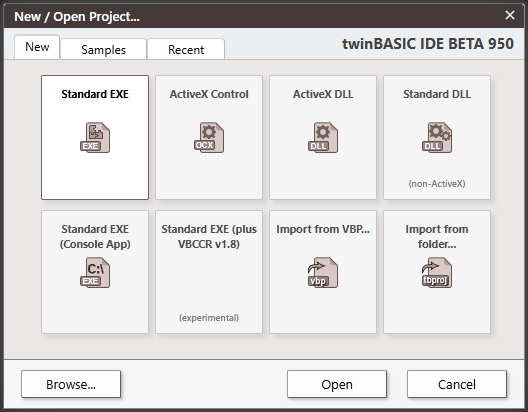
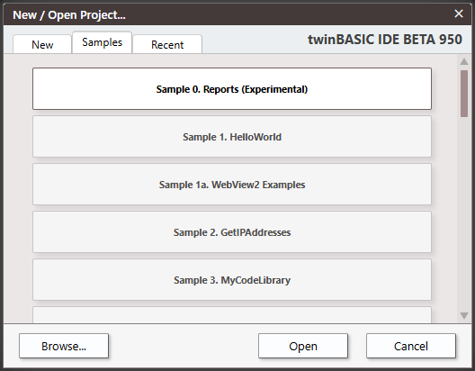
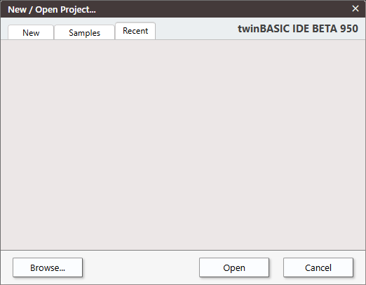
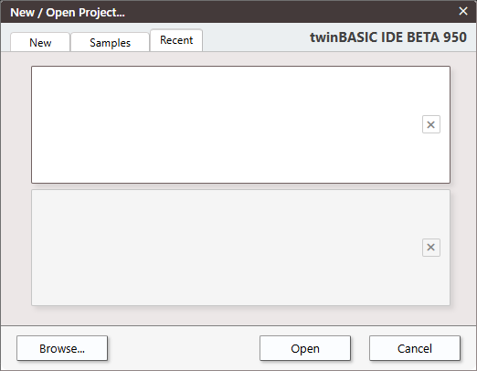

# New Project

")

Shortcut: <kbd>CTRL</kbd> + <kbd>N</kbd>

## Options

- Standard Exe
- ActiveX Control
- ActiveX DLL
- Standard DLL
- Standard EXE (Console App)
- Standard EXE (plus VBCCR v1.8)
- Import from VBP...
- Import from folder...

Browse \| Open \| Cancel

# Samples

0. Reports (Experimental)
1. WebView2 Examples
2. GetIPAddress
3. MyCodeLibrary
4. MyVBEAddin (NEW with ToolWindow)
5. MyCOMAddin
6. CustomControls
7. Package
8. FilePropertyViewer (CustomControls)
9. ActiveX Control WebView2 + Monaco
10. twinBASIC IDE Addin
11. twinBASIC IDE Addin (Chart)
12. twinBASIC IDE Addin (Monaco)
13. twinBASIC IDE Addin (ListView)
14. twinBASIC IDE Addin (VirutalListView)
15. twinBASIC IDE Addin (Global Search)
16. twinBASIC IDE Addin (TODO Widgets demo)
17. Static Library Example (SQLITE3)
18. Static Library Example (libdeflate)
19. MDI Forms
20. TreeView + ListView + ImageList
21. Windows Service Simple Example
22. Windows Service Complex Example (inc Event Logging and IPC)
23. OOP Inheritance Example (Animals)

# Recent

If you haven't opened any projects, or removed all then this tab will be blank.

A list of recent projects will be displayed, resizing depending on how many are in the list.

_Removed paths_

Click on the X to remove from the list.
