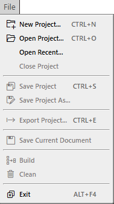

# New Project

Shortcut: <kbd>CTRL</kbd> + <kbd>N</kbd>

## Options

- Standard Exe
- ActiveX Control
- ActiveX DLL
- Standard DLL
- Standard EXE (Console App)
- Standard EXE (plus VBCCR v1.8)
- Import from VBP...
- Import from folder...

Browse \| Open \| Cancel

# Samples

Each row is labelled **Sample** followed by its number. The numbering is the dialog's own: **1a** sits between **1** and **2**.

- **0.** Reports (Experimental)
- **1.** HelloWorld
- **1a.** WebView2 Examples
- **2.** GetIPAddresses
- **3.** MyCodeLibrary
- **4.** MyVBEAddin (NEW with ToolWindow)
- **5.** MyCOMAddin
- **6.** CustomControls
- **7.** Package
- **8.** FilePropertyViewer (CustomControls)
- **9.** ActiveX Control WebView2 + Monaco
- **10.** twinBASIC IDE Addin
- **11.** twinBASIC IDE Addin (Chart)
- **12.** twinBASIC IDE Addin (Monaco)
- **13.** twinBASIC IDE Addin (ListView)
- **14.** twinBASIC IDE Addin (VirutalListView)
- **15.** twinBASIC IDE Addin (Global Search)
- **16.** twinBASIC IDE Addin (TODO Widgets demo)
- **17.** Static Library Example (SQLITE3)
- **18.** Static Library Example (libdeflate)
- **19.** MDI Forms
- **20.** TreeView + ListView + ImageList
- **21.** Windows Service Simple Example
- **22.** Windows Service Complex Example (inc Event Logging and IPC)
- **23.** OOP Inheritance Example (Animals)

# Recent

If you haven't opened any projects, or removed all then this tab will be blank.

A list of recent projects will be displayed, resizing depending on how many are in the list.

_Removed paths_

Click on the X to remove from the list.
