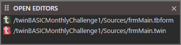

# Open Editors

When a project isn't open this will be empty.

When a project is open it will list the files that are currently open in your [Editor](Editor)

Clicking a file in the list brings it into focus in the editor.
