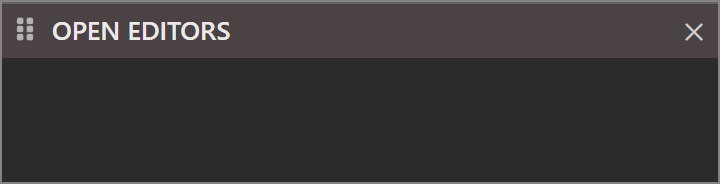
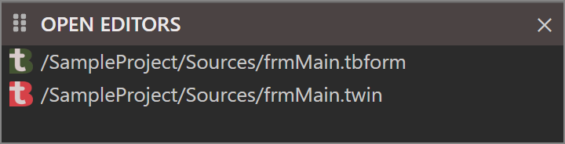

# Open Editors

When a project isn't open this will be empty.

{:width="360" height="92"}

When a project is open it will list the files that are currently open in your [Editor](Editor)

{:width="360" height="92"}

Clicking a file in the list brings it into focus in the editor.
