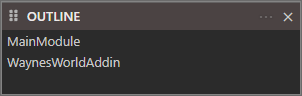

# Outline

The Outline pane shows a structural overview of the declarations in the active source file---modules, classes, procedures, and properties.

When a project isn't open this will be empty.

Once you open a project it will list the `Modules`/`Classes` etc.

You can click on an item to navigate to that point in the code file.
