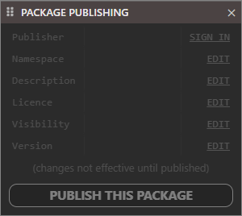
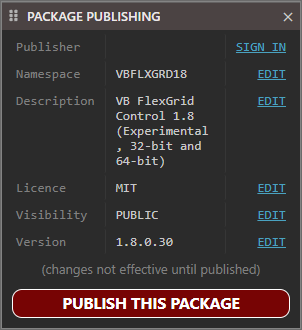

# Package Publishing

When a project isn't open this will be empty.

Once you open a project you will be able to edit the properties.

Click the "EDIT" and this will open the [Project Settings](Project%20Settings.md)
