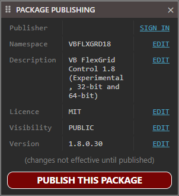

# Package Publishing

The Package Publishing pane manages the metadata for the current project when it is published as a twinBASIC package, including the package name, version, and description.

When a project isn't open this will be empty.

Once you open a project you will be able to edit the properties.

Click the "EDIT" and this will open the [Project Settings](Settings)
