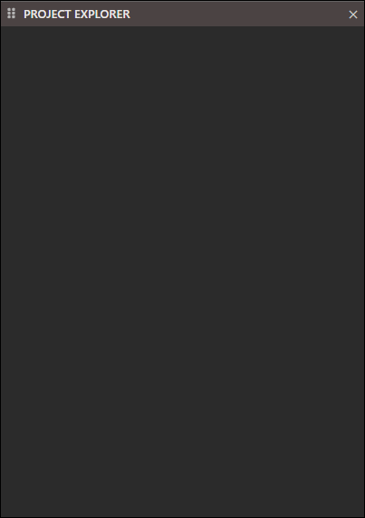
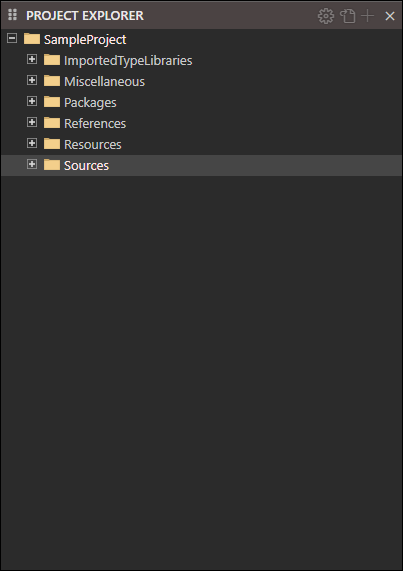
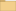
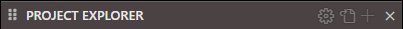
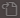
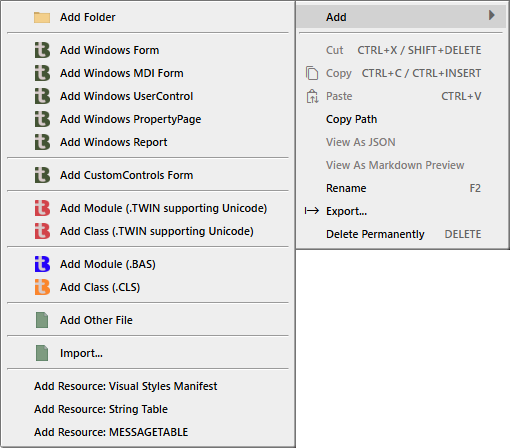
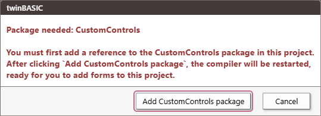

# Project Explorer




 ImportedTypeLibraries  
 Miscellaneous  
 Packages  
  <!--  VB   -->
  <!--  VBA   -->
  <!--  VBComDlg   -->
  <!--  VBRUN   -->
  <!--  WinNativeCommonCtls   -->
 References  
 Resources  
 Sources  

When a Project is open contextual icons will appear.



##  Project Settings

- [Info](Settings)

##  Toggle file view (<kbd>CTRL</kbd> + <kbd>R</kbd>)


##  Add...

Same as Right-Click

> [!NOTE]
>
>  TODO: Add each Menu item.

## Right-Click - Add



-  Add Folder
-  Add Windows Form
-  Add Windows MDI Form
-  Add Windows UserControl
-  Add Windows PropertyPage
-  Add Windows Report

---

-  Add CustomControls Form

---

-  Add Module (.TWIN supporting Unicode)
-  Add Class (.TWIN supporting Unicode)

---

- ") Add Module (.BAS)
- ") Add Class (.CLS)

---

-  Add Other File

---

-  Import

---

- Add Resource: Visual Styles Manifest
- Add Resource: String Table
- Add Resource: MESSAGETABLE

##  Folder
{: #folder }

##  Windows Form
{: #windows-form }

[tbForm](Editor/Form)

##  Windows MDI Form
{: #windows-mdi-form }

##  Windows UserControl
{: #windows-usercontrol }

##  Windows PropertyPage
{: #windows-propertypage }

##  Windows Report
{: #windows-report }

[tbReport](Editor/Report)

##  CustomControls Forms
{: #customcontrols-forms }



##  Module
{: #module }

##  Class
{: #class }

##  Other File
{: #other-file }

##  Import
{: #import }

## Resource: Visual Styles Manifest

See  `/.../Resources/MANIFEST/#1.xml`

```xml
<?xml version="1.0" encoding="UTF-8" standalone="yes"?>
<assembly xmlns="urn:schemas-microsoft-com:asm.v1" manifestVersion="1.0">
   <assemblyIdentity
      type="win32"
      processorArchitecture="*"
      name="My_twinBASIC_Application"
      version="1.0.0.0"
   />
   <description>Application description here</description>
   <dependency>
      <dependentAssembly>
         <assemblyIdentity
            type="win32"
            processorArchitecture="*"
            name="Microsoft.Windows.Common-Controls"
            version="6.0.0.0"
            publicKeyToken="6595b64144ccf1df"
            language="*"
         />
      </dependentAssembly>
   </dependency>
</assembly>
```

## Resource: String Table

See  `/.../Resources/STRING/Strings.json`

```json
[
    {
        "id": 101,
        "name": "MyLocalizedString1",
        "LCID_0000": "This is my NEUTRAL text for MyLocalizedString1",
        "LCID_0409": "This is my USA text for MyLocalizedString1",
        "LCID_0407": "This is my GERMAN text for MyLocalizedString1",
        "LCID_0809": "This is my UK text for MyLocalizedString1"
    },
    {
        "id": 102,
        "name": "MyLocalizedString2",
        "LCID_0000": "This is my NEUTRAL text for MyLocalizedString2",
        "LCID_0409": "This is my USA text for MyLocalizedString2",
        "LCID_0407": "This is my GERMAN text for MyLocalizedString2",
        "LCID_0809": "This is my UK text for MyLocalizedString2"
    }
]
```

## Resource: MESSAGETABLE

See  `/.../Resources/MESSAGETABLE/Strings.json`

```json
{
    "events": 
    [
        {
            "id": -1073610751,
            "name": "service_started",
            "LCID_0000": "%1 service started"
        },
        {
            "id": -1073610750,
            "name": "service_startup_failed",
            "LCID_0000": "%1 service startup failed"
        },
        {
            "id": -1073610749,
            "name": "service_ended",
            "LCID_0000": "%1 service ended"
        },
        {
            "id": -1073610748,
            "name": "service_stopping",
            "LCID_0000": "%1 service stopping"
        }
    ],
    "categories": 
    [
        {
            "id": 1,
            "name": "status_changed",
            "LCID_0000": "Status Changed"
        }
    ]
}
```
