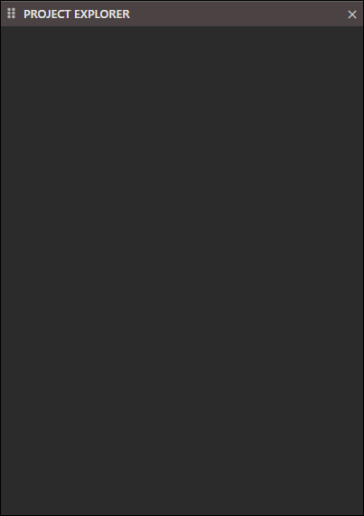
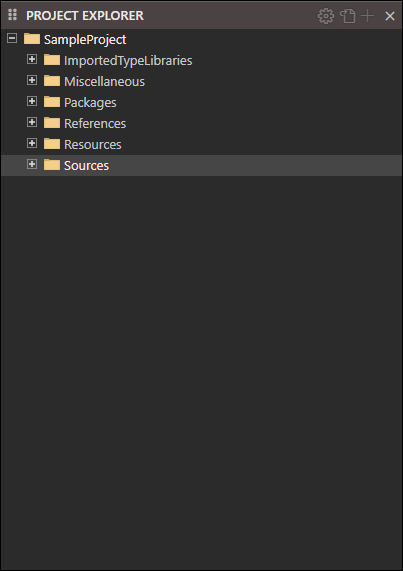
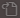

# Project Explorer




 ImportedTypeLibraries  
 Miscellaneous  
 Packages  
 References  
 Resources  
 Sources  

When a Project is open contextual icons will appear.


##  Project Settings

- [Info](Settings)

##  Toggle file view (<kbd>CTRL</kbd> + <kbd>R</kbd>)


##  Add...

Same as Right-Click

## Right-Click - Add

![The Project Explorer context menu with its Add submenu open alongside it. The submenu runs from Add Folder through the Windows Form, MDI Form, UserControl, PropertyPage and Report entries, the CustomControls form, the .TWIN module and class, the .BAS module and .CLS class, Add Other File, Import, and three Add Resource lines. The menu behind it lists Cut, Copy, Paste, Copy Path, View As JSON, View As Markdown Preview, Rename, Export and Delete Permanently, with Cut, Copy, Paste and the two View As entries greyed out.](Images/RightClick-Add.png)

-  Add Folder
-  Add Windows Form
-  Add Windows MDI Form
-  Add Windows UserControl
-  Add Windows PropertyPage
-  Add Windows Report

---

-  Add CustomControls Form

---

-  Add Module (.TWIN supporting Unicode)
-  Add Class (.TWIN supporting Unicode)

---

-  Add Module (.BAS)
-  Add Class (.CLS)

---

-  Add Other File

---

-  Import

---

- Add Resource: Visual Styles Manifest
- Add Resource: String Table
- Add Resource: MESSAGETABLE

##  Folder
{: #folder }

##  Windows Form
{: #windows-form }

[tbForm](Editor/Form)

##  Windows MDI Form
{: #windows-mdi-form }

##  Windows UserControl
{: #windows-usercontrol }

##  Windows PropertyPage
{: #windows-propertypage }

##  Windows Report
{: #windows-report }

[tbReport](Editor/Report)

##  CustomControls Forms
{: #customcontrols-forms }


##  Module
{: #module }

##  Class
{: #class }

##  Other File
{: #other-file }

##  Import
{: #import }

## Resource: Visual Styles Manifest

See  `/.../Resources/MANIFEST/#1.xml`

```xml
<?xml version="1.0" encoding="UTF-8" standalone="yes"?>
<assembly xmlns="urn:schemas-microsoft-com:asm.v1" manifestVersion="1.0">
   <assemblyIdentity
      type="win32"
      processorArchitecture="*"
      name="My_twinBASIC_Application"
      version="1.0.0.0"
   />
   <description>Application description here</description>
   <dependency>
      <dependentAssembly>
         <assemblyIdentity
            type="win32"
            processorArchitecture="*"
            name="Microsoft.Windows.Common-Controls"
            version="6.0.0.0"
            publicKeyToken="6595b64144ccf1df"
            language="*"
         />
      </dependentAssembly>
   </dependency>
</assembly>
```

## Resource: String Table

See  `/.../Resources/STRING/Strings.json`

```json
[
    {
        "id": 101,
        "name": "MyLocalizedString1",
        "LCID_0000": "This is my NEUTRAL text for MyLocalizedString1",
        "LCID_0409": "This is my USA text for MyLocalizedString1",
        "LCID_0407": "This is my GERMAN text for MyLocalizedString1",
        "LCID_0809": "This is my UK text for MyLocalizedString1"
    },
    {
        "id": 102,
        "name": "MyLocalizedString2",
        "LCID_0000": "This is my NEUTRAL text for MyLocalizedString2",
        "LCID_0409": "This is my USA text for MyLocalizedString2",
        "LCID_0407": "This is my GERMAN text for MyLocalizedString2",
        "LCID_0809": "This is my UK text for MyLocalizedString2"
    }
]
```

## Resource: MESSAGETABLE

See  `/.../Resources/MESSAGETABLE/Strings.json`

```json
{
    "events": 
    [
        {
            "id": -1073610751,
            "name": "service_started",
            "LCID_0000": "%1 service started"
        },
        {
            "id": -1073610750,
            "name": "service_startup_failed",
            "LCID_0000": "%1 service startup failed"
        },
        {
            "id": -1073610749,
            "name": "service_ended",
            "LCID_0000": "%1 service ended"
        },
        {
            "id": -1073610748,
            "name": "service_stopping",
            "LCID_0000": "%1 service stopping"
        }
    ],
    "categories": 
    [
        {
            "id": 1,
            "name": "status_changed",
            "LCID_0000": "Status Changed"
        }
    ]
}
```
