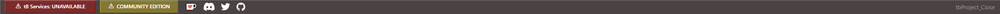
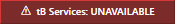
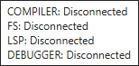
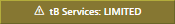
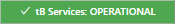
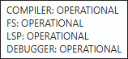
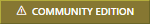
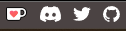

# Status Bar

## Services

COMPILER: Disconnected / OPERATIONAL

FS: Disconnected / OPERATIONAL

LSP: Disconnected / OPERATIONAL

- [Language Server Protocol](https://microsoft.github.io/language-server-protocol/)

DEBUGGER: Disconnected / OPERATIONAL

## Licence

- [Pre Order](https://twinbasic.com/preorder.html)

- Community Edition
- Professional Edition
- Ultimate Edition

## Links

- https://ko-fi.com/twinbasic
- https://discord.com/invite/UaW9GgKKuE
- http://x.com/waynephillipsea
- https://github.com/twinbasic/twinbasic

## Status
